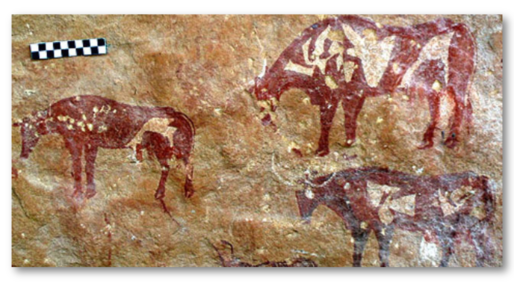

---
output:
  pdf_document: default
  html_document: default
  word_document: default
---
# Introduction to nutritional models

::: {.lo}
**Learning Objectives**

1.  Explain the rationale and history behind nutrient models.

2.  Describe how nutritional models are developed, step-by-step.

3.  List and differentiate common dairy nutritional models.

:::

```{r, setup, include=FALSE}
knitr::opts_chunk$set(
  comment = '', echo = F, message = F, warning = F, cache = TRUE,
  out.width = '85%', fig.align = 'center', dpi = 300
)

```

## A brief history

```{r, echo = F, fig.align = "center", fig.cap = "Cattle painted circa 7000 years ago in the Libyan Sahara (Sapienza University of Rome)"}

```

Deliberate animal feeding began before recorded history with the advent of agriculture in Asia and Africa 12,000 years ago [@Coffey2016]. Since this time, humans have carefully considered how to manage forages, grains, minerals, and other natural resources to provide nourishment for domesticated animals. In regions throughout the world, traditional and indigenous knowledge systems contain a wealth of information on animal nutritional management, yet very little of it is recorded in publications and books.

Primarily in the last 200 years, animal nutrition developed as a scientific discipline. The use of scientific methods enabled researchers to isolate the chemical components of feeds and to quantitatively relate dietary intakes to physiological effects. As nutrition science progressed, nutritional diseases that had once harmed or killed thousands of animals (and people) began to be curable. The productivity of agricultural animals began to increase. As per the scientific method, advances were recorded with detailed publications in the scientific literature to enable cumulative progress.

In the United States, nutrition science was spurred by government efforts to reconstruct and reduce poverty after wars. In the aftermath of the Civil War and World Wars, the U.S. government chartered the National Academies of Sciences, Engineering, and Medicine (NASEM) and its subsidiary organization the National Research Council [NRC, @Ullrey2001]. NASEM is a non-governmental, non-profit organization of academics whose mission is to translate scientific information into domestic policy and practice. In animal nutrition, NASEM is famous for organizing efforts to consolidate nutritional science knowledge into animal feeding recommendations by publishing consensus reports.

The first edition of "Nutrient Requirements of Dairy Cattle" was published by the NRC (NASEM's subsidiary) in 1945. In the eight decades following, researchers created seven more editions of this consensus report. Each edition uses the most up-to-date research on dairy cattle nutrition generated by researchers at universities and government institutions.

## Definition

::: {.green}
**Test Yourself: **
Before proceeding, we need to ask ourselves...what are nutritional models, and what do they have in common with the cave paintings shown at the beginning of the chapter?

::: 


The cave painting of cattle is a two-dimensional representation of three-dimensional animals. It conveys some information about cattle and how they are shaped. Although we cannot know the intention of its artist(s), perhaps they meant to use the cave painting to communicate some information about cattle they had observed. The painting is a "snapshot" in time that summarizes and communicates about cattle.

A nutritional model (for example, the NASEM dairy model) is also a representation of cattle. Instead of a two-dimensional artwork, nutritional models are generally represented mathematically. The tens or hundreds of mathematical expressions that comprise a nutritional model are intended to summarize and communicate what we know about cattle nutrition. Similar to the painting, a model is a representation of reality.

## Usefulness

Models are mathematical and/or statistical descriptions of inputs, processes, and outputs. Nutritional models function as decision-support tools that can use known information (e.g., feed composition, animal characteristics) to predict how nutritional processes will unfold and what outcomes will result. They can be used to answer various types of questions.

**Scenario 1**

> A dairy nutritionist has access to many different feedstuffs with known chemical composition. They have several different pens of animals to feed (e.g., calves, dry cows, lactating cows, high-producing lactating cows). How do they create diets for each pen of animals?

A nutritional model can help determine the requirements for each pen of animals. Additionally, the nutritional model can determine which feeds can be combined to create diets that meet the requirements.

**Scenario 2**

> A group of dairy producers aims to reduce greenhouse gas emissions from their farm so they can reach carbon-neutral production goals. How can they select diets that contribute to their environmental goals?

A nutritional model could help these producers predict the environmental impact of their current production practices, or explore hypothetical alternative diets and scenarios.

**Scenario 3**

> A dairy nutritionist has a suspicion that a group of cows is not producing as much milk fat as they could be, given the diet and animal characteristics. How does the nutritionist test their hypothesis?

A nutritional model can be used to benchmark production. Benchmarking means comparing the observed value against a reference value to evaluate its adequacy. In this case, the nutritionist could enter the diet and cow information to predict the expected milk fat production under these conditions. Then, they could compare this reference (expected) value to their observed value to benchmark.

**Scenario 4**

> Feed costs for certain ingredients have changed, and a nutritionist wants to ensure they can meet animal needs and maintain performance at the least possible cost. How can they create a diet that minimizes feed costs?

A nutritional model can be used to optimize diets based on certain constraints. For example, least cost formulation is a common approach. It involves finding the combination of ingredients that will create a diet that meets animal requirements and costs the least amount.

## Development

Nutritional models are developed through the scientific process. To get a sense of how nutritional models work, let's go through a fictional example to develop our own (very simple!) nutritional model. 

- Hypothesis generation

- Data collection (through observation and experimentation)

- Model development 

- Model verification and generation of new hypotheses

- ...repeat the process ad infinitum


### Hypothesis generation 

Imagine that a researcher is observing some cattle, and notices that larger cattle seem to eat more. They write this observation into their notebook.


### Data collection through observation (or experimentation)

To learn more about the hypothesized relationship between body size and feed intake, the researcher decides to find a group of cattle to collect observational data. They collect two pieces of information in each observation: 1) the animal's body weight (BW), and 2) the animal's dry matter intake (DMI). They use the data to create a plot:

```{r, fig.cap = "DMI vs BW for 300 observations from lactating cows"}

library(dplyr)
library(magrittr)
set.seed(765)
# remotes::install_github("dill/emoGG")
# library(emoGG)
#emoji_search("cow")
library(ggplot2)
theme_set(theme_bw())
# library("ggimage")
# simulate a little linear relation with residual
res = rnorm(300, 0, sd = 3)
bw = rnorm(300, 600, sd= 40)
parity = rep(c(1,7), 150)
dmi = 0.03*bw + parity + res 
milk = dmi*1.4 + res # create relation to dmi but not BW. Using same residuals which will make dmi and milk more correlated?
df = data.frame(DMI = dmi, BW = bw, Parity = parity, MilkProd = milk) %>% 
  mutate(Parity = ifelse(Parity == 1, "Primiparous (first calf)", "Multiparous (2+ calves)"))
p = ggplot(df, aes(x = BW, y = DMI)) + geom_point() +
  labs(x = "BW, kg", y = "DMI, kg/d") 
p + theme_bw()
```


::: {.green}

**Test Yourself: **
What would you conclude from the plot?
::: 


After looking at the plot, the researcher believes that DMI and BW are related. In other words, if an animal's BW is known, its DMI can be guessed with some accuracy. The researcher decides to convert this observed relationship to a mathematical model. Because the relationship seems to follow a line, they fit a regression with the linear form $y = mx + b$.

```{r, fig.cap = "Fitted regression model predicting DMI from BW for lactating cows"}
p + geom_smooth(method = "lm", se = F) + 
  annotate(geom = "text", x = 540, y = 35, label = "DMI = 0.03*BW", color = "blue", size = 5) + theme_bw() +
  labs(x = "BW, kg", y = "DMI, kg/d")
```

### Model development 

By fitting a regression model to the observed points, they get an estimate of the slope (0.03) that relates BW and DMI. In other words, the average DMI observed was 3% of the animal BW. This single mathematical expression is a very simple nutritional model: $DMI = 0.03 * BW$

The researcher thinks the model will be useful for prediction. They decide to test the predictive performance of the model by buying a new lactating cow. They record the cow's BW as 625 kg. 


```{r, fig.cap = "Fitted regression model predicting DMI from BW for lactating cows"}
# This is rendering as the next figure in output. 
# Defining the next graph as p2.1 to see if it fixes it. THey have correct captions.
p2 <- ggplot(df, aes(x = BW, y = DMI)) +
  geom_point(color = "grey") +
  geom_smooth(method = "lm", se = F) +
  annotate(geom = "text", x = 540, y = 35, label = "DMI = 0.03*BW", color = "blue", size = 5) +
  annotate(geom = "segment", x = 625, xend = 625, y = -Inf, yend = Inf, color = "red", lty = "dashed") + theme_bw() +
  labs(x = "BW, kg", y = "DMI, kg/d")

p2

```

::: {.green}
**Test Yourself: **
Using our simple nutritional model, what is this cow's predicted DMI?
::: 

### Model verification

To predict the DMI of the new cow, the researcher enters the known information (cow's BW) into the nutritional model: $DMI = 0.03 * 625$. The model predicts the cow's DMI will be 18.75 kg. Tracing up from the x-axis, the intersection of the red dashed line with the blue line shows the predicted DMI for an animal with BW = 625.

Next, the researcher decides to verify their model by measuring the animal's actual DMI.

```{r, fig.cap = "Actual DMI for a new observation (red point) of a cow with BW = 625 kg"}
p2.1 = p2 + annotate(geom = "point", x = 625, y = 25, size = 4, color = "red") + theme_bw()
p2.1
```

Uh oh.... the actual DMI observed is shown with the large red point. It is greater than the prediction. This means that the model under-predicted the actual DMI for this cow based on her BW. This causes the researcher to go back to their original model, $DMI = 0.03 * BW$. The variable BW seems to explain some, but not all of the variation in DMI. 

::: {.green}
**Test Yourself: **
What should the researcher do next?
::: 

There are several courses of action to be considered. First, the researcher could leave the model as-is, and attribute the error in prediction to un-explainable variation. Un-explainable variation comes from unknown and un-measurable sources, including the intrinsic randomness of the universe. Second, the researcher could try to gather more information to find other measurable predictors of DMI besides BW. Then, they could revise the nutritional model to include other variables that determine the DMI. 

### Model refinement (re-starting the process)

Generally, scientists take the second option. In our example, the researcher might go back to their notebook and consider... what other factors could be affecting DMI aside from BW? Eventually, they would develop a new hypothesis, for example: younger, first-lactation animals will consume less than more mature animals with two or more lactations. They plot the data again, including information about the animals' parity:

```{r, eval = F, fig.cap = "DMI vs BW for 300 observations from lactating cows, by parity"}
p = ggplot(df, aes(x = BW, y = DMI, color = Parity)) + geom_point() + theme_bw()+
  theme(legend.position = "bottom")# + geom_emoji(emoji = "1f402")
p 
```

```{r, fig.cap = "DMI vs BW for 300 observations from lactating cows, by parity"}
p = ggplot(df, aes(x = BW, y = DMI, color = Parity)) + geom_point() + theme_bw()+
  theme(legend.position = "bottom")# + geom_emoji(emoji = "1f402")
p + geom_smooth(method = "lm", se = F) + 
  annotate(geom = "text", x = 555, y = 35, label = "DMI = 0.03*BW + (multiparous effect)", color = "#F8766D", size = 5)+ 
  annotate(geom = "text", x = 555, y = 32, label = "DMI = 0.03*BW + (primiparous effect)", color = "#00BFC4", size = 5)+
  labs(x = "BW, kg", y = "DMI, kg/d") 
```

It appears there is some variation explained by parity. In this way, the researcher can update the model to include other variables, e.g., $DMI = 0.03 * BW + ParityEffect$. Nutritional models with multiple variables are difficult to visualize, but they are conceptually similar to the simpler model in our example. 

## Components of the NASEM (2021) model

Nutritional models such as the NASEM (2021) model contain thousands of variables, related by many types of mathematical expressions. Our simple example used a linear relationship, but nutritional models can also contain non-linear relationships. In our example, the effects of BW and Parity were independent and additive. Most nutritional models also include mathematical terms that describe interactions between variables. 

### Supplies, requirements, and balances

Most editions of "Nutrient Requirements of Dairy Cattle" have described animal performance in relation to energy and major nutrients such as amino acids, fiber, vitamins, and minerals. The goal of nutritional models is to help producers design diets that support the animal's needs for a healthy, productive life. This involves matching up the nutrients and energy **supplied** by the diet with the amounts **required** by the animal.  For a given nutrient, the difference between the amount supplied and the amount required is referred to as the **balance.**

For a given nutrient, the balance equals the amount supplied per day (in a unit such as g, kg, MCal) minus the amount required by the animal:
$$ Balance  = Supply -Requirement  $$

To calculate nutrient supplies, NASEM [-@NASEM8] uses primarily information about the feed chemical composition, and some information about the animal and management scenario. From this, it predicts the flows of energy and nutrients that is digestible and metabolizable for the animal. 

To estimate nutrient requirements, NASEM [-@NASEM8] calculates separate requirements for each different body functions:  including requirements for maintenance, activity, growth, reproduction, lactation, and changes in body reserves. Summing these requirements gives the total requirement for each nutrition. This method for calculating requirements is referred to as a **factorial** approach because it sums the contributions of different factors to determine the total requirement.

The next chapter of this module will discuss the complications associated with estimating nutrient requirements and matching them with nutrient supplies.


## Comparing NASEM [-@NASEM8] to other dairy models

NASEM [-@NASEM8] is one of several dairy cattle nutrition models. In most cases, models are intended to serve as decision support tools. In other words, the model estimates are intended to help dairy stakeholders, especially dairy farm managers, make more-informed decisions. The Cornell Net Protein and Carbohydrate System (CNCPS) is an alternative model upon which commercial ration formulation programs such as AMTS have been built. CNCPS also influence the development of The Large Ruminant Nutrition System (LRNS) by Texas A&M researchers. In recent years, the importance of evaluating the environmental and economic impacts of dairy production have led to the development of models not just focused on the animal-level variables (as with NASEM), but instead integrating information about the entire farm system. These models, for example, the Ruminant Farm Systems (RuFaS) model, incorporate detailed information about local weather, soil characteristics, crop growth and storage, and prices of feedstuffs.

Some programs allow users to optimize the inclusion rate of selected diet ingredients (e.g., least cost ration formulation; AMTS program). In contrast, NASEM [-@NASEM8] is designed to **evaluate** existing diets rather than **formulate** new diets that optimize user-defined parameters or meet user-defined constraints. Additionally, NASEM [-@NASEM8] predicts selected environmental impacts at the individual animal, predominantly based on dietary factors. Thus, NASEM [-@NASEM8] predictions of environmental impacts do not integrate farm system information to the same extent as other models, e.g., RuFaS.

::: grey
**Other ruminant diet evaluation models**

The Cornell Net Protein and Carbohydrate System (CNCPS) <https://cals.cornell.edu/animal-science/outreach-extension/publications-resources-software/cncps>

The Large Ruminant Nutrition System (LRNS) <https://animalscience.tamu.edu/the-utility-of-applied-nutrition-models-a-brief-history-and-future-perspectives/>

Ruminant Farm Systems (RuFaS) <http://rufas.org>
:::

```{r include=FALSE, eval = F}
# automatically create a bib database for R packages
knitr::write_bib(c(
  .packages(), 'bookdown', 'knitr', 'rmarkdown'
), 'packages.bib')
```

## Activities
