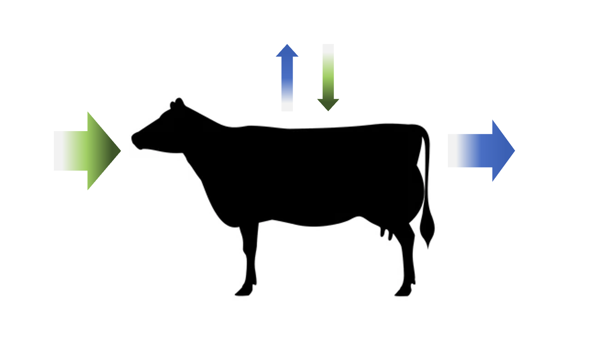
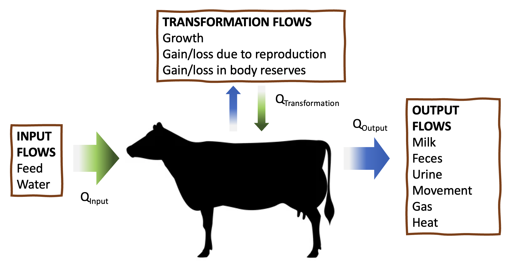
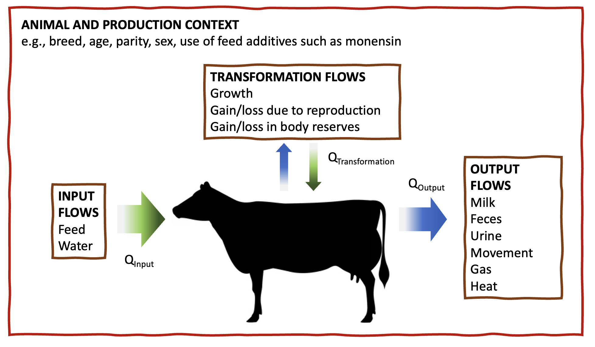

# Systems concepts

```{r, echo = F, fig.align = "center", fig.cap = "Simplified representation of animal nutrition as a system"}

library(webexercises)
```

::: lo
**Learning Objectives**

1.  Map out the basic structure and boundaries of a single-animal
    nutritional system, using systems thinking concepts.
2.  Explain physical/chemical and biological principles that apply
    across animal nutrition.
3.  Give specific examples of 1) inputs, 2) outputs, and 3) means by
    which the system is transformed for a dairy ruminant.
:::

## The animal nutritional system

In the last chapter, we created a simple nutritional model that
represented three pieces of information: feed intake, body weight, and
parity. Yet as animal scientists, we have access to much more
information about feeds, animals, and outcomes than just these three
variables. As we start to build more complex models that include more
variables, we will quickly confront a problem...**how can we organize
the many different pieces of information we can collect about an
animal's nutrition?**

In this chapter, we will begin to think about the animal as a
nutritional *system*. Specifically, we will consider the boundaries of
nutritional knowledge, discuss guiding principles, and sketch out the
configuration of a single-animal nutritional system, using dairy cattle
examples.

## Ways of understanding nutritional systems

Disciplines such as physics, economics, and animal nutrition each have
their own ways of seeing the world. Animal nutrition is an applied
discipline, so nutritionists make use of tools from various other
disciplines to achieve practical goals. For a nutritionist, the most
interesting aspects of an animal are the physical, chemical, and
biological processes through which the organism intakes nutrients uses
them to support its life.

Physical properties can be observed or measured without changing the
composition of the substance. For example, freezing water changes its
physical properties, but not its chemical composition. In contrast,
chemical changes involve the substance reacting with other substances to
change chemical composition. Finally, biological processes involve both
physics and chemistry, and they are enacted in a living organism.

In practice, animal nutritionists manage many different aspects of
animal systems, including social and economic components. For example, a
dairy nutritionist in California might formulate rations that include
lots of almond hulls, because this is a cheap feed source (economic)
that is a byproduct of a process that humans value (social). A
nutritionist might change the ingredient composition of diets based on
the desire of some people for grass-fed milk (social).

A nutritional model such as NASEM (2021) does not take into account
economic or social factors. It is based solely on physical, chemical,
and biological properties of the animal system.

| Discipline | Nutrition in Practice | Nutritional Model |
|:----------:|:---------------------:|:-----------------:|
|  Physical  |           X           |         X         |
|  Chemical  |           X           |         X         |
| Biological |           X           |         X         |
|   Social   |           X           |                   |
|  Economic  |           X           |                   |

: Ways of knowing represented in nutritional practice, versus
nutritional models.

::: orange
**Nutrition is life itself!**

If you've ever known an animal you truly loved, you might be thinking -
*an animal is more than just a nutritional system!* This is true. Yet
from the nutritionist's perspective, the biochemical processes of
digestion and metabolism form the core of life itself. The animal's
abilities to keep living, to grow, to move, to change, to reproduce, and
to make milk are all outcomes of nutritional processes.
:::

## Systems concepts

Let's start building our understanding of a single-animal nutritional
system. A single animal nutritional system is centered on the body of
one animal. However, the boundaries of the system are [not]{.underline}
the body of the animal *per se,* because our nutritional system includes
both the animal's body and the digesta in the gastrointestinal tract.
Collectively, we will call the body and digesta the **animal**.

The animal is an **open system**--it interacts with its environment
through **inputs** and **outputs** rather than being closed off to
external forces. In our single animal nutritional system, the major
**inputs** are the energy and nutrients in feed. Through the processes
of digestion and metabolism, the inputs are transformed into various
**intermediates**. Finally, the nutritional system has **outputs** such
as milk, feces, urine, heat, and activity.

Of course, the lives of animals unfold over time. Consequently,
nutritional systems occur over time. This temporal aspect adds some
complications for developing nutritional models. To simplify, we often
assume that a nutritional system is in a **steady state** condition, or
in other words, in dynamic equilibrium. A system in steady state has
inputs flowing in, and outputs flowing out, without the state of the
system itself changing. For example, a mature animal that is not
lactating or growing may have relatively stable nutritional system. In
contrast, systems can move through transient states where the system
itself is undergoing changes. For example, as a young animal grows,
their nutritional system is constantly transforming. Still, sometimes
these transformations are small enough to ignore over a short period of
time (e.g., the growth of a calf over 4 days).

Because nutritional systems are dynamic, we almost always discuss their
inputs, processes, and outputs in terms of rates (amounts per period of
time) rather than amounts. However, as an additional simplification, we
typically assume the denominator of the rate is one day in models such
as NASEM. For example, we record the rate of dry matter intake (DMI,
kg/d) and the rate of milk output (kg/d) in dairy nutritional trials. We
can even model changes to the system itself one day at a time. For
example, we can predict the nutrients required (amount per one day) for
a calf to grow in body size (amount per one day).

## Single-animal nutritional system

A few guiding principles are true across nearly all animal nutritional
models. These principles inform the basic structure of the nutritional
model and are considered by researchers throughout the processes of
model development. These rules are core assumptions in animal nutrition
that we will see repeated throughout the NASEM model.

## Physical/chemical principles: Mass & energy balance

Based on the laws of thermodynamics, we know that matter and energy are
neither created nor destroyed. Because we know mass and energy will be
conserved, we can start to develop rules about our single animal
nutritional system. These very simple rules will help us represent the
nutritional system in mathematical terms.

At steady state, the flow (Q) of energy or mass into the system equals
the flow out of the system:

$$
Q_{Input} = Q_{Output} 
$$\

At a transient state, the flow of energy or mass into the system equals
the flow out, plus the flow into transforming the system itself at a
given point in time. Transformations can involve accumulation (positive)
or decumulation (negative) of energy and matter into the system.

$$
Q_{Input}  = Q_{Output} + Q_{Transformation}
$$

The laws of thermodynamics are universal, so we can apply these rules to
the flow of energy, or to the flow of any element (carbon, nitrogen,
phosphorus) across the system.

When applied to dairy cattle nutrition, input flows relate primarily to
feed consumption. Elements and energy flow out of the animal in milk,
feces, urine, and gas. Energy is transferred during movement and heat
loss. Transformation flows occur when the animal's body grows, gains or
loses tissues associated with reproduction, or gains or loses body
reserves.

```{r, echo = F, fig.align = "center", fig.cap = "Representation of animal nutrition as a system, showing examples for each category of flows"}

```

::: green
**Test yourself**

An animal was fed some feed containing 400 g/d of phosphorus (P). Later,
the researcher analyzed the outputs (feces and urine) from the animal
and recovered 350 g/d of P. Was this animal apparently at a steady
state, or a transient state? How do you know?
`r mcq(c(answer = "transient state", "steady state"))`
:::

::: blue
**For math appreciators**

If you are a math appreciator, you may notice some opportunities to use
systems of differential equations to answer nutritional questions.

:::

## Biological principles: ordered processes

Nutritional systems involve many different processes from macroscopic to
microscopic scales. For any nutrient and for energy, nutritional models
typically describe a core sequence of nutritional processes:

1.  Ingestion - the input of nutrients, energy, and water to the
    gastrointestinal tract (GIT).
2.  Digestion - the mechanical and chemical breakdown of larger
    molecules into smaller substances that can be absorbed (e.g., fatty
    acids, amino acids, glucose, ammonia).
3.  Absorption - the passage of molecules into the body itself (into
    circulation) rather than remaining in the gastrointestinal tract.
4.  Assimilation and Use - at the cellular level, the use of nutrients
    and energy in chemical reactions that sustain life and body
    functions. Associated with output and transformation processes.

These nutritional processes can also be thought of as a set of rules.
For example, a nutrient or energy must be ingested before it can be
digested, absorbed, assimilated, or used. Therefore, we know that the
gross amount ingested is always greater than the amount digested. The
amount digested is greater than the amount available for metabolism.
Finally, the amount available for metabolism is greater than the net
amount used in output and transformation processes.

When energy and nutrients are mobilized from body reserves, they have
already passed through the processes of ingestion, digestion, and
absorption. Similarly, in nutrition trials where small-molecules are
infused into the bloodstream or distal gastrointestinal tract, these
nutrients "skip ahead" of ingestion and digestion.

## Biological principles: context-dependence

The laws of thermodynamics and other physical/chemical rules are fairly
universal--they hold true across many contexts. The same core processes
of nutrition can be found across the Animalia kingdom. This gives us the
basic configuration of a nutritional system that will be true across
different types of animals. But beyond this, the structure and behavior
of nutritional systems is dependent on the context.

For example, imagine the nutritional system of a lactating,
high-producing Holstein fed a high-quality ration, versus that of a dry
heifer fed a diet based on poor-quality forage. The principles of mass
balance and the order of nutritional processes apply to both. Yet, we
expect the specific behavior of the nutritional system will be vary
between these two contexts.

Therefore, our final guiding principle states that the structure and
behavior of nutritional systems is context-dependent. Elements of the
context such as breed, genetics, production system, geographic region,
etc., determine how the system functions. Sometimes, aspects of the
context can be represented in nutritional models, as we will see in the
NASEM model.

## Conclusions

With these guiding principles, we can sketch out a rough outline of the
configuration of a single-animal nutritional system for any nutrient or
for energy. We know that our system will have inputs, outputs, and the
potential to transform itself. We know that the system functions through
core nutritional processes from ingestion to assimilation and use. We
know that the specifics of the system behavior depend on contextual
factors.

```{r, echo = F, fig.align = "center", fig.cap = "Representation of animal nutrition as a system, showing the overarching effects of contextual factors"}

```

Although we have made progress in establishing the basic configuration
of a nutritional system, we want to be able to answer practical
questions! For example:

1.  Does this diet supply enough minerals to support the growth and
    development of a 3-month old calf?
2.  How much dietary protein will it take to support the process of
    uterine involution in a postpartum cow?
3.  For an animal walking 1000 meters to the parlor each day, how much
    extra energy is required?

These questions require us to characterize the system in greater detail.
In the subsequent chapters, we will discuss nutritional inputs,
processes, and outputs in much greater detail. We will delineate which
contextual factors have the greatest impact on nutritional system
behavior. By the end, you will be able to use a nutritional model
(NASEM) to predict how inputs will be split up into specific outputs
(e.g., what amount of nutrient X will appear in milk, urine, feces) or
used in system transformation.

::: green
**Test yourself**

Think about the illustration below showing how marbles flow
through a series of blocks.

1.  Can you draw an analogy to mass balance? A) Discuss input, output,
    and transformation (accumulation) in terms of marbles flowing in and
    out of this system. B) In this system, what happens during steady
    state, and transient state conditions?
2.  In this system, all the marbles enter the same way. What determines
    where the marbles leave the system (which color tunnel) or where
    they get stuck in the system?
    
If you're losing your marbles, you can click below to see one interpretation of this marble sorter as a system.

`r hide("Show an explanation")`

Marbles are input at the top of the system and output at the bottom when they leave the blocks. A system transformation occurs when a marble gets stuck somewhere in the system, because it changes the form of the system and its reaction to new inputs. Steady state conditions would involve inputs equalling the outputs. In other words, the number of marbles in would equal the number of marbles out for a given period of time. Transient state conditions would involve the accumulation or decumulation of marbles, where the flow of inputs would not equal the flow of outputs. 

In this system, the fates of marbles are determined by what blocks they run into, and possibly other factors such as the weight and size of the marble. 

`r unhide()`

{align="center"}
:::

## Questions

1. Describe the core physical/chemical principles underlying nutritional models. 
1. List and describe the core sequence of ordered processes in nutrition. 
1. What is an open system, and how does it apply to animal nutrition?
1. What is a steady state condition, and how does it apply to animal nutrition? 
1. Give examples of inputs, processes, and outputs in the nutritional system of a non-lactating animal. 
