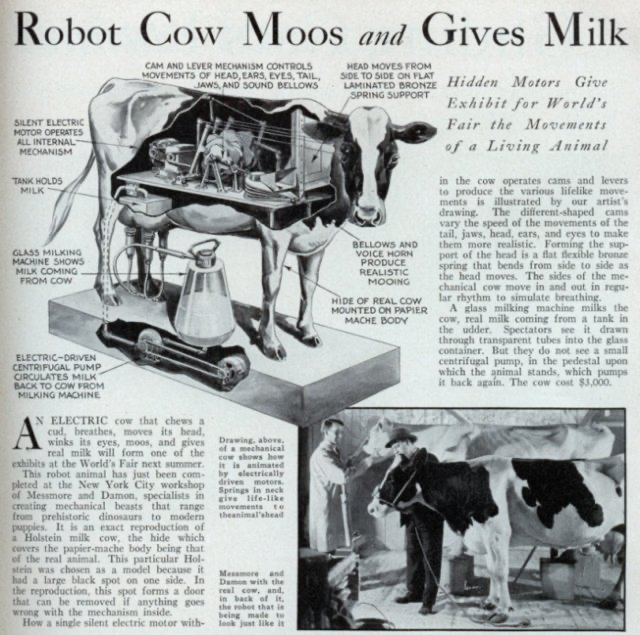

---
output:
  html_document: default
  pdf_document: default
  word_document: default
---

# Model machinery

```{r, include=FALSE}
knitr::opts_chunk$set(
  comment = '', echo = F, message = F, warning = F, cache = TRUE,
  out.width = '85%', fig.align = 'center', dpi = 300
)
```

```{r, echo = F, fig.align = "center", fig.cap = "Re-creating a dairy cow with machinery is not as easy as you might think. Source: <http://blog.modernmechanix.com>"}

library(webexercises)
```


```{r}
selected_feeds = c("Corn silage, typical", "Legume silage, mid-maturity",
                        "Rye annual hay, mature", 
                        "Pasture grass", "Legume silage, immature",
                        "Legume silage, mature",
                        "Cool season grass hay, mature",
                        "Cool season grass silage", 
                        "Corn grain dry, fine grind",
                        "Wheat grain", "Oat grain", "Wheat straw",
                        "Fat, corn oil", "Fat, canola oil", "Molasses", 
                        "Fat, soybean oil", "Canola meal", 
                        "Soybean meal, solvent 48CP", "DDGS, high protein", 
                        "Calcium carbonate", "Iron oxide", "Limestone")


library(ggplot2)
library(dplyr)
library(dairynasem)
library(plotly)

```

::: lo
**Learning Objectives**

1.  List and describe some of the "machinery" (mathematical operations) used in
    nutritional models.

2.  Use basic math to solve nutritional problems such as converting units, converting basis, scaling, and weighting. 

3.  Use a predictive model, in software, to generate estimates.

4.  Discuss some of the types of predictive models used in dairy nutrition work. 

5.  Set up and solve a diet optimization problem. 

:::


In the last chapter, we learned about some of the core parameters in the
NASEM model: supplies and requirements. In this chapter, we will roll up
our sleeves and look under the hood of the NASEM model to learn more
about other types of parameters beyond supplies and requirements. We
will also discuss some of the core mathematical concepts that underlie
the NASEM model functioning. The chapter is titled "Model machinery"
because it discusses some of the fundamental math that makes the NASEM
model work.

Nutrition involves primarily practical mathematical and statistical
problems. Animal nutritionists use nutritional modeling software to do
the "heavy lifting" for many types of calculations. We will consider
three categories of math and statistics that are used often by
nutritionists, as these also form the basis of many nutritional models.

1.  Basic mathematics
2.  Predictive models
3.  Optimization

## Basic nutrition math

Under the hood, some parts of the NASEM model are basic operations such
as converting units, converting the basis, and scaling quantities. These
operations are based on general facts, so they are unlikely to change
with future updates to the model. For example, 1 kg will always equal
1000 g.

### Using ratios, percentages, proportions

Some of the most frequent math problems done by nutritional scientists
are quite simple. To get started, we just need to review some elementary
math. The definitions may seem quite simple, but they can lead to huge errors if done incorrectly!

Relating any two quantities:

-   **Ratios** relate any two quantities with different units, or the same
    units. Ratios can be expressed as a fraction or as a numeral. In
    either case, the ratio must be expressed with units.

Relating parts of a whole:

-   **Percentages** are often used to relate two quantities with the same
    units and expressed as a number between 0 and 100.

-   **Proportions** convey the same information as a percentage, except they
    are expressed as a fraction of 1.

Percentages and proportions can sometimes get confusing if there are no
units. This is why it can be helpful to explicitly state the units
rather than using the % sign. For example, the fat content of milk
(e.g., 3.7%) could be expressed equivalently as the kg of fat per 100 kg
of milk ($\frac{3.7 \space kg \space fat}{100 \space kg \space milk}$).
The word "percent" literally translates to "per 100"! As a proportion, we could write $\frac{0.037 \text{ kg milk fat }}{\text{1 kg milk}}$. Next time you hear a percent or proportion, ask yourself... 1) what are the numerator and denominator? 2) What are the units?

::: {.green}

**Test Yourself: **

1. True or false:  ratios can be expressed without units. `r torf(FALSE)`
1. How are percentages expressed? `r mcq(c("As a fraction", "As a dividend", answer = "As a number between 0 and 100"))`
1. True or false:  ratios can be used to relate quantities with the same units? `r torf(TRUE)`

:::  

### Converting units 

In the field, many animal producers in the U.S. use units based on both
the Imperial system (e.g., lbs, inches) and the metric system (e.g.,
grams, meters). However, most research in animal nutrition is published
using the metric system. The metric system is somewhat simpler, in that
the prefixes of a unit represents its order of magnitude relative to the
base unit (e.g., a gram). Most quantities that apply for single animal
nutritional models range from the milligram to kilogram range. 

Nutritionists work with a variety of input data, and they often need to convert units from smaller amounts (e.g., the animal level) to larger amounts (e.g., the farm level). 

| **Order of Magnitude** | **Prefix** | **Unit Value** |
|------------------------|------------|----------------|
| pico                   | p          | 10\^-12        |
| nano                   | n          | 10\^-9         |
| micro                  | µ          | 10\^-6         |
| milli                  | m          | 10\^-3         |
| centi                  | c          | 10\^-2         |
| deci                   | d          | 10\^-1         |
| deca                   | da         | 10\^1          |
| hecto                  | h          | 10\^2          |
| kilo                   | k          | 10\^3          |
| mega                   | M          | 10\^6          |
| giga                   | G          | 10\^9          |


::: green
**Test yourself:  Metric practice**

1.  What is the mass in kg of 50 lbs feed? Use one decimals.
    `r fitb(c("22.7", "22.6", "22.8"))` kg

2.  A bull has a mass of 900 kg. How many pounds does the bull weigh?
    Report the whole number with no decimals. `r fitb(c("1980"))` lbs.

3.  If a vet prescribes 1.5 g of a medication, and each tablet contains
    125 mg, how many tablets should be given? `r fitb(c("12"))` tablets

`r hide("Show explanations")`

1.  50 lbs * (1 kg/ 2.2 lb) = 22.68 kg

2.  900 * 2.2 = 1980

3.  1,500 mg * (1 tablet / 125 mg) = 12 tablets

`r unhide()`
:::


### Converting basis

In animal nutrition, almost everything from feed to animal tissues
contains water. The water content can vary substantially. Although water
is important in nutrition, nutritionists generally do calculations on a
dry matter basis. This means that quantities are expressed as a fraction
of the non-water (dry matter) content, rather than as a fraction of the
total.


For a nutrient called C, the proportion of C on an as-is basis is calculated as the mass of C divided by the total mass including wet and dry matter.

$$
\text{As-is basis }= \frac{\text{mass of C}}{\text{total mass of water and dry matter}}
$$

To calculate the proportion of C on a DM basis, we divide the mass of C by the mass of DM, ignoring the wet matter. 
$$
\text{DM basis }= \frac{\text{mass of C}}{\text{ mass of dry matter }}
$$

Most of the NASEM predictions are done on a dry matter
**basis.** This means that quantities are expressed in relation to the dry
matter content of a feed (as fractions of the dry matter content). For
some feeds, it makes an enormous difference whether nutrient composition
is expressed on a DM basis vs. as-is basis (e.g., corn silage, grass
silage). For other feeds, it makes no difference at all (e.g.,
limestone, iron oxide) because the feed contains very minimal water.

```{r}
selected_feeds = c("Corn silage, typical", "Legume silage, mid-maturity",
                        "Rye annual hay, mature", 
                        "Pasture grass", "Legume silage, immature",
                        "Legume silage, mature",
                        "Cool season grass hay, mature",
                        "Cool season grass silage", 
                        "Corn grain dry, fine grind",
                        "Wheat grain", "Oat grain", "Wheat straw",
                        "Fat, corn oil", "Fat, canola oil", "Molasses", 
                        "Fat, soybean oil", "Canola meal", 
                        "Soybean meal, solvent 48CP", "DDGS, high protein", 
                        "Calcium carbonate", "Iron oxide", "Limestone")


library(ggplot2)
library(dplyr)
library(dairynasem)
library(plotly)
library(tidyr)
library(stringr)


fdlib = dairynasem::default_library

p1 = fdlib %>% 
  dplyr::select(Fd_Name, Fd_DM) %>% 
  arrange(Fd_DM) %>% 
  filter(Fd_Name %in% selected_feeds) %>%
  mutate(Fd_Wet = 100-Fd_DM,
         order = 1:length(.$Fd_DM)) %>% 
  pivot_longer(-c(Fd_Name, order), names_to = "Feed_Fraction", values_to = "Percent") %>%
  mutate(Feed_Fraction = str_replace_all(Feed_Fraction, "Fd_", "")) %>% 
  ggplot(aes(x = reorder(Fd_Name, order), y = Percent, fill = Feed_Fraction)) + 
  geom_bar(stat = "identity", position= "stack") + 
  coord_flip() +
  labs(x = NULL)+
  scale_fill_manual( c("DM", "Wet"), values =  c("#E2AA65", "#4FADEA"), name = "Feed Fraction" )+
  theme_bw() + ggtitle ("Wet and dry matter content (% as-is) \n of selected feeds (NASEM, 2021") 
p1

```

To convert nutrient content from an as-is basis to a DM basis, we need
to know:

1.  The DM content of the feed

2.  The nutrient content of the feed

It can help to write down everything you know, including units.

$$15 \text{ %CP, as-is basis} = \frac{\text{15 kg feed CP}}{\text{100 kg feed as-is}} \\[16pt]
50\text{% DM as-is basis} = \frac{50 \text{ kg feed DM}}{100\text{ kg feed DM}}$$

To convert to a DM basis, we need to think about our desired units: kg
CP / kg DM. Thinking backwards, we can use the other information we have
(the DM content of the feed). Ratios are useful, because we can invert
them (flip them) whichever way we need, as long as we keep track of the
units.

$$\begin{aligned}
\frac{\text{15 kg feed CP}}{\text{100 kg feed as-is}} * \frac{\text{100 kg feed as-is}}{\text{50 kg feed DM}} &=\\[6pt] \frac{15 \text{ kg feed CP}}{50 \text{kg feed DM}}& = \\[6pt]
 \frac{30 \text{ kg feed CP}}{100 \text{ kg feed DM}} &= 30 \text{% CP on a DM basis}
\end{aligned}$$

To go in the reverse direction, we can convert back to an as-is basis.
$$
\begin{aligned}
\frac{\text{30 kg feed CP}}{\text{100 kg feed DM}} * \frac{\text{50 kg feed DM}}{\text{100 kg feed as-is}} &=\\[6pt]
\frac{30 * 50 \text{ kg feed CP}}{100*100 \text{ kg feed as-is} } &= \\[6pt] \frac{0.15 \text{ kg feed CP}} {1 \text{ kg feed as-is}} = \frac{15 \text{ kg feed CP}} {100 \text{ kg feed as-is}} &= 15 \text{ % CP as-is}\\[6pt]
\end{aligned}
$$

Here's the kicker - the dry matter basis is not the only basis used in
nutrition. Sometimes nutrient content is expressed in relation to other
quantities. For example, in field work, nutritionists sometimes refer to
the rumen-degradable and rumen-undegradable fractions of crude protein.
Therefore, these fractions are not expressed per 100 units of feed dry
matter, they are expressed per 100 units of feed CP. Nutrient
digestibility is typically given as a percentage of that particular
nutrient intake (e.g., fiber digestibility as a percentage of fiber
intake). Therefore, it is critical to keep track of the units in the
numerator and denominator when doing any sort of nutrition calculations
to prevent errors.

::: green
**Test yourself** Assuming the feed contains water, the amount of a
nutrient on a DM basis is
`r mcq(c("less than", answer = "greater than"))` the amount on an as-is
basis.
:::

::: green
**Test yourself** A nutritionist is given the crude protein (CP) content
of a feed on an as-is basis.

CP% as-is = 8%

Because most nutritional calculations are done on a DM basis, they want
to convert this value to a DM basis. What other information do they
need?
`r mcq(c("amount of feed in ration", answer = "dry matter content of the feed", "weight of the feed"))`

Try to do the conversion of the as-is to DM basis yourself, assuming the
DM content of the feed is 35%.

`r hide("click here for the answer")`

CP % as-is = 8% DM content of the feed = 35%

(8% ) \* (100 / 35) = 22.8% CP on a DM basis

`r unhide()`
:::

::: grey
**Additional literature** For some extra practice and visualizations of
DM and as-is basis calculations, check out this resource by Reiling
(2022) and the University of Nebraska Extension:

<https://extensionpublications.unl.edu/assets/html/g2093/build/g2093.htm>
:::


### Scaling 

Scaling involves multiplying every element of a vector or matrix by the same, single number. Incidentally, this is why one single number is sometimes referred to as a "scalar."

Often, operations in the NASEM model simply involve scaling chemical
composition (e.g., the percentages of each chemical in a feed or body
pool) to amounts.

For example, we can scale the diet composition by the DMI to determine
the amount of intake of each nutrient. 

$${kg \space DMI \space*
\begin{bmatrix} 
\text{% ADF in diet}\\ 
\text{% NDF in diet} \\
\text{% CP in diet} \\
\text{% Fat in diet} \\
\text{% Ash in diet} 
\end{bmatrix} /100
=  
\begin{bmatrix} 
\text{kg ADF intake}\\
\text{kg NDF intake} \\
\text{kg CP intake} \\
\text{kg Fat intake} \\
\text{kg Ash intake} 
\end{bmatrix}}$$

::: green

**Scaling milk composition to amounts**

Producers typically have information about the fat, protein, and lactose
composition of milk (%) and the mass of milk produced (kg or lb). By
scaling the composition using the total amount, we can calculate the
amounts of fat, protein, and lactose production.

Given the following information:

Fat = 3.85% True protein = 3.10% Lactose = 4.65%

Milk production = 36 kg

Calculate the amounts of fat, true protein, and lactose produced.

`r hide("Click here for an answer")`

The problem can be set up as follows:
$${ kg \space Milk \space production \space *

\begin{bmatrix} 
\text{% Fat in milk} \\
\text{% True protein in milk}\\ 
\text{% Lactose in milk} \\
\end{bmatrix}
 /100 = 


\begin{bmatrix}  
\text{kg Fat production} \\
\text{kg True protein production}\\
\text{kg Lactose production} \\
\end{bmatrix}}$$

 Using this formula, we would calculate as follows:

36 * 3.85 / 100 = 1.386 kg fat 36 * 3.10 / 100 = 1.116 kg true protein
36 * 4.65 / 100 = 1.674 kg lactose

`r unhide()`
:::


### Weighting

Weighting involves multiplying each element of a set of values with its corresponding element in a set of weights. Weighted sums and weighted means are common in animal nutrition. For example,
weighted means are used to calculate diet composition
from ingredient composition and ingredient inclusion rates. 

A weighted sum is the sum of the products of a set of values ($x$) and weights ($w$). 

$$ \text{Weighted sum}= \sum_{i = 1}^{n \space feeds} w_ix_i $$ 
$x_i$ is the value to be weighted (e.g., nutrient composition of feed $i$)

$w_i$ is the weight (e.g., the inclusion rate of feed $i$)


To calculate a weighted mean, we divide the weighted sum (the numerator) by the sum of the weights. 

$$ \text{Weighted mean}= \frac{\sum_{i = 1}^{n} w_ix_i}{\sum_{i=1}^{n} w_i} $$ 

where $x_i$ is the $i$th value, and $w_i$ is the weight corresponding to $x_i$. If the weights are expressed as proportions (out of 1), the weighted mean and weighted sum are equivalent because the denominator is 1. If the weights are expressed as percentages (out of 100), or some other way, the denominator is more important. 

As an example, for a given diet, we could multiply the fat content of
each feed by the inclusion rate of each feed (as a proportion). Then, we
would sum up all of the values to get the fat content of the diet.

::: green
**Calculating diet fat content with a weighted mean**

A diet includes 45% corn silage, 20% alfalfa silage and 35% concentrate
mix (inclusion rates). The fat content of these feeds are: Corn silage,
fat = 2.5% of DM Alfalfa silage, fat = 2.0% of DM Concentrate mix, fat =
9.0% of DM.

What is the fat content of the diet?

`r hide("click here for a worked example")`

Calculate each ($w_i x_i$) for the n = 3 feeds. 0.45 * 2.5 = 1.125 0.20
* 2.0 = 0.40 0.35 * 9.0 = 3.15

Sum the $w_i x_i$ for the n = 3 feeds. 1.125 + 0.40 + 3.15 = 4.675

`r unhide()`
:::

## Predictive models

Another set of mathematical operations in nutrition stems from
predictive models. Predictive models are equations that stem from
statistical analysis of nutritional data through techniques such as
regression. Each equation embodies the relationships among dependent (Y)
and independent (X) variables. Using a predictive model is simple...plug
known values (Xs) into the equation to solve for the unknown (Y)
variable. When new data become available, nutritionists will often want
to update the predictive models. As a result, the sections of
nutritional models that have been developed through statistical analysis
are continually changing.

### Predictive model descriptors

**Empirical vs. theoretical**
Empirical and theoretical are two ends of a spectrum used to describe
models. These terms refer to the way in which a model was developed.
When a model is more empirical, it is typically based on observed data
and simple relationships. The word "empirical" means that it is based on experience. Conversely, theoretical models are more based on logic and abstract ideas, rather than observations in practice. 

**Input-output vs. mechanistic**
Some models are concerned only with observed inputs and outputs. Their structure is something like INPUT -> Black Box -> OUTPUT, meaning that the mechanisms between input and output are not well-characterized. These models are often more empirical rather than theoretical.  Conversely, when a model is
more **mechanistic**, it depicts the processes and intermediates in
great detail. Mechanistic models can be thought of as INPUT -> Detailed
Process -> OUTPUT models. Mechanistic models often involve more theory.

These terms are used in the NASEM narrative and more broadly to describe the types of predictive models. Most predictive models are some combination of the terms above. In other words, models fall somewhere on a spectrum rather than splitting into discrete categories. 

::: lo
**Test yourself** 

A (An) `r mcq(c("input-output",answer =  "mechanistic"))` model represents processes in great detail. 

An `r mcq(c(answer = "empirical", "imperial"))` model is based on observed relationships.

:::

### Simple linear model (empirical, input-output)

As an example, we previously used a predictive model:  $DMI \space (kg) = 0.03 * BW$. To use it, we plugged in known values to the right-hand side (independent variables). 

$DMI$ = ?

$0.03$ a coefficient relating DMI and BW determined in past research

$BW$ = 702

$DMI = 0.03*702$

$DMI = 21.06 kg$

This model is more empirical, because it is based on observations. It is more input-output, because it does not represent any of the reasons or mechanisms behind why greater BW could lead to greater DMI. 

### Exponential growth kinetic model (theoretical, mechanistic)

::: {.green}

**Think to yourself**

If you raised a newborn calf to its mature weight, and weighed it every day, what would it look like to plot its weight (Y) over time (X)? How would its growth rate (mass/time) change as it got larger?

::: 

The rate:state equation tells us the growth rate. The growth rate is
expressed here as the difference in mass ($dM$) per the difference in
time ($dt$). This is referred to as first order kinetics, because the
mass ($M$) is multiplied by a scalar $a^1 = a$.

$$ \frac{dM}{dt} = a M $$

where $a$ is the growth constant. This equation suggests that as the
mass grows, the "growth machinery" also grows. In other words, an animal
that weighs 50 lbs might grow 0.5 lbs per day, but an animal at 500 lbs
would grow at a faster rate (5 lbs per day) proportional to its mass.

```{r}
# exponential grwoth
library(ggplot2)

# Define the exponential growth function
exponential_growth <- function(t, M0, a) {
  M0 * exp(a * t)
}

# Define the time range
time <- seq(1, 283, length.out = 100)

# Set the starting mass and constant values
M0 <- 10
a <- 0.01

# Calculate the values of the exponential growth function and its derivative
growth <- exponential_growth(time, M0, a)
M = growth
derivative <- M*a

# Create a data frame with the results
data <- data.frame(time, growth, derivative)

# Create the first plot of the exponential growth function
plot1 <- ggplot() +
  geom_line(aes(time, M)) +
  labs(title = bquote("Exponential Growth: " * M == M[0] * e^(a * time))) +
  xlab("Time (days)") +
  ylab("Mass (units)") +
  theme(plot.title = element_text(hjust = 0.5))

plot1 + theme_bw()

```

Integrating the rate:state equation (finding the area underneath it)
allows us to find the mass at any point in time. We find the definite
integral from the start of the process $t = 0$ to another point in time
$t = t_1$. The integral tells us that the mass at a given time $M$ is
equal to the initial mass $M_0$ times the exponential of $at$, the
growth constant multiplied by time.

$$
M = M_0e^{at}
$$

Functions similar to this integrated rate law appear in the NASEM model
to predict the growth rate of the fetus during gestation. Importantly,
the function is cut off after the time of calving (otherwise, the mass
would continue to increase!).

::: green
**Test yourself** 

1. First order kinetics means that the mass grows at a
constant rate. `r torf(FALSE)` 

2. The exponential function (integrated
rate equation) shown above would slow down after enough time had passed.
`r torf(FALSE)`
:::

::: grey
**Literature deep dive**

France et al. (1996) described growth rates in animal science.

France, J., Dijkstra, J., & Dhanoa, M. S. (1996). Growth functions and
their application in animal science. In Annales de zootechnie (Vol. 45,
No. Suppl1, pp. 165-174).
:::

### Saturable growth kinetics (theoretical, mechanistic)

The Michaelis-Menten model describes a saturable growth process. A function
is saturable when it reaches an upper or lower bound rather than
continuing infinitely. This form of growth is used in NASEM to model microbial protein synthesis.

The Michaelis-Menten equation uses the term velocity, which is a general term encompassing the changes in products $\frac{d[P]}{dt}$ and substrates $\frac{d[S]}{dt}$ over time. 

$$v = \frac{V_{max} [S]}{K_m + [S]}$$
where 
$V$ is the growth rate

$S$ is the substrate concentration 

$V_{max}$ is the maximum velocity (max. reaction rate) and $V_{max}/2$ is half the maximum velocity. The velocity is $V_{max}/2$ when $K_m = [S]$.

$K_m$ is the Michaelis constant, which is the concentration of substrate when the reaction velocity is 50% of the $V_{max}$


At low concentrations the velocity is proportional to the concentration of substrate $S$. One way to think of this is that $K_m$ is larger than $[S]$, so $K_m + [S] \approx K_m$, so the velocity is affected by the ratio of $\frac{[S]}{K_m}$ times the maximum velocity. This is similar to first-order kinetics, where the growth rate (velocity) is a linear function of the growth machinery (e.g., the substrate concentration). At this point, the growth is not saturated. 

At high concentrations of substrate $S$, the rate approaches a maximum velocity. This is because $[S]$ has become larger than $K_m$, and $K_m + [S] \approx [S]$. The rate is $\frac{[S]}{[S]}$ times the maximum velocity ($ \approx 1 * V_{max}$. This is more similar to zeroth-order kinetics, because the growth rate is constant. The growth process becomes saturated as it gets closer and closer to $V_{max}$.


```{r}
library(ggplot2)
library(emo)

# Generate data
S <- seq(0, 10, length.out = 100)
V_max <- 5
K_m <- 2
v <- V_max * S / (K_m + S)

# Create plot of Michaelis-Menten kinetics
ggplot(data = data.frame(S, v), aes(x = S, y = v)) +
  geom_line() +
  geom_vline(xintercept = K_m, linetype = "dashed", color = "gray50") +
  geom_hline(yintercept = V_max / 2, linetype = "dashed", color = "gray50") +
  geom_hline(yintercept = V_max , linetype = "dashed", color = "gray50") +
  scale_x_continuous("Substrate Concentration ([S])", limits = c(0, 10)) +
  scale_y_continuous("Reaction Rate (v)", limits = c(0, V_max+1)) +
  ggtitle(bquote("Michaelis-Menten Kinetics: " * v == V_max * S/(K[m] + S))) +
  annotate("text", x = 2.5, y = 3.5, label = bquote("K"[m] == .(K_m))) +
  annotate("text", x = 7, y = 2.75, label = bquote("V"[max]/2 == .(V_max/2))) +
  annotate("text", x = 7, y = 5.25, label = bquote("V"[max] == .(V_max))) +
  theme(plot.title = element_text(hjust = 0.5)) + theme_bw()

```

::: {.orange}

**Feeling confused? Click below for a more practical example.** `r emo::ji("bread")`
`r hide("Tell me an analogy on saturable growth")`

Imagine you owned a bakery of a certain size with 13 dedicated bakers (a baker's dozen! `r emo::ji("chef")`). You are in charge of providing the bakers ingredients (substrates). 

At first you give them no ingredients. The bakers make no bread, and sit around the bakery all day.

Then, you decide to start giving them a small amount of ingredients every day. They are very excited and make as much bread as they can using the ingredients. At the end of the day, they still have some time to relax. The bakers send you a note - "We would be happy to make more bread if you give us more ingredients." 

You increase the amount of ingredients provided per day. The bakers are still very excited, and they make even more bread than ever before. They have less time to relax. At this stage, you start to think that the amount of bread made is proportional to the amount of ingredients provided. This is great news, you think, because if you simply provide more ingredients to the bakers, everyone will get more bread. 

You tell the bakers - it's time to push it to the limit. You offer them thousands of pounds of ingredients to use as fast as they can. The bakers spend all day making as much bread as they can, but at the end of the day there are still ingredients leftover. They can't seem to catch up! You keep giving them more ingredients, expecting more bread. The bakers work as fast as they can. In desperation, the bakers finally send you an angry note - "There is a limit to how fast we can make bread!!!"

`r unhide()` 

:::  

### DMI prediction in NASEM

Let's take a look at an actual predictive models in NASEM. For example, an equation for predicting DMI in NASEM (p. 12, eq. 2-1) uses parity, BW, body condition score (BCS), day in lactation, and milk net energy production. Researchers observed 3,143 lactations where roughly
half the observations represented primiparous cows and half were from
multiparous cows. After testing different equations, they found one that
provided a good fit with the data:

$$\begin{aligned}
DMI (kg/d) &= [3.7 + (5.7*Parity) + \\
&\quad (0.305*MilkE) + \\
&\quad (0.022*BW) + \\ 
&\quad   (-0.689-1.87*Parity)*BCS]*\\
&\quad  [1-(0.212+0.136*Parity)*e^{(-0.053*DIM)}]
\end{aligned}$$

Oh my! It's much more complex than our simple example. In this equation, we have a few more terms: 

$Parity$ is the proportion of cows that are multiparous (ranges from 0
to 1)

$BCS$ is the body condition score from 1 (thin) to 5 (obese)

$BW$ is the bodyweight in kg

$MilkE$ is the energy produced in milk, in Mcal/d

$DIM$ is the day in milk, an integer number of days since the start of
lactation

::: green
**Test yourself** Which term is the intercept in this equation?
`r mcq(c("BW", "1", answer = "3.7"))`
:::

On the one hand, we can use this equation without knowing how it works...we just plug in values for the known variables and get our estimate of DMI. Woohoo! But to be responsible animal nutritionists, we should probably dig a bit deeper into the relationships implied by the equation. 

The intercept tells us the
expected value of the dependent variable (Y) when all of the independent
variables (Xs) are set to zero. In this case, the intercept suggests that there is a small amount of DMI (3.7 kg) predicted even if all other variables are entered as zeroes. 

Each regression coefficient describes
the magnitude and direction of a relationship between an independent
variable and the dependent variable. In this equation, there are several
terms with positive coefficients (Parity, MilkE, BW). These suggest that
a greater proportion of multiparous cows, greater milk energy
production, andg greater bodyweight are predictive of greater DMI
(positive relationship). The last part of the equation includes some
complex terms where there are interactions. In an interaction, two variables (e.g., milk production and BW) are multiplied with each other rather than added. Additionally, Euler's constant $e$ appears in the expression $e^{(-0.053*DIM)}$. This part is an adjustment for depressed intake in early lactation.

### Prediction using software 

Although this math can be done on paper or with a calculator, if you are so inclined, you can try this in your favorite computer program. The program makes it easier to plug in values and generate an estimate. 

`r hide("NASEM dairy-8 Example")`
#### NASEM dairy-8

1. Open the dairy-8 program.
1. Click File > Load Simulation and load an example simulation for a lactating cow, such as "Example-Lactating-Cow-DIM-100.nd8"
1. Click to the "Animal Description/Management" tab in Inputs.
1. Enter the following information
- Percent first parity = 100 - the percent of multiparous cows
- Mature weight = 700 kg
- Condition score = 3.5
- Days in Milk = 100
1. Click the "Production" tab in Inputs. Enter Milk Production = 42.64 kg, which is the equivalent of 29 Mcal milk net energy using the default milk component concentrations. 
1. Click the square at the top for the Ration. At the bottom of the screen, you will see "Estimated Intake Based on Animal. This is the estimated DMI given the input data. 
`r unhide()` 

`r hide("R Example")`

#### R
```{r, echo = TRUE, eval = F}
# Write a function to estimate DMI using the NASEM equation
DMI_est <- function(Parity, BW, BCS, DIM, MilkE) {
  
  Dt_DMIn_Lact1 <- (3.7 + 5.7 * Parity +
    0.305 * MilkE + 0.022 * BW +
    (-0.689 - 1.87 * Parity) * BCS) *
    (1 - (0.212 + 0.136 * Parity) * exp(-0.053 * DIM))
  
  return(Dt_DMIn_Lact1)
    
}
# Define inputs for the function (PLUG IN YOUR OWN VALUES HERE)
Parity = 1 # proportion of multiparous cows
MilkE = 29 # milk net energy, Mcal
BW = 700 # animal BW, kg
BCS = 3.5 # animal Body condition score, 1 (thin) to 5 (obese)
DIM = 100 # days in milk, d

# Use the function
est_DMI_kg = DMI_est(Parity = Parity, 
                   MilkE = MilkE,
                   BW = BW, 
                   BCS = BCS, 
                   DIM = DIM)
# Show the result
est_DMI_kg
```

`r unhide()` 

`r hide("Python example")`

#### Python

```{python, echo = T, eval = F, python.reticulate = FALSE}
# Write a function to estimate DMI using the NASEM equation
def DMI_est(Parity, BW, BCS, DIM, MilkE):
    Dt_DMIn_Lact1 = (3.7 + 5.7 * Parity +
                     0.305 * MilkE + 0.022 * BW +
                     (-0.689 - 1.87 * Parity) * BCS) * \
                    (1 - (0.212 + 0.136 * Parity) * np.exp(-0.053 * DIM))
    return Dt_DMIn_Lact1

import numpy as np

# Define inputs for the function (PLUG IN YOUR OWN VALUES HERE)
Parity = 1 # proportion of multiparous cows
MilkE = 29 # milk net energy, Mcal
BW = 700 # animal BW, kg
BCS = 3.5 # animal Body condition score, 1 (thin) to 5 (obese)
DIM = 100 # days in milk, d

# Use the function
est_DMI_kg = DMI_est(Parity = Parity, 
                     MilkE = MilkE,
                     BW = BW, 
                     BCS = BCS, 
                     DIM = DIM)

# Show the result
print(est_DMI_kg)

```

`r unhide()` 


## Optimization

Nutritionists sometimes use mathematical techniques for optimization.
Optimization involves writing an objective function describing the goal
(e.g., the lowest cost ration, the most environmentally-favorable ration), 
listing out a set of constraints (e.g., nutrient requirements, available feeds), and using an optimization
technique (e.g., linear optimization) to find the best possible
solution(s). As an example, we could write an objective function that minimizes the total cost of a ration containing $n$ feeds, where each feed $i$ has its own cost $c_i$ and a certain inclusion rate $x_i$ in the diet. 

The "objective" function is a mathematical way of stating our ultimate goal (our objective). 

$$
\begin{equation*}
\text{minimize } \sum_{i=1}^{n_i} c_i x_i
\end{equation*}
$$
In other words if we have several feeds numbered 1 to $n$, we want to minimize the sum of the total diet cost. The total diet cost is calculated by weighting the feed ingredient costs ($c_i$) by the feed ingredient inclusion rate $x_i$. 

$$= \text{minimize  }   c_1x_1 + c_2x_2 + ... + c_nx_n $$

Next, we can write some constraints that express mathematically what we consider feasible diets. For example, we may want the nutrient composition to fall within a certain range. On a DM basis, we know that:

- Feed 1 is 10% protein and 40% NDF. 

- Feed 2 is 30% protein and 10% NDF. 

- Feed 3 is 50% protein and 30% NDF. 

Weighting by the inclusion rates, we can write an equation for the protein and NDF concentration in the diet: 
Diet protein concentration (% of DM) = $10x_1 + 30x_2 + 50x_3$ 
Diet NDF concentration (% of DM) = $40x_1 + 10x_2 + 30x_3 $
Then we can set these equations to be greater or less than certain numbers to constrain the diet composition.

We want our inclusion rates to add up to 1 so we have the proportion of each feed entering the diet.  Clearly, we cannot have negative inclusion rates for any feeds, so we need to add constraints to make sure all inclusion rates are greater than or equal to zero.

To summarize the constraints: 

$$
\begin{align*}
\text{Protein concentration} \quad & 10x_1 + 30x_2 + 50x_3 \geq 15 \\
\text{NDF concentration} \quad & 40x_1 + 10x_2 + 30x_3 \geq 25 \\
\text{NDF concentration} \quad & 40x_1 + 10x_2 + 30x_3 \leq 35 \\
\text{Ingredient proportions sum} \quad & x_1 + x_2 + x_3 = 1 \\
\text{amount of ingredients cannot be negative} \quad & 
\begin{cases} 
x_1 \geq 0 \\
 x_2 \geq 0 \\
 x_3 \geq 0
\end{cases}
\end{align*}
$$


{width="377"}

Only certain combinations of x1, x2, and x3 are feasible given our constraints.
In three dimensions, our constraint equations form a polygonol plane - the feasible region. Unfeasible combinations that do not meet the constraints we specified fall outside
of the blue shape. If we had more than three ingredients, we would have more than three dimensions, which becomes difficult to imagine. The constraints would form a polyhedron in n-dimensional space. 

Set up as amounts per 100 kg of feed (in nutrient matrix and others)
also get costs per 100 kg feed.

Finally, to optimize, we need to know our feed costs (USD / kg feed DM). As usual, it is very important to keep track of the units and the basis (dry matter or as-is). 

- Feed 1 = $0.15

- Feed 2 = $0.20

- Feed 3 = $0.50


::: grey
**Literature deep dive**

Optimization is used widely in finance, engineering, economics, and
other fields. Yet some of the first recorded uses of linear optimization
are for nutrition.

For example, during World War II, the mathematician George Dantzig took
a leave from his doctoral program to serve as an analyst for the U.S.
Air Force. Tasked with finding affordable and nutritionally-adequate
meals, Dantzig used his mathematics training to design an algorithm that
is still widely-used today. As summarized by Van Dooren (2018):

> Dantzig tested his model on his own diet, constructing a database with
> 50 foods. He wanted to reduce his caloric intake to 1,500 kcal and
> programmed an objective function to maximize the feeling of being full
> (operationalized as the weight per unit minus the weight of its water
> content). The solution he found was a weird diet with 200 bouillon
> cubes per day. This was possible because the former nutritional
> requirements didn't show a limit to the amount of salt. These results
> led to upper bounds being added to LP for the first time.

This illustrates the complexity of setting up optimization problems, and
the necessity for double-checking that the results are applicable to the
real world!

Van Dooren, C. (2018). A review of the use of linear programming to
optimize diets, nutritiously, economically and environmentally.
*Frontiers in nutrition*, *5*, 48.
<https://doi.org/10.3389/fnut.2018.00048>
:::

### Optimization using software

If you are so inclined, the optimization problem can be solved in R. 

```{r, echo = TRUE}

library(lpSolve)

# Create a matrix of nutrient values for each feed (col) and each nutrient (row)
nutrient_matrix <- matrix(c(10, 30, 50, # protein
                            40, 10, 30,  # NDF
                            40, 10, 30, # NDF of x1, x2, x3
                            1, 1, 1, 
                            1, 0, 0, 
                            0, 1, 0, 
                            0, 0, 1), 
                          nrow = 7, byrow = TRUE)
colnames(nutrient_matrix) <- c("Feed X1", "Feed X2", "Feed X3")
rownames(nutrient_matrix) <- c("Protein", "NDF", "Total Amount","all feeds", "X1", "X2", "X3")

# Set up the optimization problem
obj <- c(0.15, 0.20, 0.50) # vector of feed costs USD/kg DM
con <- nutrient_matrix # constraint matrix
dir <- c(">=", ">=","<=", "=", ">=", ">=", ">=") # direction of constraints (greater than or equal to)
rhs <- c(15, 25, 35, 1, 0, 0, 0) # right-hand side of constraints (nutrient requirements)

# Solve the optimization problem
result <- lp("min", obj, con, dir, rhs)

# Print the solution
cat(paste("The least-cost ration is:",
          paste0("\n x1: ", result$solution[1], " proportion feed 1 per kg diet DM"),
          paste0("\n x2: ", result$solution[2], " proportion feed 2 per kg diet DM"),
          paste0("\n x3: ", result$solution[3], " proportion feed 3 per kg diet DM"),
          paste0("\nTotal cost per kg diet DM: $", result$objval),
          collapse = ""))

```

## Other important concepts

### Allometric equations

An animal's nutritional processes are clearly affected by its body
weight (BW). Yet the relationship is not necessarily linear. Instead,
nutritionists use allometric equations to estimate how body processes
(e.g., basal metabolic rate) will scale to animals with different body
weights.

Allometric equations are those that relate body weight to physiological
and anatomical features. They have the general form $y = a * BW^b$,
where $a$ is the intercept when $BW$ = 1, $BW$ is the body weight, and
$b$ is the scaling parameter.

There are two major theories explaining allometric scaling:

In 1883, Rubner proposed that surface area was an important
    determinant of metabolic rate. Smaller animals have a greater
    surface area to volume ratio than larger animals, and therefore
    require a faster metabolic rate. Heat is dissipated through the
    surface. This led to a scaling of metabolic rate of $BW^{0.67}$.
    
In the 1930s, Kleiber originally empirically derived the $BW^{0.75}$
    scaling relationship across mammals. West and Brown (2005) proposed
    that the fluid dynamics of blood within the fractal branching of the
    circulatory system determine the metabolic rate. This leads to
    metabolic scaling of $BW^{0.75}$ in most animals. In very small
    animals, they proposed that blood viscosity increasingly determines
    blood flow, leading to a scaling of metabolic rate closer to
    $BW^{0.67}$.
    
```{r, fig.cap = "Surface area and volume for cubes with increasing side length"}
# Load required packages
library(ggplot2)

# Create a data frame with the surface areas and volumes
cube_data <- data.frame(side_length = c(1:10),
                        surface_area = c(6, 24, 54, 96, 150, 216, 294, 384, 486, 600),
                        volume = c(1, 8, 27, 64, 125, 216, 343, 512, 729, 1000))

# Create the ggplot with two geom_line layers for surface area and volume
ggplot(cube_data, aes(x = side_length)) +
  geom_line(aes(y = surface_area, color = "Surface Area")) +
  geom_line(aes(y = volume, color = "Volume")) +
  scale_color_manual(values = c("red", "blue")) +
  labs(x = "Side Length (s)", y = "Surface Area / Volume") +
 # ggtitle("Surface Area and Volume of Cubes") +
  theme(plot.title = element_text(hjust = 0.5)) + theme_bw()

```

The idea of surface area and volume scaling differently might make more sense if we consider a cube of increasing size.

$Surface \space Area \space (A) = 6s^2$

$Volume \space (V) = s^3$

| **Side Length (s)** | **Surface Area (A)** | **Volume (V)** |
|---------------------|----------------------|----------------|
| 1                   | 6                    | 1              |
| 2                   | 24                   | 8              |
| 3                   | 54                   | 27             |
| 4                   | 96                   | 64             |
| 5                   | 150                  | 125            |
| 6                   | 216                  | 216            |
| 7                   | 294                  | 343            |
| 8                   | 384                  | 512            |
| 9                   | 486                  | 729            |
| 10                  | 600                  | 1000           |

```{r, fig.cap = "Allometric scaling example for cattle"}

library(ggplot2)

# Define bodyweight data (in kg)
bodyweight <- seq(50, 1000, 10)

# Calculate bodyweight to the 0.75 power
bodyweight075 <- bodyweight^0.75

# Create data frame with bodyweight and bodyweight075 values
df <- data.frame(bodyweight, bodyweight075)

# Create scatterplot with linear regression line and equation
ggplot(df, aes(x = bodyweight, y = bodyweight075)) +
  geom_point(shape = 16, size = 1.5) +
  geom_smooth(
    method = "lm",
    formula = y ~ x,
    se = FALSE, color = "red"
  ) +
  labs(
    x = "Bodyweight (kg)", y = "BW^0.75 (kg)",
    title = "Allometric Scaling using BW^0.75"
  ) +
  theme_bw()
```

West and Brown's (2005) BW^0.75 concept is somewhat harder to visualize. Still, we can picture somewhat how it works by imagining the fractal branching of the circulatory system. 

```{r fig.cap="A fractal tree illustrating branching similar to circulation in the animal. Source code for this fractal tree thanks to Martin Stefan:  https://rpubs.com/mstefan-rpubs/fractals"}
# https://rpubs.com/mstefan-rpubs/fractals 
emptyCanvas <- function(xlim, ylim, bg="gray20") {
  par(mar=rep(1,4), bg=bg)
  plot(1, 
       type="n", 
       bty="n",
       xlab="", ylab="", 
       xaxt="n", yaxt="n",
       xlim=xlim, ylim=ylim)
}

# function to draw a single line
drawLine <- function(line, col="white", lwd=1) {
  segments(x0=line[1], 
           y0=line[2], 
           x1=line[3], 
           y1=line[4], 
           col=col,
           lwd=lwd)
}
# function to add a new line to an existing one
newLine <- function(line, angle, reduce=1) {
  
  x0 <- line[1]
  y0 <- line[2]
  x1 <- line[3]
  y1 <- line[4]
  
  dx <- unname(x1-x0)                      # change in x direction
  dy <- unname(y1-y0)                      # change in y direction
  l <- sqrt(dx^2 + dy^2)                   # length of the line
  
  theta <- atan(dy/dx) * 180 / pi          # angle between line and origin
  rad <- (angle+theta) * pi / 180          # (theta + new angle) in radians
  
  coeff <- sign(theta)*sign(dy)            # coefficient of direction
  if(coeff == 0) coeff <- -1
  
  x2 <- x0 + coeff*l*cos(rad)*reduce + dx  # new x location
  y2 <- y0 + coeff*l*sin(rad)*reduce + dy  # new y location
  return(c(x1,y1,x2,y2))
  
}

# wrapper around "drawLine" to draw entire objects
drawObject <- function(object, col="white", lwd=1) {
  invisible(apply(object, 1, drawLine, col=col, lwd=lwd))
}

# function to run next iteration based on "ifun()"
iterate <- function(object, ifun, ...) {
  linesList <- vector("list",0)
  for(i in 1:nrow(object)) {
    old_line <- matrix(object[i,], nrow=1)
    new_line <- ifun(old_line, ...)
    linesList[[length(linesList)+1]] <- new_line
  }
  new_object <- do.call(rbind, linesList)
  return(new_object)
}
#https://rpubs.com/mstefan-rpubs/fractals
# iterator function: recursive tree
tree <- function(line0, angle=30, reduce=.7, randomness=0) {
  
  # angles and randomness
  angle1 <- angle+rnorm(1,0,randomness)  # left branch
  angle2 <- -angle+rnorm(1,0,randomness) # right branch
  
  # new branches
  line1 <- newLine(line0, angle=angle1, reduce=reduce)   
  line2 <- newLine(line0, angle=angle2, reduce=reduce)
  
  # store in matrix and return
  mat <- matrix(c(line1,line2), byrow=T, ncol=4)
  return(mat)
  
}

# example: recursive tree (after ten iterations)
fractal <- matrix(c(0,0,0,10), nrow=1)
emptyCanvas(xlim=c(-30,30), ylim=c(0,35))
drawObject(fractal)
for(i in 1:10) {
  fractal <- iterate(fractal, ifun=tree, angle=23)
  drawObject(fractal)
}
```


```{r}
opts = c(
  "Converting from bodyweight to body condition score",
  answer = "Predicting basal energy expenditure of animals with differing body size",
  "Calculating energy content of milk"
)
```

::: green
**Test yourself** In what situation would allometric scaling be helpful?
`r longmcq(opts)`
:::

::: grey
**Literature deep dive**

For an in-depth review of allometric scaling in reference to different
species of ruminants (including exotics!), see Hackmann and Spain
(2010).

Hackmann, T. J., & Spain, J. N. (2010). Invited review: ruminant ecology
and evolution: perspectives useful to ruminant livestock research and
production. Journal of dairy science, 93(4), 1320--1334.
<https://doi.org/10.3168/jds.2009-2071>

For an explanation of the derivation of allometric scaling (more
complex) see West and Brown (2005).

West, G. B., & Brown, J.H. (2005). The origin of allometric scaling laws
in biology from genomes to ecosystems: towards a quantitative unifying
theory of biological structure and organization. J Exp Biol 1 May 2005;
208 (9): 1575--1592. doi: <https://doi.org/10.1242/jeb.01589>

:::

# Conclusions


