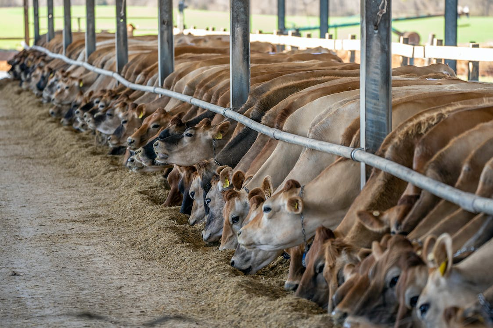
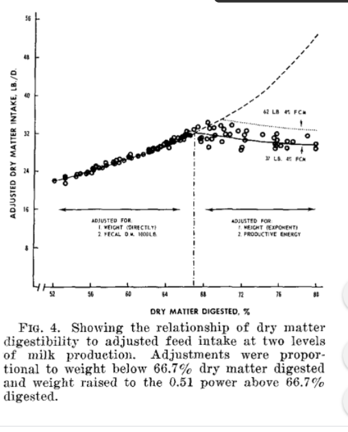

---
output:
  html_document: default
  pdf_document: default
  word_document: default
---

# Dry matter intake

```{r, include=FALSE}
knitr::opts_chunk$set(
  comment = '', echo = F, message = F, warning = F, cache = TRUE,
  out.width = '85%', fig.align = 'center', dpi = 300
)
```

```{r, echo = F, fig.align = "center", fig.cap = "Jersey cattle eating."}

library(webexercises)
library(emo)
```

::: {.lo}

**Learning Objectives**

1. List and explain two major theories of intake regulation. 
1. Discuss how animal, diet, and other factors influence dry matter intake. 
1. Use NASEM (2021) equations to predict dry matter intake. 

::: 


## Introduction to DMI

Dry matter intake (DMI) is critically important in animal nutrition because it establishes the amount of nutrients available to the animal. When balancing rations, the nutritionist must predict the amount of dry matter the animal will consume. The accurate prediction of DMI is formulate balanced rations. If actual DMI is less than expected, the animal will be underfed nutrients and fed a ration that is too "diluted" to meet its needs. This may have implications on health and productivity. If DMI is greater than predicted, the animal will be fed a ration that is too "concentrated" in nutrients. Over-consumption of nutrients is typically more expensive and can increase environmental outputs. 

## Two theories of DMI regulation

NASEM (2021) alludes to two major theories of intake regulation in ruminants:  physical fill feedback and fuel-sensing. These theories explain why certain animal, diet, and environmental factors affect DMI. 

**Physical fill limitations**

The physical fill (distension) of the gastrointestinal tract can signal satiety the the body. For example, researchers have inflated balloons in the stomachs of humans and other animals and shown that it decreased hunger (reviewed by Allen, 1996). The gastrointestinal tract only has room for a certain amount of digesta, so there are limitations to DMI based on the degree of physical fullness.

**Fuel-sensing**

Allen (2014) explained that ruminants can sense the body energy status that the ruminant liver can sense the body's energy status and send signals (afferents) to the brain to stimulate or inhibit feeding. This is referred to as hepatic oxidation theory (hepatic = related to the liver; oxidation = breakdown of fuels).

::: {.grey}

**Literature Deep Dive: **  

One of the articles mentioned by the NASEM (2021) committee is a famous study done by Conrad (1964). This figure from Conrad (1964) shows how DMI rises as digestibility improves from 52 to about 67% of DM. This could correspond to feeding "higher quality" feeds, which result in less rumen distension and pass through the digestive tract more quickly. If gut fill is not a limitation, the animal is able to eat progressively more as digestibility increases. However, there is a point (here, estimated at 67% digestibility), after which feed intake declines with increasing digestibility. One possible reason is that the animal's hunger and satiety signals stop them from eating more. This is referred to as "fuel-sensing."



Source: Conrad, H. R., Pratt, A. D., & Hibbs, J. W. (1964). Regulation of feed intake in dairy cows. I. Change in importance of physical and physiological factors with increasing digestibility. Journal of Dairy Science, 47(1), 54-62. [https://doi.org/10.3168/jds.S0022-0302(64)88581-7](https://doi.org/10.3168/jds.S0022-0302(64)88581-7){.uri}

:::  


::: {.orange}

**Analogy to humans: ** `r emo::ji("leafy_green")` vs. `r emo::ji("peanuts")`

If you prefer to think in human terms, picture a very unrealistic situation, in which a person loves lettuce (a high fiber, low digestibility food). This person loves lettuce so much that they are trying to meet their caloric needs by eating a lettuce-only diet. This person would have to eat a massive amount of lettuce...something like 30-50 pounds...to meet their requirement for kilocalories. But the gastrointestinal tract (GIT) will only physically hold a certain volume of digesta. Additionally, lettuce is difficult to digest, so it passes through the GIT slowly. Therefore, this person would probably reach a physical fill limitation to their DMI before their energy needs were met. Note that we have only discussed energy requirements, although there could likely be a shortage of nutrients too.

The lettuce-loving person is analogous to a ruminant consuming low-digestibility diet (sometimes referred to as "low-quality diet").

Now picture a person who loves peanut butter (a low-fiber, high-digestibility food). This person can meet their energy requirement by eating a small volume of peanut butter. Because it is easily digested, it will move more quickly through the GIT. Therefore, the physical fill of the GIT does not limit their DMI. Instead, fuel-sensing signals will regulate intake. This person could have a relatively non-distended GIT and not feel hungry, because the liver senses an influx in energy and sends satiety signals to the brain.

The peanut-butter-eating person is analogous to an animal consuming a high-digestibility diet.

::: 

## Animal factors

Thinking about the theories of intake regulation, we can see why certain animal factors affect DMI. Body weight increases the size of the digestive tract, allowing a greater volume of feed intake before physical fill limitations occur. Greater body weight also increases the animal's demand for nutrients, meaning that more feed will be required before satiety signals are triggered. Greater body condition score (BCS) near calving is associated with greater oxidation fatty acids derived from body reserves. As explained by the hepatic oxidation theory, this can lead to satiety signaling and decreased intake, potentially throughout the postpartum period. 

Milk production is another important factor in determining DMI. Milk production demands a tremendous amount of nutrients and energy. The need for nutrients and energy can sometimes cause the animal to feel hungrier, because the body senses that energy supply is insufficient relative to energy demand (Allen and Bradford, 2012). 

The consensus report does not explain why Parity affects DMI. However, there are several potential reasons. Compared to primiparous cows, multiparous cows have a larger digestive tract relative to their body size. This anatomical difference may affect their DMI independent of BW. Additionally, multiparous cows may have differences in satiety signaling compared to primiparous cows. 


## Diet factors

Various aspects of diet composition can affect DMI. For example, diets that are too dry (hay only) or wet (fresh pasture) can negatively affect DMI. Certain nutrient imbalances (e.g., too much fat or quickly-fermentable carbohydrates) can suppress the function of rumen microbes, causing feed to stay longer in the rumen and suppressing intake. These factors are discussed in greater detail in NASEM (2021), but not included in predictive equations. 

Originally, researchers thought that dietary fiber (NDF) was the most important factor to determining DMI (Mertens, 1994). This is a reasonable theory for a few reasons. First, the volume of a ration (or any particular feed ingredient) is closely related to its fiber content. Long-chopped forages are sources of fiber that have a large volume per unit of weight (low density). In contrast, concentrates are generally lower in fiber and have a low volume per unit of weight (high density). This difference in density means that higher fiber rations create more physical fill per unit of DMI. Second, fiber takes longer to digest than other nutrients, so it often passes more slowly through the digestive tract. High fiber diets could lead to physical fill limitations because they would decrease the rate of passage and increase the amount of digesta in the animal at any given point in time. Both of these principles have been tested over several decades of research and seem to be true. 

However, eventually researchers also found that the physical form of fibrous feeds affected DMI (Dado and Allen, 1995). For example, fiber from forages (fNDF) was less dense and passed slowly through the digestive tract, and limited intake. Conversely, fiber from concentrate sources such as byproducts (non-forage NDF) was fairly dense, passed relatively quickly through the digestive tract, and did not affect physical fill to the same extent. Therefore, it became important to differentiate between forage and non-forage fiber in determining DMI. 

## Other factors

The NASEM (2021) committee also discussed several other factors affecting DMI. Although these factors were not included in predictive equations, they mentioned a few important points:

* **Eating habits and cow behavior** - Feed availability affects how much cows eat. When cows have 24/7 access to feed, they may change their eating habits. Additionally, DMI can be affected by social interactions. Cows that are socially dominant tend to out-compete less-dominant peers to access the feed bunk. If bunk space is limited, this can drastically affect DMI. 
* **Feeding frequency** - Increasing the frequency of feeding or pushing up feed (moving feed closer to cows) has been shown to affect eating behavior, which may affect DMI. 
* **Sorting** - Sorting is when animals selectively consume some parts of the ration and not others. Typically, animals may sort out longer particles or dust, and selectively consume energy-dense or shorter-particle fractions. This means that the ration actually consumed by the animal can be different than the ration fed. 
* **Weather** - Cold ambient temperatures are predicted to increase DMI, whereas heat stress typically decreases DMI. 

## DMI in NASEM (2021)

NASEM (2021) gives the following equation to predict DMI for lactating Holsteins:

Eq. 2-1, p. 12
$$\begin{aligned}
DMI (kg/d) &= [3.7 + (5.7*Parity) + \\
&\quad (0.305*MilkE) + \\
&\quad (0.022*BW) + \\ 
&\quad   (-0.689-1.87*Parity)*BCS]*\\
&\quad  [1-(0.212+0.136*Parity)*e^{(-0.053*DIM)}]
\end{aligned}$$

$Parity$ is the proportion of cows that are multiparous (ranges from 0
to 1)  
$BCS$ is the body condition score from 1 (thin) to 5 (obese)   
$BW$ is the bodyweight in kg  
$MilkE$ is the energy produced in milk, in Mcal/d  
$DIM$ is the day in milk, an integer number of days since the start of
lactation  


Although various aspects of the diet can affect DMI, NASEM (2021) considers mainly fiber and forage fiber content in determining physical fill limitations. NASEM (2021) gives the following equation to predict DMI for lactating Holsteins based on both animal and diet factors:

Eq. 2-2, p. 13
$$\begin{aligned}
DMI (kg/d) &= 12.0-(0.107*fNDF) + \\
&\quad (8.17*ADF/NDF) + \\
&\quad (0.0253*fNDFD) + \\ 
&\quad   (-0.328*(ADF/NDF-0.602)) * (fNDFD-48.3) +\\
&\quad  (0.225*MY) +\\
&\quad 0.00390*(fNDFD-48.3)*(MY-33.1)
\end{aligned}$$

$fNDF$ is the forage NDF content of the diet as a percentage of diet DM  
$ADF/NDF$ is the ADF content of the diet (% of DM) divided by the NDF content of the diet (% of DM)   
$fNDFD$ is the digestibility of forage NDF measured *in vitro* or *in situ*  
$MY$ is the milk yield, in kg/d  

Forage NDF is determined by summing the NDF from forage sources. Starting with a list of ingredients and inclusion rates (% of DM), 1) Find out which ingredients are forages. This is listed in the NASEM (2021) Feed Library. 2) Determine the NDF content of the forage feeds as a percentage of ingredient DM. 3) Compute a weighted sum of forage ingredient NDF, where the weights are the inclusion rates of each forage ingredient $i$ in the diet. 


$$fNDF =  \sum_{i = 1}^{\text{n forages in diet}} w_i(NDF_i)$$

$fNDF$ is the sum of forage ingredient NDF, expressed as a percentage of diet DM (kg NDF from forages / 100 kg diet DM). 
$w_i$ is the weighting factor, the inclusion rate of feed $i$ in the diet as a proportion (kg ingredient / 1 kg diet). 
$NDF_i$ is the NDF content of the forage ingredient $i$ as a percentage of DM (kg NDF / 100 kg ingredient). 

::: {.orange}

**Example fNDF calculation: **  

**Inclusion of ingredients in diet** ($w_i$, proportion of diet DM)  
Corn silage 0.4
Alfalfa silage 0.2
Other non-forage ingredients 0.4

**NDF content of ingredients** ($NDF_i$, % of ingredient DM) 
Corn silage 45%  
Alfalfa silage 42%

$$(0.4*45)+(0.2*42)\\fNDF = 26.4\text{% of diet DM} $$

::: 


Importantly, the fNDFD is expressed as a percentage of forage NDF, in other words, the kg of digestible forage NDF per 100 kg of forage NDF. The ADF/NDF ratio is included as a proxy for forage fragility. Fragility is a measure of how readily the feed breaks apart when chewed by the animal, which affects its behavior throughout the digestive tract. 

```{r, eval = F}
# if forage, 
# NDF (kg NDF / 100 kg DM) * (kg dNDF / kg NDF) * (kg DM of feed)
# kg NDF cancels
# kg DM cancels
# remaining units are kg dNDF / kg DM
# This is divided by kg forage NDF / kg diet DM, which gives final units
# kg dNDF / kg fNDF
# Second equation is used in DMI 
  Dt_ForDNDF48 <- sum((1-f$Fd_Conc/100) * f$Fd_NDF*f$Fd_DNDF48/100*Fd_DMInp,  na.rm=TRUE)  #should be updated to use TT_dcFdNDF_Base so it could be referenced to in vivo.
  Dt_ForDNDF48_ForNDF <- Dt_ForDNDF48 / Dt_ForNDF * 100
  # Sum of forage ingredients
  # NDFi * NDFDi * Fd_DMInp
  # o determine the fNDFD for the diet (kg digestible NDF / 100 kg diet NDF), one must find the fNDFD for each of the forage ingredients and compute a weighted sum, where the weights are the NDF content of each ingredient $i$. Then, the NDFD must be converted to a diet DM basis by  

```


***Which equation should I use?***
It is up to the nutritionist to decide which DMI equation is most appropriate. For example, when a diet with a large amount of forage NDF is fed, it may be reasonable to use Eq. 2-2 because physical fill limitations may play a large role in determining DMI. In contrast, Eq. 2-1 may be useful when trying to estimate DMI separately for groupings based on animal factors. For example, farms may group primiparous and multiparous cattle separately and feed them separate rations. It is also common to feed a separate ration for cows with very high milk production. Determining DMI for these groups requires an equation that accounts for animal effects. 

## Examples

### NASEM dairy-8

`r hide("Show NASEM dairy 8 example")`

1. Open NASEM dairy-8. 
1. Load one of the default simulations, for example by clicking File > Load Simulation > "Example-Lactating-Cow-DIM-050." *NOTE:  The equations in this chapter only apply to lactating cows, so please be sure you select an appropriate simulation.*
1. Under Inputs (tile) > Animal Description/Management, take a look at the body weight, body condition score, and parity inputs. 
1. Under Inputs > Production, look to see which milk production is expected for this default simulation. 
1. Under the Feeds tile, look at what is included in the ration.
1. Click "Reports" tile in the top menu. 
1. Check "All" under "Select one or more reports," or select only "Report 1" for a shorter output. Then hit the button "Generate Selected Reports." A Word Document will appear for download. 
1. In the report, Table 1.2 shows "Entered Performance" with "Estimated DMI Based on Animal" (Eq. 2-1) and "Estimated DMI Based on Animal/Fiber" (Eq 2-2). 
1. Another way get the Eq. 2-2 DMI prediction is to click the Ration tile and look near the bottom left of the screen to see "Estimated Intake Based on Animal and Diet."

`r unhide()` 

### R 

`r hide("Show R example")`

```{r, echo=TRUE, eval = F}
# Define a function for DMI Eq 2-1
DMI_2_1 <- function(Parity, MilkE, BW, BCS, DIM) {
  DMI <- (3.7 + (5.7 * Parity) +
    (0.305 * MilkE) +
    (0.022 * BW) +
    (-0.689 - 1.87 * Parity) * BCS) *
    (1 - (0.212 + 0.136 * Parity) * exp(-0.053 * DIM))

  return(DMI)
}

# Parity is the proportion of cows that are multiparous (ranges from 0 to 1)  
# BCS is the body condition score from 1 (thin) to 5 (obese)   
# BW is the bodyweight in kg  
# MilkE is the energy produced in milk, in Mcal/d  
# DIM is the day in milk, an integer number of days since the start of lactation  

Parity = 0.5 # half multiparous
MilkE = 25
BW = 650
BCS = 3.5
DIM = 100

result = DMI_2_1(Parity, MilkE, BW, BCS, DIM)
paste("DMI 2-1:", round(result, 3))

##################################
 
# Define a function for DMI Eq 2-2
DMI_2_2 <- function(fNDF, ADF_NDF, fNDFD, MY) {
  DMI <- 12.0 - (0.107 * fNDF) +
    (8.17 * ADF_NDF) +
    (0.0253 * fNDFD) +
    (-0.328 * (ADF_NDF - 0.602)) * (fNDFD - 48.3) +
    (0.225 * MY) +
    0.00390 * (fNDFD - 48.3) * (MY - 33.1)

  return(DMI)
}
# fNDF is the forage NDF content of the diet as a percentage of diet DM  
# ADF/NDF is the ADF content of the diet (% of DM) divided by the NDF content of the diet (% of DM)   
# fNDFD is the digestibility of forage NDF measured *in vitro* or *in situ*  
# MY is the milk yield, in kg/d  

ADF_NDF = 0.75
fNDF = 30
fNDFD = 50
MY = 35

result = DMI_2_2(fNDF, ADF_NDF, fNDFD, MY)
paste("DMI 2-2:", round(result, 3))
```

`r unhide()` 

### Python

`r hide("Show Python example")`

```{python, echo = T, eval = F}
# import package to use exp. 
import math

# Define a function for DMI Eq 2-1
def DMI_2_1(Parity, MilkE, BW, BCS, DIM):
    DMI = (3.7 + (5.7 * Parity) + \
           (0.305 * MilkE) + \
           (0.022 * BW) + \
           (-0.689 - 1.87 * Parity) * BCS) * \
          (1 - (0.212 + 0.136 * Parity) * math.exp(-0.053 * DIM))
    return DMI

# Parity is the proportion of cows that are multiparous (ranges from 0 to 1)
# BCS is the body condition score from 1 (thin) to 5 (obese)
# BW is the bodyweight in kg
# MilkE is the energy produced in milk, in Mcal/d
# DIM is the day in milk, an integer number of days since the start of lactation

Parity = 0.5 # half multiparous
MilkE = 25
BW = 650
BCS = 3.5
DIM = 100

result = DMI_2_1(Parity, MilkE, BW, BCS, DIM)
print("DMI 2-1:", result)

##################################
 

# Define a function for DMI Eq 2-2
def DMI_2_2(fNDF, ADF_NDF, fNDFD, MY):
    DMI = 12.0 - (0.107 * fNDF) + \
          (8.17 * ADF_NDF) + \
          (0.0253 * fNDFD) + \
          (-0.328 * (ADF_NDF - 0.602)) * (fNDFD - 48.3) + \
          (0.225 * MY) + \
          0.00390 * (fNDFD - 48.3) * (MY - 33.1)
    return DMI

# fNDF is the forage NDF content of the diet as a percentage of diet DM
# ADF/NDF is the ADF content of the diet (% of DM) divided by the NDF content of the diet (% of DM)
# fNDFD is the digestibility of forage NDF measured *in vitro* or *in situ*
# MY is the milk yield, in kg/d

ADF_NDF = 0.75
fNDF = 30
fNDFD = 50
MY = 35

result = DMI_2_2(fNDF, ADF_NDF, fNDFD, MY)
print("DMI 2-2:", result)

```

`r unhide()` 

## Questions

1. What is DMI and why is it important in animal nutrition?
1. What are two theories explaining DMI? Give an example of each. 
1. How do body weight, body condition, and milk production affect DMI?
1. What aspects of diet composition affect DMI?
1. Describe other factors mentioned by the NASEM (2021) committee as important to DMI. 
1. Describe the two equations for DMI given in NASEM (2021) and give an example of when each might be useful. 

