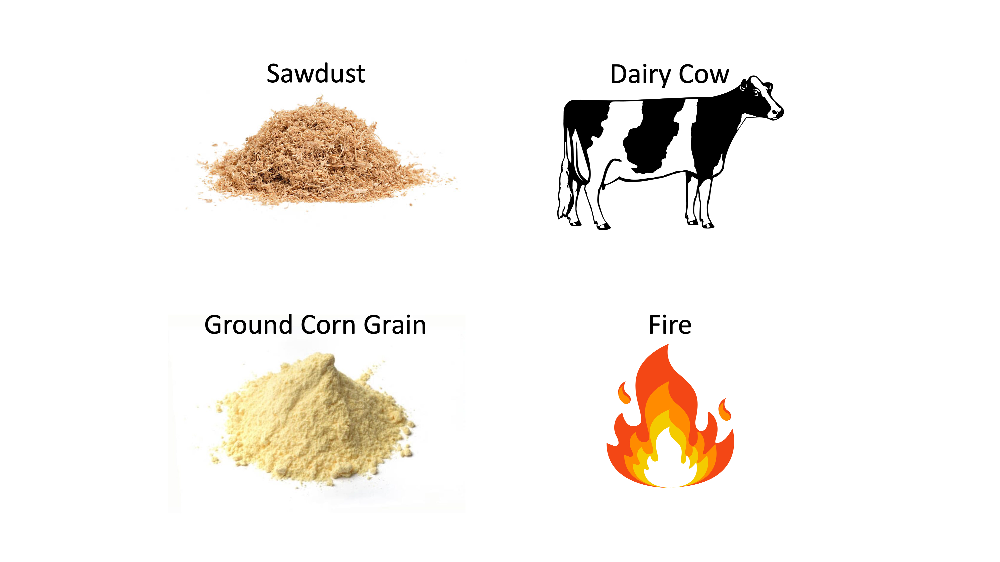

---
output:
  html_document: default
  pdf_document: default
  word_document: default
---

# Energy overview

```{r, include=FALSE}
knitr::opts_chunk$set(
  comment = '', echo = F, message = F, warning = F, cache = TRUE,
  out.width = '85%', fig.align = 'center', dpi = 300
)
```

```{r, echo = F, out.width = '100%', fig.align = "center", fig.cap = "Two energy sources and two energy reactors to be discussed in this chapter!"}

library(webexercises)
```

::: {.lo}

**Learning Objectives**

1. Give a definition of energy in physics/chemistry.
1. Explain how energy affects biological systems.
1. Describe a technique to measure energy content.
1. Discuss why chemical compounds differ in their potential metabolic/combustion energy. 

::: 


## Introduction

The opening picture for this chapter shows sawdust, ground corn, a dairy cow, and a fire. This is to illustrate two energy sources (sawdust and ground corn) and two energy reactors (dairy cow and fire). By combining a source and reactor within certain environmental conditions, we create a system. Assuming similar environmental conditions, we can explore a few hypothetical options. 

1. **Burn the sawdust and ground corn.** If you burnt a similar amount of both substances in a fire, which substance would give off more heat?

1. **Feed the sawdust and ground corn to a lactating dairy cow.** If you fed the sawdust and ground corn to a lactating dairy cow, which substance could the cow derive more energy from?

Potential energy is a property of a *system*, not just one substance. In physics, energy is often discussed in relation to mechanical work (movement). A system could consist of a ball at the top of a hill, which has potential energy. In chemistry, we discuss chemical potential energy, the energy "contained" in chemical bonds. Here, a system could involve reactants at certain temperature, pressure, and other conditions. Chemical potential energy refers to the energy that could be released during reactions, when bonds are broken and formed. In nutrition, we generally discuss chemical potential energy and the system is always animal metabolism. Nutritionists categorize various chemicals based on their potential to produce energy within the metabolic reactions occurring inside animals.  

In this chapter, we will discuss some basic principles of energy from chemistry, physics, and biology. Then, we'll delve into their application to animal nutrition. The chapter will also provide some hints about how energy is considered in the NASEM (2021) dairy nutrition model. 

::: {.green}

**Test Yourself: **
True or false:  energy is a nutrient. `r torf(FALSE)`

`r hide("click here for an explanation")`

Although energy is required by the dairy cow, it is not a nutrient. The nutrients fat, carbohydrate, and protein yield energy.

`r unhide()` 
:::  


## Chemical/physical laws

Animals, like everything else on earth, must follow the Laws of Thermodynamics:

* **The First Law of Thermodynamics** states that energy cannot be created or destroyed. Energy can be transferred or converted from one form to another. As it pertains to animal nutrition, Weiss (2008) summarized this as "energy input must equal energy output plus or minus any change in body energy." This is the "conservation of energy" principle discussed in the Systems Concepts chapter of this textbook. In nutrition, this principle is built-into the energy scheme where the total input energy (gross energy) must equal the sum of the energy in output and transformation flows (NE, and energy in heat, urine, feces, and gas emissions). 

* **The Second Law of Thermodynamics** states that the entropy, or disorder, of a system tends to increase over time. Increases in entropy always result in the release of heat. In nutrition, this means that some loss of energy (from the animal) as heat during metabolism is inevitable. This law also applies in other situations. When a person drives a gasoline-powered car, the potential energy contained in the fuel cannot be perfectly turned into mechanical energy, and some is released as heat. It is also important to remember that this law applies to closed systems. 


## Measuring energy with calorimetry

For several hundred years, calorimetry has been the main way used to measure energy involved in chemical processes. In **direct calorimetry,** a container of water is placed around a small chamber. Inside the chamber, a substance is burned. When substances burn in open air, they release energy in several forms, including heat, light, and sound. The amount of heat production is directly proportional to (not equal to) the potential energy content of the substance when oxidized. The researcher measures the temperature change in the surrounding water. Calorimetry works because of the conservation of energy. The energy released by burning a substance is not created or destroyed...it is transferred to the surrounding water.

::: {.orange}

**Indirect calorimetry**  
Another way to study energy metabolism is through indirect calorimetry. In this method, heat production is not *directly* measured. Instead, the composition of exhaled gas is analyzed to estimate the consumption of $O_2$ and production of $CO_2$ over time. From these quantities, it is possible to infer the amount of heat production as well as the types of fuels being used.

In human medicine, a device called a metabolic cart is used for indirect calorimetry. The patient rests quietly while breathing into a face mask or other device that measures their exhaled gases. This type of analysis can be used to estimate resting metabolic rate (sometimes called basal metabolic rate).

In dairy cattle nutrition, face masks are not practical. Instead, researchers create stalls for animals inside sealed rooms called respiratory chambers. By measuring the gas entering and leaving the respiratory chamber, they can make predictions about metabolism.

:::

Calorimetry was invented more than 200 years ago by a French nobleman named Antoine Lavoisier (1743-1794) and French mathematician Pierre-Simon Laplace (1749-1827). These two were the first to propose an interesting question:

> Is an animal's energy metabolism analogous to a fire?

Lavoisier and Laplace did experiments to test this hypothesis using calorimeters. First, they burnt feeds in the calorimeters with a small flame. This reaction consumed oxygen ($O_2$) and produced ($CO_2$), water ($H_2O$), heat, light, and sound. Then, they found an animal small enough to sit inside the calorimeter--a mouse! As the mouse sat inside the calorimeter, its metabolic reactions consumed ($O_2$) and produced ($CO_2$), water ($H_2O$),  heat, and movement. 

As a result of these experiments, it became clear that burning substances (combustion, an oxidation process) was similar to metabolism (which involves other oxidation processes). The equations for metabolism and combustion of energy-containing nutrients (carbohydrates, fats, amino acids, etc.) are similar in form. Both processes can be described simply as follows:

$$Fuel + O_2 \rightarrow CO_2 + H_2O + energy$$
Another interesting result from early calorimetry studies was the finding that certain substances released more heat when burned compared to others. This led to another question...

> During oxidation, why do some substances seem to release more energy than others?

To figure this out, we need to delve into a little chemistry. What's happening when we combust a substance? First, the initial supply of heat applied to the substance (a match or bunsen burner) decomposes the substance's chemical macrostructure, breaking larger molecules (polymers) into smaller molecules (monomers). Then, the smaller molecules can chemically react with oxygen as shown in the equation above. The amount of energy produced by the combustion reaction depends on which monomers are reacting with oxygen, and what bonds are they contain. 

With respect to nutrition, you may have heard that fats provide more energy than carbohydrates or proteins when metabolized. A common rule of thumb states that the kilocalories per gram supplied by fats $\approx$ 9, proteins $\approx$ 4, and carbohydrates $\approx$ 4. To see why, we can compare a fat monomer (palmitic acid) with a carbohydrate monomer (glucose).

```{r, echo = F, out.width = '100%', fig.align = "center", fig.cap = "Comparison of bonds in a fat monomer, palmitic acid (A), with a carbohydrate monomer (B) glucose, and a protein monomer, lysine (C)."}

knitr::include_graphics("images/energy_comparison.png")
```

::: {.green}

**Test Yourself: **  
What do you notice about these molecules?
Which molecule has the greatest percentage of C-C and C-H bonds? `r mcq(c(answer = "palmitic acid", "glucose", "lysine"))`

:::  

Palmitic acid contains a large percentage of C-C and C-H bonds:  
C-C 15  
C-H 31  
C=0 1  
C-O 1  
O-H 1  

In contrast, glucose contains a mixture of C-C, C-H, C-O, C=O bonds:  
C-C 5  
C-O 5  
C=O 1  
O-H 5  
C-H 7  

When molecules containing lots of C-C and C-H are combusted, many C-C and C-H bonds are broken, and many C=O and O-H bonds are formed in the $CO_2$ and $H_2O$ products. In relation to oxidation, C-C and C-H bonds have more potential energy than some other types of bonds (e.g., C-O). Another way to think of this is that C-H and C-C bonds are less stable than C-O bonds. This is because O is more electronegative and has a stronger "desire" for electrons than C or H (C, H, and O; 2.5, 2.2, and 3.4 electronegativity respectively, on Pauling scale). Therefore, a C-C or C-H bond is like a ball at the top of a hill...it is unstable (weak bond) and has a lot of potential energy. A C-O bond is like a ball at the bottom of a hill. It is more stable (strong bond) and has less potential energy. Moving from the less-stable to more-stable state releases energy, like a ball rolling down a hill. 
Another way to think about heat production is through bond enthalpies. Through experiments, chemists have determined the average energy associated with dissociation of certain bonds at standard temperature and pressure, in a gas phase. The table gives some examples of the energy associated with different types of bonds. Importantly, these must be interpreted with respect to a *system* (i.e., a reaction in certain conditions, typically standard temperature and pressure and gaseous phase reactants). 

```{r}
# https://courses.lumenlearning.com/wm-biology1/chapter/reading-electrons-and-energy/
# http://virtual.vtt.fi/virtual/innofirewood/stateoftheart/database/burning/burning.html wood burning
bond <- c("C-H", "C-C", "C-O", "O=O", "C=O", "O-H")
bond_energy <- c(413, 348, 358, 498, 805, 464)
df = tibble(Bond = bond, `Average Bond Enthalpy (kJ/mol)` = bond_energy)
kable(df, escape = F) %>% kable_styling(full_width = F)
```

::: {.blue}

**Combustion of methane**  

If your house has a gas stove, you have probably combusted methane to produce heat. The reaction can be described like this:

$$CH_4 (g) + 2O_2 (g) \rightarrow CO_2 (g) + 2H_2O (l)$$

In this reaction, some bonds are broken:   
4 mol C-H  
2 mol O=O  

and some bonds are formed:  
2 mol C=O  
4 mol H-O  

It is possible to estimate the heat produced by this reaction using average bond enthalpies. Importantly, average bond enthalpies apply to gases. If one of the reactants or products is a liquid, the calculation must include an extra step to account for the enthalpy change of vaporization. 

Bond enthalpies ($kJ \space mol^{-1}$)  
C-H	+413  
O=O	+498  
C=O in carbon dioxide	+805  
O-H	+464  
Conversion of water from liquid to gas +41 (enthalpy change of vaporization)  

Enthalpy change = bonds broken - bonds formed  
Enthalpy change = $[4*413 + 2*498] - [2*805 + 4*464 + 2*41]$
= $-900 \space kJ$  

This means that approximately 900 kJ of heat are given off (applied to the surroundings) as a result of this reaction. Here, we can also see that going from weaker C-H bonds to stronger C=O and O-H bonds releases energy to the surroundings. 

::: 


## Biological importance of energy

Energy is involved in every chemical reaction in the body. Collectively, the entire sum of reactions that maintain an organism's life is referred to as **Metabolism**. During metabolism, energy is transferred through oxidation and reduction reactions. Metabolism includes catabolic and anabolic reactions.

In **catabolism**, larger molecules such as proteins, fats, and carbohydrates are gradually broken down and oxidized, producing carbon dioxide and water, and releasing energy to the surroundings.  Examples of catabolism include proteolysis, glycogenolysis, and lipolysis. The processes of digesting feed and mobilizing body reserves are catabolic. As a whole, catabolism is exergonic, i.e., it releases energy to its surroundings. 

In **anabolism**, larger molecules are built from smaller molecules. This results in storage of energy within the animal system. Overall, anabolism is endergonic--storing energy. Examples of anabolism include protein synthesis, glycogenesis, and lipogenesis. In dairy cattle, the synthesis of fats, proteins, and lactose in milk are anabolic processes that requires a great deal of energy. 

Energy is required to maintain the constant balance of catabolic and anabolic processes that maintains life. These reactions not only grow and remodel the body's physical form, they also produce the heat that maintains the animal's body temperature at the conditions required to survive in its environment. In skeletal muscle, chemical energy is converted to mechanical energy so the animal can move around. In summary, energy is central to nearly every process involved in an organism's function.   

## Energy in nutritional processes

In human and animal nutrition, energy is defined in relation to ordered nutritional processes. This conceptualization of energy has existed for decades and is not particular to the NASEM (2021) model. 


```{r, echo = F, out.width = '85%', fig.align = "center", fig.cap = "Fractionation of energy within an animal nutritional system."}

```


**Gross Energy (GE)** represents the total amount of chemical energy in a feed before undergoing any digestive processes. The amount of GE depends solely on the chemical composition (i.e., nutrient fractions) of the feed, so GE does not change for different animal characteristics. For this reason, estimation of GE is very precise. However, GE is not very useful for diet formulation because not all the energy can be digested, metabolized, or used for body functions.

**Digestible Energy (DE)** is the energy remaining after subtracting fecal energy losses. DE requires estimation of the digestibility of feed nutrients ([intake - fecal excretion]/intake), which depends on animal factors. Therefore, DE is estimated using animal trials where feed energy intakes and fecal energy outputs are recorded. Additionally, scientists have developed in vitro assays that mimic digestion processes and can be used to estimate DE. Because DE is affected by animal factors, DE estimates are less precise than GE.

**Metabolizable Energy (ME)** is the energy that [*can*]{.underline} support body functions such as growth, movement, lactation, and accretion of body reserves. ME is calculated as the energy remaining after accounting for losses in feces, urine, and gas. Compounds excreted in urine contain some energy (urea,$CH_4N_2O$ accounts for a large fraction of urine energy), and enteric fermentation releases gases that contain some energy (methane, $CH_4$). These are counted as energetic losses because the body has not completely oxidized the compound to $CO_2$ and there is still some energy remaining. Measuring ME involves not only measuring DE, but also collecting and conducting calorimetry on urine samples, and measuring gas production. Because of these additional sources of error, ME estimates are even less precise than DE.

**Net Energy (NE)** is the energy that is actually [*does*]{.underline} support body functions such as growth, movement, lactation, and accretion of body reserves. NE is calculated as ME minus the heat released in metabolic reactions. Although it is possible to measure the heat produced by an animal in a whole-animal calorimeter, this is rarely done in practice (Weiss, 2008). Although NE estimates are less precise, it is perhaps the most useful energy quantity for nutritionists, because we are focused on predicting animal health and performance outcomes.

> Far better an approximate answer to the right question, which is often vague, than an exact answer to the wrong question, which can always be made precise. 
John Tukey, The future of data analysis. Annals of Mathematical Statistics 33 (1), (1962), page 13.

::: {.green}

**Test Yourself: **  

1. Which of the fractions above could you determine using only a calorimeter and feed, without an animal or other laboratory equipment? `r mcq(c(answer = "GE", "DE", "ME", "NE"))`

1. Which fraction requires using calorimetry to determine urine energy losses? `r mcq(c("GE", "DE",  answer =  "ME"))`

1. True or false:  you could determine DE by burning feed and feces in a calorimeter. `r torf(TRUE)`

1. Which of the fractions above accounts for energy lost as heat? `r mcq(c( "GE", "DE", "ME", answer = "NE"))`

1. True or false:  GE is the most useful fraction for ration formulation. `r torf(FALSE)`

:::  

## Conclusions

Let's return to the hypothetical scenarios originally posed at the beginning of the chapter. Use what you learned in this chapter to try to answer the questions. 

1. **Scenario:  Burn sawdust and ground corn.** Assume you are given sawdust and ground corn that had similar GE values on a DM basis (Mcal GE per g DM). If you burnt the same amount (g of DM) of both substances in a fire, which substance would give off more heat? Why?

`r hide("click here for an answer")`

Both substances have similar GE values. This means that they will produce a similar amount of heat when burnt. Neither will produce more heat...the amount of heat produced for each will be similar. 

`r unhide()` 


2. **Feed the sawdust and ground corn to a lactating dairy cow.** If you fed the same GE-equivalent sawdust and ground corn to a lactating dairy cow, which substance could the cow derive more energy from? You can assume the sawdust is less digestible than the corn grain. Explain your reasoning in terms of GE, DE, ME, and NE.

`r hide("click here for an answer")`

Although both substances have similar GE values, the lower digestibility of sawdust means that its value to the animal is less than that of corn grain. Because DE for sawdust will be lower than corn grain, ME and NE will also be lower. Thus, the sawdust has less energy value to the cow than the corn grain, despite both substances having similar GE values.

`r unhide()` 

::: {.orange}

**Just for fun: **  

Look at the "Nutrition Facts" label on a human food item. The label shows the grams of metabolizable fat, protein, and carbohydrates in the food. Use the macronutrient composition to get a rough approximation of the kilocalorie content of the food, using the rule of thumb:  kilocalories per gram supplied by fats $\approx$ 9, proteins $\approx$ 4, and carbohydrates $\approx$ 4. Note that kcal are often abbreviated as "calories" in human nutrition.

Check against the calorie content reported on the label. Do they match?

```{r, echo = F, out.width = '30%', fig.align = "center", fig.cap = "Nutrition facts for human food label."}
knitr::include_graphics("images/nutrition_facts.png")
```

:::  


## Questions

1. Describe a technique used to measure the energy associated with chemical processes. 
1. Differentiate direct and indirect calorimetry. 
1. How does energy affect biological systems?
1. What is the First Law of Thermodynamics? How does it apply to nutrition?
1. What is the Second Law of Thermodynamics? How does it apply to nutrition?
1. What is a general equation that describes both combustion and metabolism, with respect to calorimetry?
1. Why do some substances release more energy than others during oxidation? 
1. Define GE. 
1. Define DE and list sources of error in DE estimation. 
1. Define ME and list sources of error in ME estimation. 
1. Define NE and list sources of error in NE estimation. 


## References

Weiss, W.P. (2008). Feed Energy Applications. Paper originally published in the 2008 Proceedings of 4-State Dairy Nutrition Conference, p. 22-27.

Bond enthalpy table from:
https://chem.libretexts.org/Courses/Mount_Royal_University/Chem_1202/Unit_5%3A_Fundamentals_of_Thermochemistry/5.8%3A_Standard_Enthalpies_of_Formation
