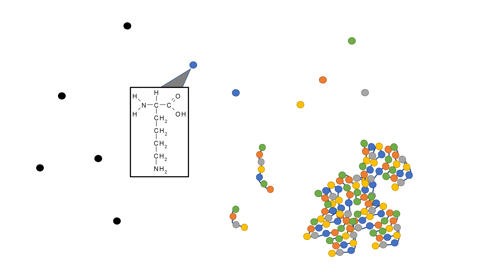

---
output:
  html_document: default
  pdf_document: default
  word_document: default
editor_options: 
  markdown: 
    wrap: 72
---

# Protein overview
```{r, echo = F, fig.align = "center", fig.cap = "Crude protein includes nonprotein nitrogen (symbolized by black circles), and amino acid nitrogen (symbolized by multicolor circles), where the amino acid N can be arranged in various forms."}

```

```{r, echo = F}
#knitr::include_graphics("images/protein_system.png")
library(webexercises)
library(kableExtra)


# POTENTIAL ADDITION 
#4.  Explain the concept of a "limiting AA" and discuss its relevance
#    (and complications) when applied to dairy nutrition.

```


```{r, include=FALSE}
knitr::opts_chunk$set(
  comment = '', echo = F, message = F, warning = F, cache = TRUE,
  out.width = '85%', fig.align = 'center', dpi = 300
)
```

```{r, echo = FALSE}
library(ggplot2)
theme_set(theme_classic())
```

::: lo

**Learning Objectives**

1.  Explain the importance of proteins in body functions.

1.  Define crude protein, true protein, and non-protein nitrogen.

1.  Explain the goals of protein nutrition in terms of economic and
    environmental tradeoffs.
    
1.  Differentiate essential, non-essential, and conditionally-essential
    amino acids.

1.  Discuss why AA, and not just nitrogen, are considered in nutritional models.

:::


## Biological definition of protein

Biologically, proteins are defined as macromolecules comprised of many
amino acids bonded together. Proteins are required for structure,
function, and regulation of the body. For example:

-   actin and myosin proteins contract muscles
-   collagen and elastin, proteins in connective tissue, provide
    structural support
-   protein hormones such as insulin and vasopressin regulate body
    processes
-   hemoglobin carries oxygen in the blood
-   immunoglobulin proteins (antibodies) participate in the immune
    response

All proteins contain nitrogen, because every amino acid has an amino
group ($-NH_2$). All proteins also contain carbon, hydrogen, and oxygen.
Some proteins contain sulfur, iron, copper, or other elements. Although
every protein contains N, the N content of a given AA or protein varies.

Across the animal kingdom, dietary AA absorbed in the small intestine
are used to synthesize body proteins and output proteins during
translation. In some animals (e.g., ruminants) a microbial community
enables more significant use of dietary non-protein nitrogenous
compounds for protein synthesis. This is one reason why the nutritional
definition of protein is slightly different from its biological
definition.

```{r, echo = F, fig.align = "center", fig.cap = "A. Free amino acids. B. Peptides, which are chains of AA. C. An example protein, which is a large molecule formed by a sequence of ~50 to 2000 AA, and takes on a 3-dimensional structure that can include multiple subunits"}
knitr::include_graphics("images/AAtoProtein.png")
```

## Nutritional definitions of protein

In animal nutrition, "protein" is defined in more practical, measurable
terms. The simplest nutritional term for protein is crude protein (CP).
The CP fraction in a feed sample is determined by the laboratory
analysis of the total nitrogen (N) content in the sample multiplied by
6.25.

$$ CP = N * 6.25$$

where CP is crude protein expressed in any unit (% of the DM, grams, or
g/d for example), N is N content in the same unit, and 6.25 is a
conversion factor that assumes that on average 1 g of N is found is 6.25
g of protein.The nutritional definition of protein therefore includes all
N-containing compounds. This means that it accounts for both:

-   **true protein (TP)**, which consists of AA; and

-   **non-protein nitrogen (NPN)** which includes all other nitrogenous
    compounds that are not AA. NPN includes compounds such as urea,
    ammonia, nucleotides (in DNA and RNA), and choline. Although these
    compounds are not protein, they still contain N.

The amount of CP is the sum of the amounts of TP and NPN. For many feed
and output proteins, the majority of CP is TP. For example, the protein
in cow milk is approximately 5% NPN and 95% TP.

$$ CP = TP + NPN $$

In non-ruminant animals, TP is the only usable fraction of CP, and the
NPN fraction is of little use. Yet ruminants, or more exactly the
microbes that populate the rumen, can use NPN to grow. Through microbial
growth processes, some of the NPN in CP are converted into true protein
(AA) that the host animal (the cow) can use.


```{r, echo = F, fig.align = "center", fig.cap = "Examples of N-containing compounds that would be included in CP. A. Urea molecule, an example of NPN. B. Thymine, a nucleic acid which is NPN. C. Lysine, an AA which would be considered TP."}
knitr::include_graphics("images/NPNvsAA.png")
```

::: grey

**NPN Literature Deep Dive**

In experiments throughout the 1950s and 60s (e.g., Virtanen, 1966),
researchers fed cows NPN (e.g. ammonium sulfate, urea) labeled with a
stable isotope ($^{15}N$). By collecting and analyzing milk from these
cows, they were able to prove that the same label N from the feed NPN
sources appeared later in every type of amino acid found in the cow's
milk. In other words, the labeled N from NPN was transformed to amino
acids, absorbed by the cow, and incorporated into milk protein. This
proved that the microbiota can synthesize (at least to a small extent)
every type of AA found in milk protein.

Virtanen, A. I. (1966). Milk Production of Cows on Protein-Free Feed: Studies of the use of urea and ammonium salts as the sole nitrogen source open new important perspectives. Science, 153(3744), 1603-1614. 

Still, it is important to remember that feeding CP with a large fraction of NPN can depress growth and
production relative to feeding CP with lesser NPN (and consequently more
true protein). Many NPN sources, e.g., urea, are very quickly degraded
in the rumen and can cross into the bloodstream as ammonia. Too much
ammonia in the blood can be toxic, and even kill animals (ammonia/urea
toxicity). For these reasons, protein composition and kinetics need to be carefully managed in the
ration.

:::

An important limitation built into any CP value is that proteins contain
16% N, which means that in each 100 g of protein, there are 16 g of N.
Thus 1 g of N measured in the laboratory corresponds to 6.25 g of
protein (100/16). Thus, remember that the N content of a feed will
always be 6.25 times lower than its CP content. In reality 16% N in
protein is an average obtained across many feed protein sources and N
content of proteins actually varies from 13 to 19%, which should equate
to variable conversion factors ranging from 5.26 to 7.69 (FAO, 2003).

One notable exception for us as nutritionists interested in milk
production, is that N content of milk CP contains 15.77% N. Thus the N
to CP conversion factor is 100/15.77 = 6.34 (NASEM, 2021).

Another consequence of the assumptions made in calculating CP is that
some feed may have a CP value greater than 100%! For example, feed grade
urea, which can be used in dairy rations as a source of NPN, typically
contains 46% N. Following the 6.25 rule, the CP of urea is 287%.

Although CP is not a perfect measure of protein *per se*, it provides a
common and measurable starting point for nutritional models. CP can be
determined through a standardized and simple laboratory technique, which
makes it practical for large-scale use across many feeds and farms. The
NASEM model discusses the CP, TP, and NPN contents not just of feeds,
but also of other quantities (e.g., microbial protein, feces, urine), so
these definitions will be important to remember.

::: green
**Test Yourself**

1. True or false. Monogastric animals can derive significant amounts of metabolizable protein from NPN. `r torf(FALSE)`.  
1. Which of the following is considered true protein? `r mcq(c(answer = "AA", "urea", "nucleotides", "creatinine"))`.  
1. Which of the following is an example of NPN? `r mcq(c("myosin", "amino acid", answer = "urea", "CH4"))`.  
1. Calculate the percent of N in alfalfa silage with 20% CP (on a DM
basis) `r fitb("3.2")` % of DM (1 digit after decimal)   

`r hide("click here for an explanation")`

$$ CP = N * 6.25\\
20 = N * 6.25\\
\frac{20}{6.25} = N \\
N = 3.2\text{% of DM}
$$ `r unhide()`
:::

## Goals of dairy protein nutrition

Because ruminants can convert non-protein nitrogen to amino acids thanks to rumen microbes, protein nutrition is intertwined with nitrogen nutrition. In general terms, goals in protein and nitrogen nutrition in dairy cattle include:

1. manage the kinetics of ruminal N degradation and N recycling to support microbial protein synthesis.  
1. supply adequate amounts of amino acids (AA) to the small intestine to meet animal needs.
2. reduce losses of N in manure.

For lactating dairy cattle, optimizing milk protein output is a central goal. Milk protein supplies 20% of the protein consumed by American people (NHANES, 2010), making it important for human nutrition. The dairy industry also supplies 21% of the beef consumed in the U.S. (Moreira et al., 2021). Although milk and meat production is important to human nutrition domestically, it is arguably more critical in developing countries where protein and energy undernutrition is more common (FAO, 2018).

Manure N is part of a naturally-occurring N cycle. However, excess manure N is an environmental concern because of its potential contribution to water quality degradation (nitrate in drinking water for example) and because of its contribution to air quality degradation (emission of ammonia, which can perturb the balance of natural ecosystem, and emission of nitrous oxide, which is a very potent greenhouse gas contributing to climate change). Therefore, feeding the human population must be balanced with stewardship of the environment. 

::: {.green}

**Test Yourself: **  
1. Which of the following is a goal of protein and nitrogen nutrition in dairy cattle? 
`r mcq(c("Promote ruminal N degradation", "Maximize losses of N in manure", answer = "Optimize productivity"))`  
1. Which GHG is produced as a result of the N cycle? `r mcq(c("CO2", "NH3", "NO2", "N2", answer = "N2O"))`

:::  

## The animal protein system

In the subsequent activities, we will explore the animal protein system. Recalling from previous chapters (Systems Concepts), the animal's protein system involves input, output, and transformation flows. The system includes a core sequence of nutritional processes (ingestion, digestion, absorption, assimilation/use). Protein models describe these features with respect to protein and protein-related nutrients. 

- Ingestion (as Crude Protein) 
- Rumen degradation (as Rumen-Degraded Protein) and passage (as Rumen-Undegraded Protein) and microbial protein synthesis  
- Intestinal digestion; absorption to circulation (as Metabolizable Protein) 
- Assimilation and/or use (as Net Protein) for output flows such as milk protein and maintenance proteins (in hair, hooves, and digestive tract) and transformation flows such as body reserve gain


```{r, echo = F, fig.align = "center", out.width = '100%', fig.cap = "Depiction of protein flows in ruminant animals. Figure shows how protein proceeds through the digestive tract, NPN and AA are absorbed into circulation, and NPN and AA in circulation follow various paths."}
knitr::include_graphics("images/protein_system.png")
```

As the figure illustrates, protein flows in the animal are quite complex. The NASEM (2021) model does not depict every mechanism in detail. Instead, it focuses on some major areas that are most nutritionally-relevant. For example, significant transformations in the rumen affect the AA composition of protein available to the animal, so ruminal protein degradation and passage are modeled in great detail. It is also critical to know how much AA reach circulation (metabolizable protein), because these are the AA the animal can use to meet bodily needs. Finally, NASEM (2021) offers some predictions of the net protein needed by the animal for body functions. Each of these areas will be discussed in greater detail in later chapters. 

## Amino acids

Historically, diets were formulated on a protein basis. However, physiologically, animals require individual AA, not protein *per se*. There are 20 common AAs that occur in proteins. Of these, nine are
classified as essential (EAA) and one as conditionally essential. EAA
are essential because their carbon skeletons cannot be synthesized by
animal cells at a rate that meets metabolic needs. In contrast,
Non-essential AA (NEAA) can be synthesized by animal cells in large
enough quantities to supply needs. The term "conditionally essential"
refers to an AA that is essential under certain conditions. Dairy cattle
can synthesize Arg in large quantities, but Arg synthesis is
not enough to meet Arg demands when milk production is high.
Therefore, whether or not Arg is "essential" depends on the
conditions.

Early studies pointed to Lys and Met as the the most limiting AA for milk production when preserved forages were included in the TMR. The previous edition of 'Nutrient Requirements of Dairy Cattle' (NRC, 2001) included recommendations for the percentage of metabolizable protein that should come from these two AA. This approach had limitations. First, it did not include many other AA that affected production. Second, because AA recommendations were given as a percentage of MP (rather than g/d), it described the AA "profile" rather than the specific amount supplied of each individual EAA. Between 2001 and 2021, significant research efforts were dedicated to expanding knowledge of AA flows in dairy cattle. As a result, supplies of all essential AA (EAA; g/d) are modeled in NASEM (2021).   


```{r}
# Create a data frame with the essential amino acids and their abbreviations
essential_aa <- data.frame(
  EAA = c("Histidine", "Isoleucine", "Leucine", "Lysine", "Methionine", "Phenylalanine", "Threonine", "Tryptophan", "Valine", "Arginine"),
  Abbreviation = c("His", "Ile", "Leu", "Lys", "Met", "Phe", "Thr", "Trp", "Val", "Arg")
)

# Display the table with only the first two columns
kable(essential_aa, table.attr = "style='width:50%;'") %>% 
  kable_styling(position = "center")
```

::: {.green}

**Test Yourself: ** 

1. True or False: Animals require individual amino acids (AA) rather than protein itself. `r torf(TRUE)`. 
1. True or False: Non-essential amino acids (NEAA) can be synthesized by animal cells in large enough quantities to supply needs. `r torf(TRUE)`. 
1. How many essential amino acids (EAA) are there? `r mcq(c("6", answer = "9", "10", "12"))`. 
1. Which AA is conditionally essential for dairy cattle? `r mcq(c("Leu", "Val", "Iso", answer = "Arg"))`. 
1. Which AA were included in the previous NRC (2001) model? `r mcq(c(answer = "Lys and Met", "Lys and Leu", "His and Met"))`. 

:::  

::: {.orange}

**What about recycling?**  

Although the NASEM model describes most protein input, output, and transformation flows, it does not explicitly describe some of the circularity inherent in actual protein flows. We can consider two examples:

First, in ruminants, circulating urea is recycled to the gastrointestinal tract. Urea that re-enters the rumen can contribute to microbial protein supply. This mechanism is not depicted in the NASEM (2021) model explicitly.  

Second, in dairy cattle (as in many other mammals), body protein is continually turning over. In fact, the rate of turnover is greater than rates of inputs and outputs. For example, a lactating dairy cow may consume 2.0 kg of apparently-digestible protein, and export 1.0-1.5 kg of milk protein per day, but degrade 3.0 kg of body protein and synthesize in excess of 4.0 kg of protein per day (Lobley, 2003). By mass, the empty body (subtracting weight of digesta) of a dairy cow contains ~ 8-11% protein on an as-is basis (NASEM, 2021). This means that a 700 kg lactating Holstein with 506 kg empty body weight would have 40-55 kg of body protein (Yan et al., 2009). The constant turnover of body protein (sometimes called "remodeling") offers animals flexibility to continually alter structure and/or function of body tissues. It also makes the animal more resilient to varying diet composition. For example, the animal can tolerate some day-to-day imbalances or insufficiencies in dietary AA because it can also draw upon body reserve AAs. However, regular body protein turnover (recycling) does not represent a net input, output, or change to the animal's status. Therefore, it is excluded from the NASEM model. 

::: 

::: {.grey}

**Further Reading**

Wattiaux, M. A. (1998). Protein metabolism in dairy cows. Dairy Essentials: Nutrition and Feeding, Reproduction and Genetic Selection, Lactation and Milking, Raising Dairy Heifers.
https://avys.omu.edu.tr/storage/app/public/gciftci/120181/7.pdf

::: 

## References

National Health and Nutrition Examination Survey (2010). https://wwwn.cdc.gov/nchs/nhanes/2009-2010/DR1IFF_F.htm 

Moreira, L. C., Rosa, G. J., & Schaefer, D. M. (2021). Beef production from cull dairy cows: a review from culling to consumption. Journal of Animal Science, 99(7), skab192.

Yan, T., Patterson, D. C., Mayne, C. S., Agnew, R. E., & Porter, M. G. (2009). Prediction of empty body weight and composition from live weight and other live animal measurements in lactating dairy cows. The Journal of Agricultural Science, 147(3), 241-252.

FAO. 2018. World Livestock: Transforming the livestock sector through the Sustainable Development Goals. Rome. 222 pp. https://doi.org/10.4060/ca1201en. Licence: CC BY-NC-SA 3.0 IGO.

## Questions

1. What is NPN? Can non-ruminants use NPN to meet their protein requirements? 
1. Why are proteins important for the body's structure and function? Give examples.
1. How does the nutritional definition of protein differ from its biological definition? 
1. How would you describe the goals of protein nutrition in dairy cattle?
1. What is crude protein (CP), and how is it measured? 
1. What are some limitations of how CP is calculated?
1. What types of compounds fall under the category of NPN? 
1. How was it demonstrated that NPN can be transformed into amino acids in dairy cattle? 
1. Why is it important to manage protein composition and kinetics carefully in animal nutrition?
1. Differentiate essential and non-essential AA.
1. Which AA is conditionally essential?
1. Give three examples of essential AA. 
