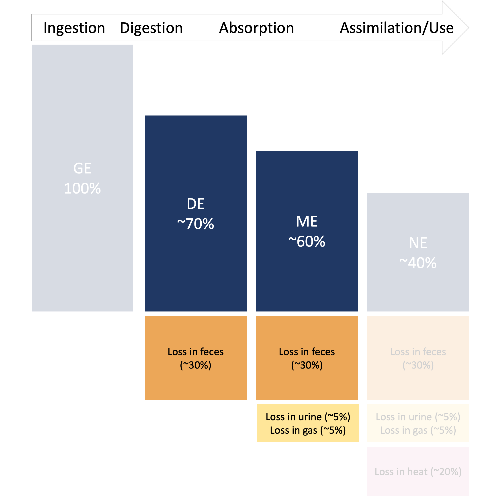

---
output:
  html_document: default
  pdf_document: default
  word_document: default
---


# Energy supply

```{r, include=FALSE}
knitr::opts_chunk$set(
  comment = '', echo = F, message = F, warning = F, cache = TRUE,
  out.width = '85%', fig.align = 'center', dpi = 300
)
```


```{r, echo = FALSE, fig.cap = "Animal nutrition energy scheme as a flow diagram."}
library(DiagrammeR)
# TD top to bottom, LR left right
# https://jojozhuang.github.io/tutorial/mermaid-cheat-sheet/
mermaid("
graph TD;
GE[__________________Gross Energy, 100%__________________] --> 
DE[__________Digestible Energy, 60 to 70%__________];
    GE -.-> FE[Fecal Energy Loss];
    DE --> ME[______Metabolizable Energy, 50 to 60%______];
    DE -.-> GEloss[Gas & Urine Energy Loss];
    ME --> NE[______Net Energy, 30 to 40%______];
    ME -.-> HE[Heat Energy Loss]; 

    style GE fill:#BFD7EA,stroke:#555,stroke-width:2px;
    style DE fill:#F9CFA7,stroke:#555,stroke-width:2px;
    style ME fill:#CBE1C0,stroke:#555,stroke-width:2px;
    style NE fill:#F5B1AC,stroke:#555,stroke-width:2px",
height = '99%', width = '99%')

 #c("#BFD7EA", "#F9CFA7", "#CBE1C0", "#F5B1AC")
 #Tips1["<p style='width:250px;height:25px;margin:0px;'>centered</p>"]
# Tips2["<p style='width:250px;height:25px;margin:0px;text-align:right'>right align</p>"]
# Tips3["<p style='width:250px;height:25px;margin:0px;text-align:left'>left align</p>"]

```

::: {.lo}

**Learning Objectives**

1. Estimate GE from feed fractions using NASEM (2021) equations. 

1. Discuss how base DE values are calculated for different feed fractions. 

1. Explain adjustments to base DE done at the diet level. 

1. Explain the steps to calculate ME from DE in NASEM (2021). 
::: 


## Energy intake (gross energy)

In NASEM (2021), the first step in determining the energy value of a feed is estimating its gross energy (GE) content. As discussed in the last chapter, GE can be measured using a calorimeter. However, it is also possible to estimate GE using the feed chemical composition. Estimating GE from a feed's chemical composition is the first step in predicting energy supplies in the NASEM (2021) model.


```{r}
library(dairynasem)
f = dairynasem::default_library

  ############## Gross Energy in each Ingredient ###############
  En_FA <- 9.4        #Combustion energies for each nutrient, MCal/kg of nutrient
  En_CP <- 5.65		#excludes NPN
  En_NFC <- 4.2
  En_NDF <- 4.2
  En_NDFnf <- 4.14
  En_NPNCP <- 0.89  #per kg of CP equivalent based on urea at 2.5 kcal/g
  En_rOM <- 4.0
  En_St <- 4.23
  En_WSC <- 3.9
  En_Acet <- 3.48
  En_Prop <- 4.96
  En_Butr <- 5.95

  f$Fd_GE <- (f$Fd_CP/100*En_CP + f$Fd_FA/100*En_FA + f$Fd_St/100*En_St + f$Fd_NDF/100*En_NDF + (100-f$Fd_CP-f$Fd_FA-f$Fd_St-f$Fd_NDF-f$Fd_Ash)/100*En_rOM) #the remainder


```

```{r, echo = F, out.width = '100%', fig.asp = .75, fig.cap = "Gross energy content of selected feeds. Source:  NASEM (2021) Library"}
selected_feeds = c("Corn silage, typical", "Legume silage, mid-maturity",
                        "Rye annual hay, mature", 
                        "Pasture grass", "Legume silage, immature",
                        "Legume silage, mature",
                        "Cool season grass hay, mature",
                        "Cool season grass silage", 
                        "Corn grain dry, fine grind",
                        "Wheat grain", "Oat grain", "Wheat straw",
                        "Fat, corn oil", "Fat, canola oil", "Molasses", 
                        "Fat, soybean oil", "Canola meal", 
                        "Soybean meal, solvent 48CP", "DDGS, high protein", 
                        "Calcium carbonate", "Iron oxide", "Limestone")

library(ggplot2)
library(plotly)
pge = f %>% 
  filter(Fd_Name %in% selected_feeds) %>% 
  ggplot( aes(x = reorder(Fd_Name, Fd_GE), y = Fd_GE, color = Fd_Category)) + 
  geom_point() +
  geom_segment(aes(x = Fd_Name, xend = Fd_Name, y = Fd_GE, yend = 0), linewidth = 1) +
  geom_label(aes(x = Fd_Name, y = Fd_GE, label = round(Fd_GE, 1)))+
  theme(axis.text.x = element_text(angle = 90)) + coord_flip() + 
  labs(y = "Feed Gross Energy, Mcal/kg DM", x = NULL) + theme_bw() # + facet_wrap(~Fd_Category, scales = "free_y", ncol = 1)

pge
```

::: green
**Pause and think** What do you notice about the GE content of the feeds shown?
:::

You may have noticed that these feeds split into roughly three categories: 1) very energy-dense fat supplements, 2) feeds with moderate energy-density, and 3) vitamins and minerals with zero energy. You may have also noticed that the energy contents of feeds with mostly fat are close to 9 Mcal/kg DM, whereas feeds with more carbohydrate and protein are closer to 4 Mcal/kg DM. This is close to the rule of thumb learned in the last chapter (approx. 9, 4, and 4 kcal/g for fats, proteins, and carbohydrates, respectively). 

The 9-4-4 rule of thumb is helpful in human nutrition, yet in animal nutrition it has some limitations. First, it is a rough approximation. Human "diet formulation" is often more approximate and *ad hoc*, whereas in animal nutrition we typically want to be quite precise. Second, animals consume a variety of feedstuffs that humans do not, including forages and non-protein nitrogen (NPN) feeds. 

In this chapter, we will see how the NASEM (2021) model uses a method to estimate gross energy that is similar to the 9-4-4 rule of thumb. However, it includes more feed fractions (not just fat, protein, carbohydrates) and accommodates some of the unique aspects of ruminant diets (e.g., NPN).

::: {.red}

**Note on terminology**  
NASEM (2021) refers to the chemical fractions used in energy calculation (e.g., NDF, starch, ROM) as "feed fractions" or "uniform fractions." For conceptual clarity, we will refer to these chemical fractions as "OM fractions." This is because OM fractions can be applied at the feed and diet level, so it may confuse some learners to refer to them as "feed fractions." Additionally, not all of the fractions behave as "uniform fractions," *per se* (e.g., Starch), as acknowledged in the NASEM (2021) chapter.

::: 

## GE from OM fractions

The first two steps in the NASEM (2021) energy scheme are as follows:  1) Separate energy-containing matter into “mostly uniform” fractions, and 2) Calculate gross energy values for each fraction. 

```{r}
# This is a cleaner way to do it, because the fractions exactly match the GE values. 
```

To estimate GE based on chemical composition, the feed (or ration) must be divided up into mostly-uniform fractions. Because the ash (minerals) in a feed do not supply any energy, only the organic matter (OM = DM - Ash) is considered. In NASEM (2021), these OM fractions are:

* **NDF** - neutral detergent fiber, which contains cellulose, hemicellulose, and lignin  
* **Starch** - which is a polymer of glucose
* **FA** - fatty acids that are greater than 4 carbons long; does not include short-chain volatile fatty acids or lactic acid. 
* **ROM** - contains the organic matter left over after accounting for the other fractions; e.g., water-soluble carbohydrates, short-chain fatty acids, glycerol, and soluble fiber.
* **CP-sNPNCPE** - crude protein from rumen-degradable protein and rumen-undegradable protein, excluding CP from supplemental non-protein nitrogen (NPN).  
* **sNPNCPE** - RDP from supplemental NPN, on a CP basis. 

These OM fractions are routinely assayed experimentally. Most of the OM fractions can be determined through wet chemistry (i.e., by using laboratory techniques). The exceptions are RDP and RUP, which require not only a laboratory analysis (for CP) but also an *in situ* or *in vitro* experiment (for distinguishing RDP vs. RUP). 

Each of these OM fractions has its own GE value, similar to the 9-4-4 rule-of-thumb, but more precise. These are given on p. 23 (NASEM, 2021) as the Mcal/kg of feed DM.

* **NDF** = 4.20  
* **Starch** = 4.23  
* **FA** = 9.40  
* **ROM** = 4.00  
* **CP-sNPNCPE** = 5.65  
* **sNPNCPE** = 0.89  

Using these GE values, the GE content (Mcal/kg of DM) can be calculated using the OM fractions. This is given in Eq. 3-2, p. 23 (NASEM, 2021). The equations for GE can be applied to a single feed, or an entire diet. The examples moving forward assume that GE is calculated at the individual feed level (i.e., calculate GE separately for each feed). 

$$
\begin{align}
\text{GE_DM of feed or diet} &= (0.042 * \text{NDF_DM}) + \\
& \ \ \ \ \   (0.0423 * \text{Starch_DM}) + \\
& \ \ \ \ \   (0.040 * \text{ROM_DM} )+ \\
& \ \ \ \ \   (0.094 * \text{FA_DM}) + \\
& \ \ \ \ \   0.0565 *( \text{CP_DM} - \text{sNPNCPE_DM}) + \\
& \ \ \ \ \   (0.0089 * \text{sNPNCPE_DM}) \\
\end{align}
$$

Where OM fractions are expressed as a percentage of DM. Note that in NASEM (2021), the GE values (Mcal/kg) were divided by 100 as shorthand to convert the OM fractions from percentages to proportions. 

::: {.grey}

**Literature Deep Dive:  Uniform Fractions**  
Nutritionally uniform fractions are chemical fractions (e.g., NDF, ROM) where 1) the relationship between inclusion of the fraction in a diet (g of fraction/kg diet DM) and digestibility of the fraction (%) is linear, and 2) the relation of inclusion and digestibility appears similar regardless of the feeds that supplied the chemical fraction. In other words, if we think of uniform fraction as a nutrient, it doesn't matter which feed supplied the nutrient, because the nutrient itself is what affects animal performance. 

The original work to define uniform fractions (Lucas, 1964) resulted in the coining of the term "the Lucas test." More recent work has been done to update this idea:

Tebbe, A. W., Faulkner, M. J., & Weiss, W. P. (2017). Effect of partitioning the nonfiber carbohydrate fraction and neutral detergent fiber method on digestibility of carbohydrates by dairy cows. Journal of dairy science, 100(8), 6218–6228. https://doi.org/10.3168/jds.2017-12719

:::  

## Base digestibilities of OM fractions
```{r}
# why do you have to assume p. 24 26% starch and 3.5% of BW? Why couldn't you just use animal inputs?
```

The next step in energy fractionation is to 3) Calculate base digestibilities for each fraction assuming a certain DMI and starch content. The term "base digestibilities" refers to the digestibility of the fraction that is expected (based on experimentation) for an animal with a DMI at 3.5% of body weight fed a diet with 26% starch. The equations for base DE are simplest to calculate at the level of individual feeds. 

### NDF

$$\text{dNDF_NDF} =\frac{0.75 * (NDF - Lignin) * [1-(Lignin/NDF)^{0.667}]}{NDF}$$
Where   
$\text{dNDF_NDF}$ is the proportion of NDF digested at base conditions.  
$NDF$ is the neutral detergent fiber content of the diet as a % of DM.  
$Lignin$ is the lignin content of the diet as a % of DM.  

Because NDF is a uniform feed fraction, this equation can be used at the feed level or the diet level. 

### Starch
Starch digestibility varies a great deal based on the feed processing, so it was not possible to have a single equation or digestibility coefficient that worked across all feeds. Instead, separate starch digestibilities are given in the Feed Library based on values determined experimentally. These are listed as dStarch_Starch. 

### CP

The digested proportion of CP not from NPN sources (dCP_CP) is based on the protein model, which will be discussed in a later chapter. It is the sum of RDP and digestible RUP (dRUP). Base RUP and dRUP values are given in the Feed Library, so it is possible to calculate the dCP_CP without first completing the protein model. 

After subtracting RDP from NPN sources from the RDP, the dCP_CP can be calculated as:
$$\text{dCP_CP} = RDP + dRUP$$

### sNPNCPE

The narrative does not explicitly mention the digestibility of sNPNCPE. Because it is a component of RDP, the proportion of sNPNCPE digested is assumed to be 1.0, i.e., 100%. 

### ROM

The base digestibility of ROM is 0.96 across all feeds. This shows that ROM is a highly-digestible feed fraction--it is nearly completely-digestible.

### FA

For most feeds, dFA_FA is set at 0.73. However, there is an exception for supplemental fats, where digestibilities are based on experimental data.

## Summing to diet level

The previous sections calculated GE and base digestibilities for each individual feed. In the next section, we need to apply diet-level adjustments. This requires that we start with the diet composition (% of diet DM), and the diet-level base digestibilities (%, unitless) of the OM fractions NDF, starch, CP (excluding sNPNCPE), sNPNCPE, ROM, and FA. 

**Diet content of an OM Fraction (% of DM)**  
For a given OM fraction (e.g., NDF) the feed-level composition (e.g., $NDF_i$, % of individual feed DM) can be converted to the diet level by computing a weighted sum, where the weights ($w_i$) are the inclusion rate of each feed as a proportion of diet DM. For example:

$$\text{NDF_DM, % of diet DM}= \sum_{i = 1}^{n \space feeds} ({NDF_i} * w_i)$$ 

**Diet base digestibility of an OM Fraction (%)**  
Calculating the diet-level base digestibility for an OM fraction is more complex. To continue the example using NDF, the base digestibility of NDF can be calculated as follows. For each individual feed, multiply the feed's NDF content ($NDF\_DM_i$, NDF, % of feed DM) by its base digestibility ($dNDF\_NDF_i$, %) and the feed's inclusion rate in the diet as a proportion of DM ($w_i$, feed DM in diet DM). Sum the products for all feeds in the diet. This returns the digestible NDF as a percent of diet DM. Then, in the denominator, calculate the diet NDF (% of DM). Dividing the numerator by denominator returns the diet digestible NDF as a percent of diet NDF. The order of operations is important, because we want the OM fraction base digestibility coefficients for each feed to be multiplied by the amount of the OM fraction in that feed. 

$$\text{dNDF_NDF at diet-level}= \frac{\sum_{i = 1}^{n \space feeds} ({dNDF\_NDF_i} * NDF\_DM_i * w_i)}{\sum_{i = 1}^{n \space feeds}{ (NDF\_DM_i * w_i)}}$$
```{r, eval = F}

NDF_DM = c(30, 40, 45)
dNDF_NDF = c(75, 73, 60)
incl = c(0.25, 0.35, 0.50)
sum(dNDF_NDF*incl)
sum(NDF_DM*incl)

dNDF = sum(dNDF_NDF*incl)*sum(NDF_DM*incl)/100
dNDF

dNDF = sum(dNDF_NDF*NDF_DM*incl/100)
dNDF

dNDF_NDFdiet = sum(dNDF_NDF * NDF_DM * incl) / sum(NDF_DM * incl)
dNDF_NDFdiet
# wow it's correct. good job

dNDF_NDFdiet = sum(dNDF_NDF * NDF_DM/100 * incl) / sum(NDF_DM * incl)
dNDF_NDFdiet
# Calculated at feed level, then used to calculate diet level. 
# starch, % of DM * digestibility. * intake
# The equation above is the same as this, except without using DMI. 
# Not divided by 100 because it will be out of 100. 
 f$Fd_DigSt <- f$Fd_St * f$Fd_dcSt/100


  f$Fd_DigStIn_Base <- f$Fd_DigSt/100 * f$Fd_DMIn
  Dt_DigStIn_Base <- sum(f$Fd_DigStIn_Base, na.rm = TRUE)
  An_DigStIn_Base <- Dt_DigStIn_Base + Inf_StIn * i$Inf_ttdcSt/100
  Dt_DigWSCIn <- sum(f$Fd_DigWSCIn, na.rm = TRUE)
  Dt_DigrOMtIn <- sum(f$Fd_DigrOMtIn, na.rm = TRUE)
  Dt_DigrOMaIn <- Dt_DigrOMtIn - Fe_rOMend
  An_DigWSCIn <- Dt_DigWSCIn + InfRum_GlcIn + InfSI_GlcIn
  An_DigrOMaIn <- Dt_DigrOMaIn + InfRum_GlcIn + InfRum_AcetIn + 
    InfRum_PropIn + InfRum_ButrIn + InfSI_GlcIn + InfSI_AcetIn + 
    InfSI_PropIn + InfSI_ButrIn
  An_DigrOMtIn <- Dt_DigrOMtIn + InfRum_GlcIn + InfRum_AcetIn + 
    InfRum_PropIn + InfRum_ButrIn + InfSI_GlcIn + InfSI_AcetIn + 
    InfSI_PropIn + InfSI_ButrIn
  TT_dcSt_Base <- Dt_DigStIn_Base/Dt_StIn * 100 ## <----################################
 
  TT_dcSt_Base <- ifelse(is.na(TT_dcSt_Base), 0, TT_dcSt_Base)
  TT_dcSt <- ifelse(TT_dcSt_Base == 0, 0, TT_dcSt_Base - (1 * 
    (An_DMIn_BW - 0.035)) * 100)


```


## Diet-level DE adjustments

The next step is to 4) adjust the base digestibilities calculated at the feed level, to account for diet-level effects of NDF and starch content. Feeding excessive starch has been associated with decreased fiber digestibility due to changes in rumen microbial fermentation. It has been well-established that digestibility of certain nutrients (e.g., NDF, Starch) decreases as the animal's DMI increases. 


### dNDF_NDF adjustment

To adjust the base NDF digestibility, NASEM (2021) offers the following equation 3-5a (p. 25):

$$
\begin{aligned}
\text{dNDF_NDF_adjusted} &= \text{dNDF_NDF} - 0.0059*(Starch-26) \\ & \quad - 1.1*(\text{DMI_BW}-0.035)
\end{aligned}
$$

Where    
$\text{dNDF_NDF}$ is the base dNDF_NDF calculated previously    
$Starch$ is the percentage of starch in diet DM (kg Starch / 100 kg diet DM)    
$\text{DMI_BW}$ is the DMI as a proportion of body weight (e.g., 3.0% of BW = 0.03).   

This equation suggests that the digestibility of NDF decreases as the level of dietary starch increases above 26% of DM, and as the DMI increases above 3.5% of the animal's bodyweight. Conversely, greater NDF digestibility is expected at lower dietary starch and lower DMI_BW.

### dStarch_Starch adjustment

Starch digestibility is also adjusted for the level of intake relative to the animal's body weight. An equation is given on p. 26 (NASEM, 2021).

$$\text{dStarch_Starch_adjusted} = \text{dStarch_Starch} - 1.0(\text{DMI_BW} - 0.035)$$
This suggests that the digestibility of starch decreases as DMI increases above 3.5% of the animal's bodyweight. On the other hand, lower intake (% of BW) is expected to improve starch digestibility. 

### Other adjustments

The other adjustment made by NASEM (2021) is a correction for endogenous CP and ROM. This is because most of the experimental data used to determine digestibility reported *apparent* digestibility. However, the *true* digestibility is most relevant to the energy flows. For details on digestibility calculations, see the [Glossary](#Glossary). 

Apparent and true digestibilities are assumed to be the same for NDF, Starch, and FAs. For CP - sNPNCPE, the digestible energy values are corrected for the fecal energy from metabolic fecal protein (MFCP) and fecal microbial protein (fMCP). This correction involves subtracting the energy from endogenous CP from the predicted diet DE. A similar approach is used to predict endogenous fecal ROM (efROM), calculate its contribution to fecal energy, and subtract it from diet DE. These adjustments are discussed in detail in NASEM (2021, p. 27). 

## DE calculation

To calculate DE, the GE value of each diet fraction is multiplied by the digestibility of that fraction. Then, the energy from each fraction is summed to yield the energy for the entire diet. The diet OM fractions (e.g., NDF, starch, FA, ROM) are input as a percentage of DM, so they should be a number between 0 and 100. 

Eq. 3-8 (NASEM, 2021, p. 27)

$$
\begin{aligned}
\text{DE_DM; Mcal/kg of diet DM} &= (0.042 * NDF\_DM * dNDF\_NDF\_adjusted) + \\[6pt] 
&\ \ \ \ \ (0.0423 * Starch\_DM * dStarch\_Starch\_adjusted) +\\[6pt] 
&\ \ \ \ \  (0.0940 * FA\_DM * dFA\_FA) +\\[6pt]  
&\ \ \ \ \  [0.0565 * (RDP\_DM- sNPNCPE\_DM + dRUP\_DM)] + \\[6pt] 
&\ \ \ \ \  (0.0089 * sNPNCPE\_DM) +\\[6pt] 
&\ \ \ \ \  (0.040 * ROM\_DM * 0.96) +\\[6pt] 
&\ \ \ \ \ (-0.00565 * MFCP) +\\[6pt] 
&\ \ \ \ \ (-0.00565 * fMCP)+\\[6pt] 
&\ \ \ \ \ (-0.0040 * efROM\_DM)
\end{aligned}
$$

The total DE intake (Mcal/d) can be calculated by multiplying the DE content of the diet (Mcal/kg of diet DM) by the animal's DMI (kg/d). This operation cancels out the "kg" leaving behind "Mcal/d."

$$ \text{DE, Mcal/d} = DE\_DM * DMI$$

```{r, echo = F, out.width = '100%', fig.asp = .72, fig.cap = "Base digestible energy content (Mcal/kg) of selected feeds, and the percentage of GE that is DE (grey rectangle). Source:  NASEM (2021) Library"}

f2 = f %>% 
  mutate(DEpctofGE = (Fd_DE_Base / Fd_GE)*100)

pde = f2 %>% 
  filter(Fd_Name %in% selected_feeds) %>% 
  ggplot( aes(x = reorder(Fd_Name, Fd_DE_Base), y = Fd_DE_Base, color = Fd_Category)) + 
  geom_point() +
  geom_segment(aes(x = Fd_Name, xend = Fd_Name, y = Fd_DE_Base, yend = 0), linewidth = 1) +
  geom_label(aes(x = Fd_Name, y = Fd_DE_Base, label = round(Fd_DE_Base, 1)))+
  geom_text(aes(x = Fd_Name, y = 8, label = round(DEpctofGE))) +
  theme(axis.text.x = element_text(angle = 90)) + coord_flip() + 
  annotate(geom = "rect", ymin = 7.5, ymax = Inf, xmin = -Inf, xmax = Inf, fill = "grey", alpha = .2)+
  annotate(geom = "text", y = 8, x = 1.80, label = "% of GE", angle = -270)+
  labs(y = "Feed Base Digestible Energy, Mcal/kg DM", x = NULL) + theme_bw() # + facet_wrap(~Fd_Category, scales = "free_y", ncol = 1)

pde
```


::: green
**Pause and think** What do you notice about the DE content of the feeds shown, in comparison with their GE content?
:::

::: {.orange}

**Why is it important to account for energy losses in feces? **  

Energy losses in feces can represent about a third of GE intake, depending on the diet and animal characteristics. This makes fecal losses the largest loss of GE in the energy fractionation scheme. We can see clearly that fecal dry matter contains a fair amount of energy, because dried animal dung will readily burn, a renewable energy source that has been used for centuries!

```{r, echo = F, out.width = '30%', fig.align = "center", fig.cap = "Dung cooking fire in Pushkar, India. Source: Wikipedia. https://commons.wikimedia.org/wiki/File:Dung_cooking_fire._Pushkar_India.JPG"}

```

:::  

## DE to ME 

To get from DE to ME, the next step is to 5) estimate urine energy (UE) and gas energy output (GasE, i.e., methane). The equations for estimating urine energy and gas energy are detailed in other chapters of NASEM (2021) as explained on p. 28. Urine energy is mainly a function of dietary N intake, since most urine energy losses are in the form of urea (a N compound). Gas energy is a function of DMI and the intake of fats and digestible fiber, because these factors affect methane production. 

Eq. 3-10b, p. 28
$$
ME\_DM = DE\_DM - GasE\_DM - UE\_DM
$$
Where all terms are expressed as Mcal/kg DMI. To convert this to the total amount of ME supplied by a diet, multiply ME_DM by the animal's DMI. 

$$\text{ME, Mcal/d}  = ME\_DM *DMI$$

```{r, echo = F, out.width = '85%', fig.align = "center", fig.cap = "Energy scheme discussed in last chapter, focused on DE to ME."}

```


## Conclusions

In this chapter, we discussed how GE intake is fractionated into DE, ME, and energy losses in NASEM (2021). In the next chapter, we will discuss how ME supply contributes to meeting body needs as NE. 

## Examples

`r hide("Show NASEM dairy-8 example")`
1. Open NASEM dairy-8. 
1. Load one of the default simulations, for example by clicking File > Load Simulation > "Example-Lactating-Cow-DIM-150." The default simulation is pre-populated with inputs.
1. Click "Reports" tile in the top menu. 
1. Check "All" under "Select one or more reports." Then hit the button "Generate Selected Reports." A Word Document will appear for download. 
1. In the Word Document, find "Table 4-1," shows the breakdown of energy values for this simulation. 
1. Change the animal and diet inputs and re-run simulations to see how the energy predictions change!

`r unhide()` 

`r hide("Show R example")`

```{r, eval = F, echo = TRUE}
NDF_DM = 0.4
Starch_DM = 9
ROM_DM = 9
FA_DM = 9
CP_DM = 9
sNPNCPE_DM = 8

GE_DM <- function(NDF_DM, Starch_DM, ROM_DM, FA_DM, CP_DM, sNPNCPE_DM) {
  GE_DM <- 0.042 * NDF_DM + 0.0423 * Starch_DM + 0.040 * ROM_DM + 0.094 * FA_DM +
    0.0565 * (CP_DM - sNPNCPE_DM) + 0.0089 * sNPNCPE_DM
  return(GE_DM)
}

GE_DM(NDF_DM = NDF_DM,
      Starch_DM = Starch_DM,
      ROM_DM = ROM_DM,
      FA_DM = FA_DM,
      CP_DM = CP_DM,
      sNPNCPE_DM = sNPNCPE_DM)
```

`r unhide()` 


## Questions

1. What is the first step in determining the energy value of a feed according to NASEM (2021)? 
1. What are the OM fractions used in estimating GE based on chemical composition? 
1. What (approximately) are the GE values of the OM fractions used in estimating GE?
1. Explain each term in the equation used to calculate GE. 
1. Explain each term in the equation used to calculate DE. 
1. How is GE calculation similar, and how it it different from the he 9-4-4 rule of thumb used in human nutrition?
1. For which fractions are base digestibilities adjusted?
1. For which fractions are true digestibility and apparent digestibility assumed to be the same?
1. Why is it necessary to adjust the base digestibilities at the diet level? How are the adjustments made for NDF and starch content?
1. How does DMI affect the digestibility of NDF and starch?
1. Which of the feed fractions is most digestible? Which is the least?
1. Which loss (fecal, urine, gas) is the most substantial when considering transformations from GE to ME? 
