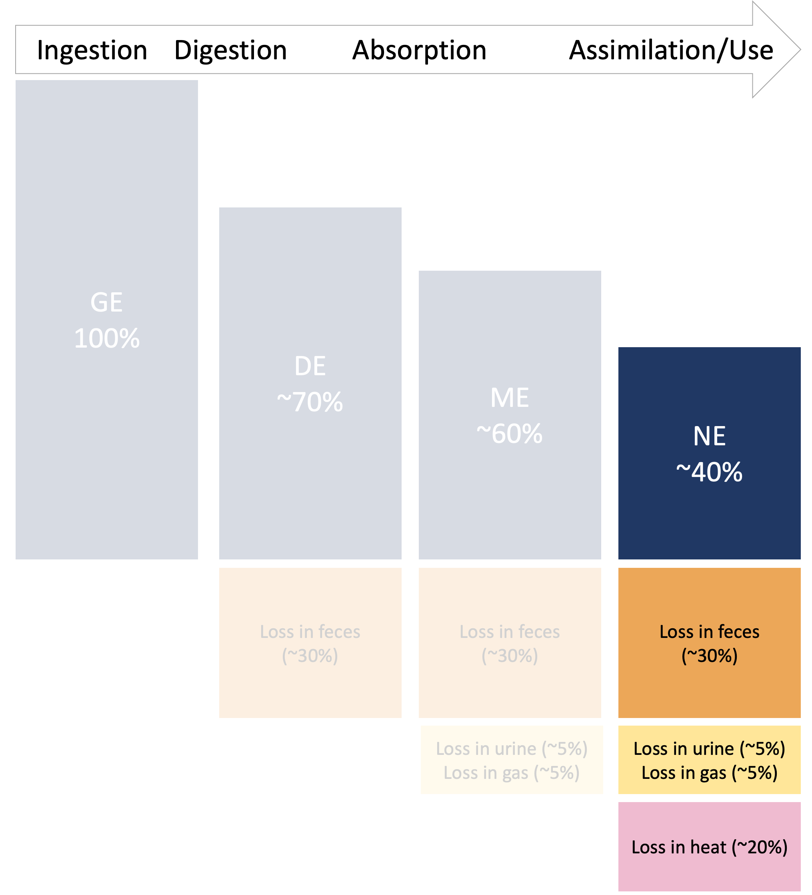
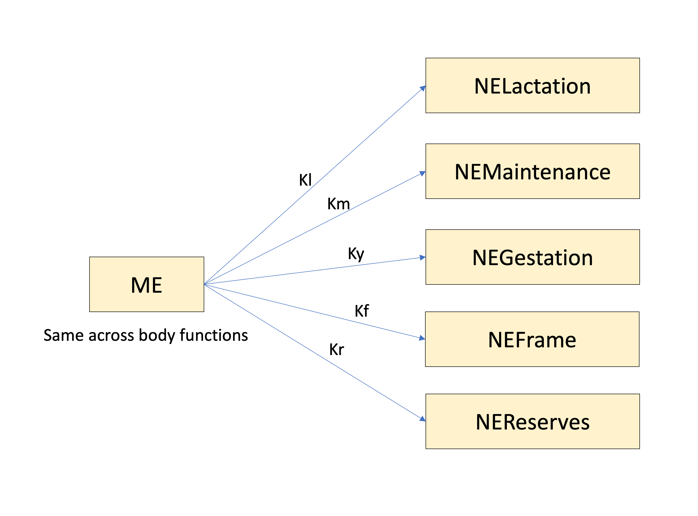

---
output:
  html_document: default
  pdf_document: default
  word_document: default
---


# Energy use


```{r, include=FALSE}
knitr::opts_chunk$set(
  comment = '', echo = F, message = F, warning = F, cache = TRUE,
  out.width = '85%', fig.align = 'center', dpi = 300
)
library(webexercises)
library(kableExtra)
```


```{r, echo = F, out.width = '85%', fig.align = "center", fig.cap = "Energy scheme discussed in Energy overview chapter, focused on NE use."}

```

::: {.lo}

**Learning Objectives**

1. List the body functions that are accounted for in the NASEM (2021) energy model. 
1. Explain how energy use is predicted within the NASEM (2021) model for various body functions. 
1. Convert ME to NEL, and convert different NE uses to an NEL basis. 

::: 

```{r}
# RE is unecessary. THey should all be NE for different uses. There should be no NEL. This makes everything 
# RE is not conceptually aligned with rest of system. 
```


## Body functions in the energy model

In the last chapter, we followed the flow of energy through ingestion, digestion, and absorption to find the available energy (ME) after accounting for fecal, urinary, and gaseous energy losses. In this chapter, we will first determine the predicted use of energy for various body functions (NE). Then we will discuss how ME can be converted to NE to meet the animal's needs. 

::: {.red}

**Note on terminology**  
To facilitate learning, the energy scheme presented in this interactive textbook differs from NASEM (2021) in some of the terminology used and the ways equations are presented. First, it refers to Reserve Energy (RE) as an NE use, to be consistent with the Protein Chapter of NASEM (2021). Additionally, equations are modified to express energy first on an "NE basis," meaning the energy actually assimilated or used by the body function. This modification is intended to ensure learners can grasp the concept of NEL before expressing other energy uses on an NEL basis. The NE basis can be converted to an NEL basis to match the NASEM (2021) consensus report, as described later in this chapter. 

::: 

## Maintenance

The maintenance requirement of adult dairy cattle is calculated as follows:

$$NEMaintenance = 0.10 * BW^{0.75}$$

Where NEMaintenance is in Mcal/d and BW is in kg. Maintenance requirements have traditionally been determined by measuring fasting heat production in a respiratory chamber. In other words, this techniques involves measuring the heat losses of the animal's body (as a proxy for energy use), separately from the heat produced by digesting feed intake. Because respiratory chambers temporarily limit the animal's normal movements in order to do indirect calorimetry, these values do not reflect the energy expenditures of cattle moving around normally. The committee has adjusted predicted maintenance use to account for this. 


## Lactation

Because milk composition is often measured, the NASEM (2021) consensus report provides a method to estimate the energy contained in milk based on its composition. This equation inflates the coefficient for true protein to account for the energy contained in milk urea, assuming milk urea is 5.5% of milk CP. 

$$
\text{NELactation} =[( 9.29*Fat)  + (5.85*TP) + (3.95*Lactose)] * MilkProduction
$$

Where Fat, TP, and Lactose are the kg of component per kg of milk. The part in brackets gives the NE content of milk (Mcal NE/ kg milk). To convert this to the total use of NE for milk production per day (NELactation, Mcal/d), the NEL content of milk must be multiplied by the milk production (kg/d). 


## Activity

Requirements for activity are included in the maintenance requirement. These equations are appropriate for most confinement operations. For grazing operations where animals have substantially greater activity, equations are provided in Chapter 13 (NASEM, 2021). 

## Environmental effects

The Nutrient Requirements of Beef Cattle includes equations to predict energy requirements for thermal regulation (i.e., maintaining the body temperature in different environmental conditions). For dairy cattle, the NASEM (2021) committee explained that there was insufficient data to create similar equations for lactating dairy cattle, although they acknowledged that thermal regulation affects energy balance. This probably reflects an important difference between beef and dairy systems:  whereas certain beef production systems provide animals extensive outdoor access (e.g., rangeland or feedlot), many U.S. dairy production systems confine cattle to barns that are environmentally controlled. However, the NASEM (2021) model does include equations to adjust energy requirememts for calves due to thermal stress. 


## Gestation

The energy requirements for gestation are estimated based on the predicted weight of the gravid uterus (uterus + fetus + reproductive tissues) during gestation, and the predicted weight of the uterus as it regresses to non-reproductive state during the first 100 days of lactation (involution). 

$$NEGestation = GrUterWtChange * 0.882$$ 

Where NEGestation is in Mcal/d, and the change in the gravid uterus is in kg of as-is weight per d. During gestation, the maternal and fetal tissues grow and demand energy (positive use). Predicted energy use for gestation also accounts for the involution of maternal reproductive tissues after parturition. As the maternal tissues return to their non-reproductive state, they release some energy that the animal can use (negative use). Details for calculating the uterine weight throughout the first 100 days in lactation are given on p. 32. 

::: {.green}

**Test Yourself: ** 

The energy use for gestation is positive immediately after parturition (calving). `r torf(FALSE)`

:::  

## Body reserve change

For lactating cows, the NEL required to gain or lose body reserves is calculated as follows:

$$ NEReserve = 6.3 * BWChange$$

Where the reserve change is in Mcal/d and the BW change is in kg/d, which can be positive (gaining body reserves) or negative (losing body reserves). The animal demands energy from the diet to gain body reserves. On the other hand, mobilizing body reserves releases energy and reduces the need for dietary energy. 

## Frame gain

The NASEM (2021) committee used the following approach to calculate energy requirements for frame gain. First, they determined the fat and protein content of "frame gain" as cattle grow. These are discussed extensively in Chapter 11 (NASEM, 2021). This was important, because the fat and protein content of the animal's body changes as they mature. Based on the protein and fat content, the committee suggested the following equation:

$$\text{NEFrame} = (9.4*FatADG + 5.55*ProteinADG)$$
```{r}
# 0.61 is the 0.4 / 0.66?
# It is exactly the same as protein chapter conceptually, but the handling of NE is messy. The NEL 
```

Where FrameGainNE is in Mcal/d and FatADG and ProteinADG are the kg of Fat and Protein gained as the animal's frame grows, per day. Frame gain is assumed to always demand energy, because there is no normal situation in which the animal's frame shrinks. This equation is interesting, because its coefficients are fairly similar to the coefficients in the NELactation equation. This suggests that the energy content of major body components (fat, protein) is similar to the energy content of milk components (fat, protein).

## Total energy use

The total energy use is predicted as the sum of energy used for maintenance, lactation, gestation, body reserve, and frame. Gestation and body reserves can be positive uses (e.g., energy demand for growing fetus or accumulating body reserves) or negative uses (e.g., energy released by involution of reproductive tissues or mobilization of body reserves).  

$$NETotal = NEMaintenance + NELactation + NEGestation + \\[16pt]  NEReserve + NEFrame$$
```{r}
# empty space to get render properly
```

::: {.green}

**Test Yourself: **

Which of the following body functions is NOT accounted for in the NASEM (2021) energy model?
`r mcq(c("Maintenance", "Lactation", "Gestation", answer = "Respiration", "Frame", "Reserves"))`

:::  

## Converting to NEL basis

As discussed in the last chapter, ME represents circulating energy that is available to the animal for metabolic purposes. However, ME is not used with perfect efficiency. Instead, some ME energy is lost as heat. Interestingly, experimental work has shown that heat losses associated with ME use/assimilation differ depending on the animal conditions (dry vs. lactating) and the body function the ME is used for (Lactation, Maintenance, Gestation, etc.). This is reviewed extensively in NASEM (2021).  

Based on past experimental work, NASEM (2021) provides a set of efficiencies for ME to NE conversion for different animal types (Lactating and Dry) as well as different body functions (Lactation, Maintenance, Gestation, Frame, Reserves). These ME to NE conversion efficiencies describe the proportion of ME that can be used as NE (K) versus the proportion lost as heat (1-K). 

<div align="center">
**Efficiencies of ME to NE conversion for different body functions**
</div>

```{r}
Function <- c("Lactation", "Maintenance", "Gestation", "Frame", "Reserves")
Parameter <- c("Kl_ME_NE", "Km_ME_NE", "Ky_ME_NE", "Kf_ME_NE", "Kr_ME_NE")
Lactating = c(0.66, 0.66, 0.14, 0.40, 0.74)
Dry = c(NA, 0.66, 0.14, 0.40, 0.60)

df = data.frame("Function" = Function, "Parameter" = Parameter, "Lactating" = Lactating, "Dry" = Dry)
kable(df) %>% kable_styling(full_width = F)
```


NEL is the base unit for energy in NASEM (2021). In other words, energy uses are expressed in relation to the NE used for lactation. This seems to be a source of confusion for many people, but converting between an ME basis and NEL basis is quite simple. 

For example, let's try converting NEGestation to NEL. First, convert NEGestation back to ME, which is the same across body functions. Doing this requires finding the efficiency of converting NE to ME for gestation using the table above. Then, convert the ME to NEL by using the efficiency of converting ME to NE for lactation in the table above. 

$$NEGestation * \frac{1.00 \space ME}{0.14 \space NEGestation}*\frac{0.66 \space NEL}{1.00 \space ME}$$
There is also a way to think about this visually. Looking at the figure below, we can use three rules to calculate any NE $\rightarrow$ ME or NE $\rightarrow$ NE conversion we need! Here are the rules:  

1. Always start and end at a box. A "starting box" is one you have the values for. The "destination box" is the value you are trying to determine. These can be ME or NE. 
1. To go forwards down an arrow, you must multiply the value in the starting box by the value associated with the arrow. This will give you the value of the destination box. 
1. To go backwards down an arrow, you must divide the value in the starting box by the value associated with the arrow. This will give the value in the destination box. 

This works because of the mathematical relationships between these quantities. If NEL = ME * Kl, we also know that ME = NEL / Kl. The direction of the arrows reminds us which way involves multiplication, and which way involves division by the K coefficient.    


```{r, echo = F, out.width='100%', fig.align = "center", fig.cap = "Diagram of ME, conversion efficiencies (K values) and NE for various body functions."}

```

::: {.blue}

**Examples: ** 

1. **ME to NEFrame.**  Start at the ME box. Go forward along the Kf arrow.  Arrive at the NEFrame box. This process gives the equation:  ME * Kf = NEFrame  

1. **NEFrame to NEL.** Start at the NEFrame box. Go backwards along the Kf arrow to arrive at ME. Go forward along the Kl arrow to arrive at NEL. This yields the equation:  NEFrame / Kf * Kl = NEL

1. **NEReserves to NEL.** Start at the NEReserves box. Go backwards along the Kr arrow. Arrive at ME. Then, go forward along the Kl arrow. Arrive at NELactation. This gives the equation:  NEReserves / Kr * Kl = NEL  

1. **NEL to ME.** Start at the NEL box. Go backwards along the Kl arrow. Arrive at ME. This gives the equation:  NEL / Kl = ME. 

:::  

## NEL use simulations

To get an idea of overall uses, let's compare predicted energy uses for the following scenarios:

- A dry multiparous cow at 260 days in gestation (dry = not lactating). This cow is anticipated to be gaining a small amount of body reserves (0.1 kg/d). The cow is assumed to be 3+ lactations and no longer growing in frame size.

- The same multiparous cow, but after starting to lactate, at 30 days in milk (DIM). Her reproductive organs are still involuting. The animal is not accreting body reserves.

- The same lactating multiparous cow at 150 DIM, mid-lactation, after reaching peak production. The animal is not accreting body reserves. 

- The same lactating multiparous cow at 250 DIM, in late lactation. At this point, she is expected to gain some body reserves (0.1 kg/d)

- A lactating primiparous cow at 150 DIM that is still growing in frame size. 

```{r}
library(ggplot2)
library(dplyr)
library(tidyr)
energy_use <- structure(list(Use = c(
  "Dry multiparous, 260 days gestation", "Dry multiparous, 260 days gestation", "Dry multiparous, 260 days gestation",
  "Dry multiparous, 260 days gestation", "Dry multiparous, 260 days gestation", "Lactating multiparous, 30 DIM", "Lactating multiparous, 30 DIM",
  "Lactating multiparous, 30 DIM", "Lactating multiparous, 30 DIM", "Lactating multiparous, 30 DIM", "Lactating multiparous, 250 DIM",
  "Lactating multiparous, 250 DIM", "Lactating multiparous, 250 DIM", "Lactating multiparous, 250 DIM", "Lactating multiparous, 250 DIM",
  "Lactating multiparous, 150 DIM", "Lactating multiparous, 150 DIM", "Lactating multiparous, 150 DIM", "Lactating multiparous, 150 DIM",
  "Lactating multiparous, 150 DIM", "Lactating primiparous, 150 DIM", "Lactating primiparous, 150 DIM",
  "Lactating primiparous, 150 DIM", "Lactating primiparous, 150 DIM", "Lactating primiparous, 150 DIM"
), name = structure(c(
  5L, 1L, 2L, 3L, 4L, 5L, 1L, 2L, 3L,
  4L, 5L, 1L, 2L, 3L, 4L, 5L, 1L, 2L, 3L, 4L, 5L, 1L, 2L, 3L, 4L
), levels = c("Milk", "Gestation", "Frame", "Reserves", "Maintenance"), class = "factor"), value = c(
  13.0214081, 0, 4.02048963, 0, 0.716408,
  13.0214081, 32.667525, -0.0320332321, 0, 0, 13.0214081, 23.23024,
  0.628423172, 0, 0.5731264, 13.021408, 27.9488825, 0.0237097,
  0, 0, 10.5737126, 23.23024, 0.0237097, 1.3784487, 1.3784487
)), row.names = c(
  NA,
  -25L
), class = "data.frame")

```


```{r, out.width =  '85%', fig.height = 10, fig.width = 6, fig.cap = "Predicted net energy of lactation (NEL, Mcal/d) use for different body functions"}
energy_use2 = energy_use  %>%
  # filter(Use == "Dry multiparous, 260 days gestation" | Use == "Lactating multiparous, 150 DIM" | Use == "Lactating primiparous, 150 DIM") %>%
  # pivot_longer(-Use) %>%
  mutate(
    `NEL, Mcal/d` = format(round(value, digits = 2), nsmall = 2),
    Scenario = factor(Use, levels = c(Use = c(
      "Lactating multiparous, 30 DIM",
      "Lactating multiparous, 150 DIM",
      "Lactating multiparous, 250 DIM",
      "Dry multiparous, 260 days gestation",
      "Lactating primiparous, 150 DIM"
    )))
  ) %>% 
  rename(Function = name) %>% 
  select(Scenario, Function, `NEL, Mcal/d`) %>% 
  pivot_wider(names_from = Function, values_from =  `NEL, Mcal/d` )
kable(energy_use2, caption = "NEL use for body functions for selected scenarios, Mcal/d") %>% 
  kable_styling(full_width = F)

```


```{r, out.width =  '85%', fig.height = 10, fig.width = 6, fig.cap = "Predicted net energy of lactation (NEL, Mcal/d) use for different body functions"}
energy_use  %>%
  # filter(Use == "Dry multiparous, 260 days gestation" | Use == "Lactating multiparous, 150 DIM" | Use == "Lactating primiparous, 150 DIM") %>%
  # pivot_longer(-Use) %>%
  mutate(
    lab = format(round(value, digits = 2), nsmall = 2),
    Use = factor(Use, levels = c(Use = c(
      "Lactating multiparous, 30 DIM",
      "Lactating multiparous, 150 DIM",
      "Lactating multiparous, 250 DIM",
      "Dry multiparous, 260 days gestation",
      "Lactating primiparous, 150 DIM"
    )))
  ) %>%
  ggplot(aes(x = name, y = value, fill = name)) +
  geom_bar(position = "stack", stat = "identity") + 
  geom_label(aes(label = lab),
    fill = "white",
    label.padding = unit(.1, "lines"), size = 4
  ) +
  labs(x = NULL, y = NULL) + 
  theme(
    axis.text.x = element_text(
      angle = 45,
      hjust = 1
    ),
    legend.position = "none"
  ) +
  facet_wrap(~Use, ncol = 1) + 
  theme_bw() +
  theme(legend.position = "none") +
  coord_flip() 

```

::: {.green}

**Pause and think**   

What 3-5 main points (about NEL use) would you conclude based on these figures? Write down a few observations.

::: 

As the figures show, milk production can often be the largest use of NEL for lactating cows, followed by maintenance. Comparatively, frame size and body reserve energy use is relatively minor. Energy use for gestation is also relatively small in these simulations, and is slightly negative during involution of reproductive tissues (30 DIM). 

## Questions

1. Explain what factors are involved in calculating maintenance energy use.  
1. How would you calculate the energy content of milk (Mcal/kg milk) and the total milk energy output (Mcal/d) using production data?.  
1. Describe how energy use is estimated during 1-283 days of gestation, and 1-100 days of lactation. 
1. Does the environmental temperature affect predicted energy use in the NASEM model? Explain your answer.  
1. How are energy requirements for frame gain different from body reserve gain/loss? Explain the differences in terms of predictive equations. 
1. What is the base energy unit in NASEM (2021)?
1. How can net energy values for different body functions be converted to NEL?

## Examples


`r hide("Show NASEM dairy-8 example")`

1. Open NASEM dairy-8. 
1. Load one of the default simulations, for example by clicking File > Load Simulation > "Example-Lactating-Cow-DIM-150." The default simulation is pre-populated with inputs.
1. Click "Reports" tile in the top menu. 
1. Check "All" under "Select one or more reports." Then hit the button "Generate Selected Reports." A Word Document will appear for download. 
1. In the Word Document, find "Table 4-2." It shows the predicted energy use in Mcal/kg of DMI and Mcal/d for this simulation. 
1. Load a different simulation or change the inputs for the current simulation and repeat the process above to see how the energy predictions change. 

`r unhide()` 


`r hide("Show R example")`

```{r, eval = F, echo = T}
# NEMaintenance, Mcal/d #—————————————————————
# BW, kg
NEMaintenance <- function(BW) {
  return(0.10 * BW^0.75)
}

ne_maintenance = NEMaintenance(700)
ne_maintenance
ne_maintenance/0.66*0.66 # convert NEMaintenance to NEL (they are equivalent)

# NELactation, Mcal/d #—————————————————————
# Fat, TP, Lactose = kg/kg milk
# Milk Production, kg/d
NELactation <- function(Fat, TP, Lactose, MilkProduction) {
  return((9.29 * Fat + 5.85 * TP + 3.95 * Lactose) * MilkProduction)
}

ne_lactation = NELactation(Fat = 0.035, 
            TP = 0.030, 
            Lactose = 0.045,
            MilkProduction = 30)
ne_lactation
# NEGestation, Mcal/d #—————————————————————
# GrUterWtChange, kg/d = (0.0243 - (0.0000245*260))*50
NEGestation <- function(GrUterWtChange) {
  return(GrUterWtChange * 0.882)
}
ne_gest = NEGestation(0.897717)
ne_gest/0.14*0.66 # convert from NEGestation to NEL basis

# NEReserve, Mcal/d #—————————————————————
# BW change, kg/d
NEReserve <- function(BWChange) {
  return(NEReserve <- 6.3 * BWChange)
}
ne_reserve = NEReserve(0.20)
ne_reserve
ne_reserve/0.74*0.66 # convert from NEFrame to NEL basis, lactating

# NEFrame, Mcal/d #—————————————————————
# FatADG, ProteinADG, kg/d as-is
NEFrame <- function(FatADG, ProteinADG) {
  return(9.4 * FatADG + 5.55 * ProteinADG)
}
ne_frame = NEFrame(FatADG = 0.07, ProteinADG = 0.025)
ne_frame
ne_frame/0.40*0.66 # convert NEFrame to NEL

```

`r unhide()` 


`r hide("Show Python example")`
```{python, echo = T, eval = F}
# NEMaintenance, Mcal/d #—————————————————————
# BW, kg
def NEMaintenance(BW):
    return 0.10 * BW**0.75

ne_maintenance = NEMaintenance(700)
print(ne_maintenance)
print(ne_maintenance/0.66*0.66)  # convert NEMaintenance to NEL (they are equivalent)

# NELactation, Mcal/d #—————————————————————
# Fat, TP, Lactose = kg/kg milk
# Milk Production, kg/d
def NELactation(Fat, TP, Lactose, MilkProduction):
    return (9.29 * Fat + 5.85 * TP + 3.95 * Lactose) * MilkProduction

ne_lactation = NELactation(Fat=0.035,
                           TP=0.030,
                           Lactose=0.045,
                           MilkProduction=30)
print(ne_lactation)

# NEGestation, Mcal/d #—————————————————————
# GrUterWtChange, kg/d = (0.0243 - (0.0000245*260))*50
def NEGestation(GrUterWtChange):
    return GrUterWtChange * 0.882

ne_gest = NEGestation(0.897717)
print(ne_gest/0.14*0.66)  # convert from NEGestation to NEL basis

# NEReserve, Mcal/d #—————————————————————
# BW change, kg/d
def NEReserve(BWChange):
    return 6.3 * BWChange

ne_reserve = NEReserve(0.20)
print(ne_reserve)
print(ne_reserve/0.74*0.66)  # convert from NEFrame to NEL basis, lactating

# NEFrame, Mcal/d #—————————————————————
# FatADG, ProteinADG, kg/d as-is
def NEFrame(FatADG, ProteinADG):
    return 9.4 * FatADG + 5.55 * ProteinADG

ne_frame = NEFrame(FatADG=0.07, ProteinADG=0.025)
print(ne_frame)
print(ne_frame/0.40*0.66)  # convert NEFrame to NEL

```

`r unhide()` 

