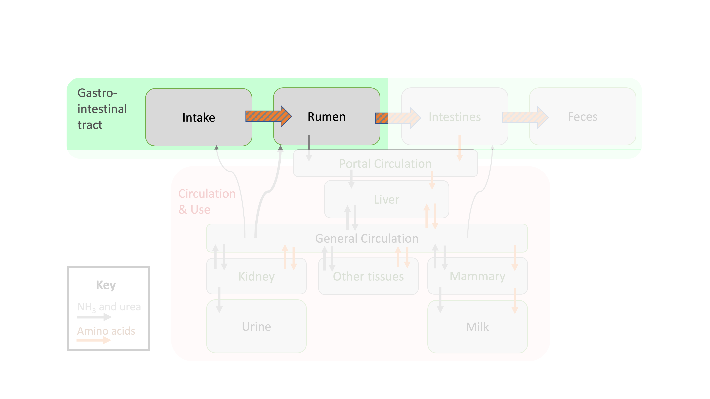
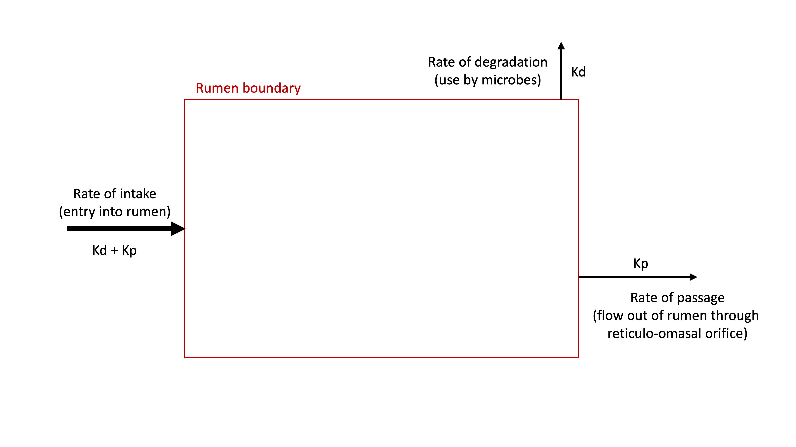
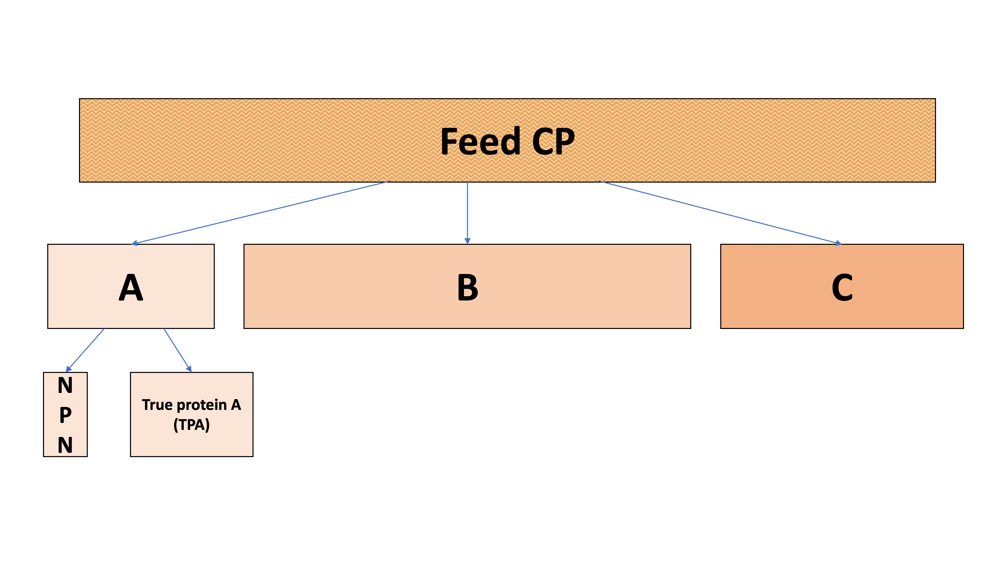
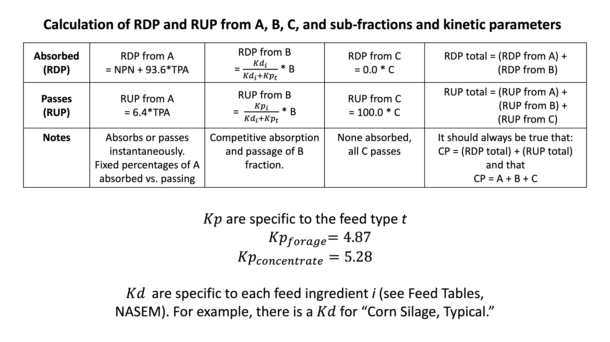

---
output:
  html_document: default
  pdf_document: default
  word_document: default
editor_options: 
  markdown: 
    wrap: 72
---

# Protein intake and ruminal supplies

```{r, echo = F, fig.align = "center", out.width = '100%', fig.cap = "Depiction of protein flows in ruminant animals focused on intake and ruminal flows."}

library(webexercises)
library(kableExtra)

```

```{r, include=FALSE}
knitr::opts_chunk$set(
  comment = '', echo = F, message = F, warning = F, cache = TRUE,
  out.width = '85%', fig.align = 'center', dpi = 300
)
```

```{r, echo = FALSE}
library(ggplot2)
theme_set(theme_classic())
```

::: lo
**Learning Objectives**

1.  Define RDP and RUP.

2.  Explain the possible fates of protein that enters the rumen.

3.  Describe experimental methods for determining protein kinetics.

4.  Calculate CP, RDP, and RUP for a given feed, and for a diet using NASEM (2021) equations. 

:::

In the last chapter, we learned basic biological and nutritional definitions of protein. Next, we will discuss how protein nutrition is modeled in dairy cattle. As a first step, this chapter discusses how CP ingested by the animal is transformed in the rumen. Rumen physiology has been studied for centuries. However, we will learn how experimental methods developed in the last half-century influenced thinking about ruminal protein kinetics. Additionally, we will practice with NASEM (2021) equations to illustrate a modern modeling choice. 

## CP intake

CP is a low cost, routine feed analysis that is done on almost all samples sent to commercial laboratories. NASEM (2021) Feed Tables have default values for CP content of many different types of feeds. Notice that fats and vitamins/minerals provide no CP. 


```{r, fig.height= 2, fig.width = 3, fig.cap = "Crude protein (% of DM; Mean ± SD) \n of selected feeds in the NASEM library"}

selected_feeds = c("Corn silage, typical", "Legume silage, mid-maturity",
                        "Rye annual hay, mature", 
                        "Pasture grass", "Legume silage, immature",
                        "Legume silage, mature",
                        "Cool season grass hay, mature",
                        "Cool season grass silage", 
                        "Corn grain dry, fine grind",
                        "Wheat grain", "Oat grain", "Wheat straw",
                        "Fat, corn oil", "Fat, canola oil", "Molasses", 
                        "Fat, soybean oil", "Canola meal", 
                        "Soybean meal, solvent 48CP", "DDGS, high protein", 
                        "Calcium carbonate", "Iron oxide", "Limestone")


library(ggplot2)
library(dplyr)
library(dairynasem)
library(plotly)
library(readxl)
fdlib = dairynasem::default_library
linlib = read_excel("~/Library/CloudStorage/OneDrive-UW-Madison/Documents/2022-Fall/NASEM Teaching/Linear_Library.xlsx")


cp = linlib %>% 
  filter(Fd_Nutrient_Label == "CP") %>% 
  filter(Fd_Name %in% selected_feeds)

  # include SD as group to trick plotly into thinking it is an aes that can be included in tooltip.
cpp = cp %>% 
 # filter(Fd_Type == "Concentrate" & Fd_Category == "Plant Protein") %>% 
  data.frame(.) %>% 
  ggplot(data = ., aes(x = reorder(Fd_Name, FD_Mean), y = FD_Mean, group = Fd_SD)) +  
  geom_point() + 
  labs(x = NULL, y = NULL, title = NULL)+
  geom_errorbar(aes(ymin = FD_Mean - Fd_SD, ymax = FD_Mean + Fd_SD)) +
  theme(axis.text.x = element_text(angle = 90, hjust = 1),
        axis.title.y = element_blank()) +
  coord_flip() + theme_minimal()
 # ggtitle("Crude protein (% of DM; Mean ± SD) \n of selected feeds in the NASEM library") + 

ggplotly(cpp, tooltip = c("FD_Mean", "Fd_SD"))
  

```


**CP Intake:  Feed-level calculations**

Calculating an animal's intake of a certain nutrient from a certain ingredient involves multiplying the DMI of that ingredient by the CP composition (DM basis) of that feed ingredient. This can be done for any protein fraction given in the NASEM Feed Tables. 

Given information:

CP content of corn grain = 8%  
DMI of corn grain = 5 kg 

CP Intake from Corn Grain = (8 kg CP/100 kg DM) * 5 kg DM = 0.4 kg CP intake from corn grain 

This example can be done individually for each ingredient. Or, it can be done by multiplying two vectors: a vector of CP contents and a vector of DMI, which each should be as long as the number of feeds ($n$) in the diet. 

**CP Intake:  Diet-level calculations**

We can perform a similar operation at the diet level, across all ingredients. This relates to the weighted sum discussed previously (Machinery chapter).   

$$\text{Diet CP Intake}= \sum_{i = 1}^{n \space feeds} w_iCP_i $$ 


$w_i$ is the DMI of feed $i$ in kg 
$CP_i$ is the CP content of feed $i$ as a percent (kg CP / 100 kg DM) 


## Ruminal protein supplies

In ruminants, dietary protein undergoes significant transformations in
the rumen that affect its nutritive properties. For this reason, all
dairy nutrition models include some description of protein degradation
or passage through the rumen, and microbial protein synthesis. In general, the majority of dietary protein in the diet of a lactating cow will be RDP (55 to 75% of CP) and a lesser fraction will be RUP (25 to 45% of CP). This often means that half or more of the cow's protein nutritional needs are often met by microbial protein supply.  

### RDP and RUP

Protein systems such as NASEM break down CP intake in two fractions: the
fraction degraded by the rumen microbes (RDP) and the fraction that
escapes rumen degradation (RUP). Both RDP and RUP contribute to the
supply of AA at the small intestine, but in different ways. The microbes
used the RDP as a source of N to grow, producing microbial protein with
a different AA composition than the RDP. In contrast, RUP passes through
the rumen intact, without microbes altering the AA composition. Then,
microbial protein and RUP are both digested with mammalian enzymes in
the abomasum and small intestine.

$$ CP = RDP + RUP $$

CP that enters the rumen has only two possible fates: it will either be
degraded (RDP) or pass out of the rumen (RUP). At this point we have
reached a question. *How do we know how much protein will be degraded in
the rumen, and how much protein will pass through the rumen?*

Many nutritional models (including NASEM) address this problem by modeling the kinetics of ruminal protein degradation and passage for each feed. In other words, they model the rates (amount / time) of intake, degradation, and passage to determine the fates of CP intake (RDP or RUP). K is the generic term used to denote a "rate." Because there is one input and only two possible outputs, the rate of intake (Kd + Kp) is equal to the rate of degradation (Kd) plus the rate of passage (Kp). This is due to the conservation of mass: what goes in, must come out, so over time the inputs = outputs. 

```{r, out.width = '100%', echo = F, fig.align = "center",  fig.cap = "Diagram of the rumen protein system, showing that CP intake can flow through two possible fates:  degradation or passage."}

```


**Rates of Degradation (kd, %/h)**  
One of the first ways nutrition
researchers tried to determine protein degradation kinetics was through
*in situ* (translation: on site) studies of protein degradation. In
these studies, researchers placed a small mass of feed (0.3 to 12 g)
inside a porous bag. Then, they lowered these bags into the rumen of a
cannulated cow. In theory, the pores of the bag are large enough for
microbes and rumen fluid to flow in, but not large enough for undigested
feed particles to flow out. By taking bags out every several hours, they
could measure how much protein had disappeared from the bag at a given
time. With the proper setup, the disappearance rate from the bag tells
the digestion rate at any given time.

In the 1970s, researchers in Aberdeen, U.K. proposed a way of thinking
about ruminal protein disappearance that is still used today. In a study using *in situ* techniques, 0rskov and McDonald (1979) took repeated observations of the amount of protein remaining in the rumen for a given feed. Graphically, their observations looked something like this:
```{r, fig.align = "center", fig.cap = "Ruminal protein degradation kinetics, unlabeled."}
# Load the necessary packages
library(ggplot2)

# Set up the data
time <- c(1, seq(1, 48, by = 4))
protein <- c(100, 71, 51, 37, 26, 19, 14, 10, 10, 10, 10, 10, 10)
frac <- c("A", "A", "B", "B", "B", "B", "B", "B", "C", "C", "C", "C", "C")
a_frac <- 80
b_frac <- 15
c_frac <- 5

# Create a data frame with the data
data <- data.frame(time = time, protein = protein)

ggplot(data, aes(x = time, y = protein)) +
  geom_line(linetype = "dashed") +
  geom_point( size = 4) +
  scale_y_continuous(limits = c(0, 110), expand = c(0, 0)) +
  labs(x = "Time (hours)", y = "Protein remaining (%)", title = NULL) +
  theme_bw() +
  theme(legend.position = "none") +
  theme(text = element_text(size = 20))
```

::: {.green}

**Pause and think**   

What would you conclude about ruminal protein kinetics based on this figure?

::: 

From these observations, 0rskov and McDonald (1979) decided that CP entering the rumen seemed to behave in three main ways: 

> "there exists one protein fraction (A; % total protein)
which disappears very rapidly from the rumen, and...a second protein
fraction (B; % total protein) disappears at a constant fractional
rate...with some protein supplements there is clearly a third protein
fraction which does not disappear over the period of observations (C; %
total protein)"

In other words, these researchers decided to categorize ruminal protein fractions into three parts based on their rates of degradation. In equation form the amounts of CP (% of DM) can be expressed:  

$$CP = A + B + C$$

```{r, fig.align = "center", fig.cap = "Ruminal protein degradation kinetics. Shows the fraction degraded instantaneously, a fraction degraded at a moderate rate, and a fraction where no degradation occurs."}
# Create the plot using ggplot
ggplot(data, aes(x = time, y = protein)) +
  geom_line(linetype = "dashed") +
  geom_point(aes(color = frac), size = 4) +
  scale_y_continuous(limits = c(0, 110), expand = c(0, 0)) +
  labs(x = "Time (hours)", y = "Protein remaining (%)", title = NULL) +
  annotate("text", x = 5, y = 85, label = "A fraction", hjust = 0, size = 7, color = "#F8766D") +
  annotate("text", x = 20, y = 45, label = "B fraction", hjust = 1, size = 7, color = "#00BA38") +
  annotate("text", x = 35, y = 20, label = "C fraction", hjust = 0, size = 7, color = "#619CFF") +
  theme_bw() +
  theme(legend.position = "none") +
  theme(text = element_text(size = 20))

```

The discovery of 0rskov and McDonald (1979) suggested that the rate of
degradation was infinitely fast for the A portion of CP (Kd = $\infty$
%/h), the rate of degradation was basically zero for the C portion of CP
(Kd = 0 %/h), and the rate of degradation for the B portion of CP was
somewhere in between (Kd = 0 to $\infty$ %/h). This conceptual framework
was later used in the development of the NRC (2001) and NASEM (2021)
models, with a few modifications.


::: {.green}
**Test Yourself**

1. Which of these equations is NOT correct? `r mcq(c("CP = TP + NPN", answer = "CP = Kd + Kp", "CP = RDP + RUP", "CP = A + B + C"))`
1. The `r mcq(c("A", answer = "B", "C"))` fraction is degraded at a moderate rate.
1. The `r mcq(c(answer = "A", "B", "C"))` fraction is degraded instantaneously.
1. The `r mcq(c("A", "B", answer= "C"))` fraction is never degraded.

:::
::: {.orange}

**Relation to carbohydrate nutrition**   
It is important to remember that the microbial population requires both N and carbohydrates to grow and reproduce. Similar to the quickly-degrading, moderately-fast degrading, and slow-degrading fractions of protein, carbohydrates also vary in their rates of ruminal degradation. Glucose and other simple sugars are rapidly degraded, starch (depending on its processing) is moderately-quickly degraded, and fiber (NDF) is more slowly degraded. 

:::

**Rates of Passage (kp, %/h)**   
In *in situ* studies, researchers can
keep a bag of feed particles inside the rumen for many days, until all
potentially rumen-degradable material has disappeared (i.e., the rate of
passage is zero). However, in reality, feed particles are constantly
passing out of the rumen to the lower gastrointestinal tract. This means
that some potentially rumen-degradable material flows out of the rumen
before it can be degraded.

To learn about rates of passage, researchers have used labeled
ingredients. Certain elements (e.g., Cr, Co, Yb) are not absorbed in the
gastrointestinal tract and appear to have limited effects on the
function of the animal and microbiota. Because these elements pass
through the animal without being absorbed, they can be used to determine
the rate of passage of digesta at various locations along the digestive
tract. It is also possible to ascertain the rate of passage of N
specifically (as opposed to ALL digesta) by "labeling" feeds with a
stable N isotope.

**Competition between Degradation and Passage**  

In the NASEM model, the fractions of CP that are RDP and RUP depend on
the competition between rate of degradation (Kd, %/h and rate of passage
(Kp, %/h) from the rumen. The slower the rate of passage is, the greater
the period of time a feed spends in the rumen, the greater the period of
time available for microbial action, and the greater the extent of
degradation of the protein.

::: blue
**Example**

Using a simple example, if Kd is 4%/h and Kp is 8%/h, then the
proportion of the B fraction degraded in the rumen is:

4 / (4 + 8) = 0.33 (or 33%)

and the proportion of the B fraction that escapes ruminal degradation
is:

8 / (4 = 8) = 0.66 (or 66%)

Note that the sum of Kd and Kp provides an estimate of the rate of
disappearance of the B fraction from the rumen. In our example, the rate
of disappearance of the B fraction is 12%/h (8%/h due to passage from
the rumen plus 4%/h due to the degradation by rumen microbes).

:::

The first step in calculating RDP and RUP is gathering information about
each feed in the diet. The Feed Tables in NASEM (2021) provide
parameters for each specific feed ingredient. For example, alfalfa
haylage has an entry containing the following information:

-   Crude protein (% of DM)
-   The NPN content (% of CP), all of which is assumed to belong to the
    A fraction
-   The A fraction (% of CP)
-   The B fraction (% of CP)
-   The C fraction (% of CP)
-   Rate of degradation (Kd, %/h)

The rates of passage (Kp, %/h) are given in the Protein chapter. There
is one Kp for forages (4.87 %/h) and one for concentrate feeds (%/h).

```{r, fig.cap = "Degradation kinetics for the B fraction in four selected feeds from the NASEM (2021) library. Two are concentrates (soybean meal and wheat grain) and two are forages (corn silage and legume silage). Grey boxes show the fractions of CP instantaneously degraded and passing."}
library(tidyr)
library(ggplot2)
library(knitr)
library(dplyr)

feed = c("Wheat grain", "Corn silage, typical", "Legume silage, mid-maturity", 
                           "Soybean meal, solvent 48CP")
A = c(31, 60, 52, 18)
B = c(54, 24, 39, 80)
C = c(15, 16, 9, 2)
Kd = c(0.191, 0.04068, 0.08174, 0.09) # kd/100
Kp = c(0.0528, 0.0487, 0.0487, 0.0528) #ifelse feed is concentrate

RUP = A*.064 + C + B*(Kp/(Kd + Kp)) %>% round(3)
RDP = A*.936 + B*(Kd/(Kd + Kp)) %>% round(3)


df = data.frame(feed = feed,
                A = A,
                B = B,
                C = C,
                Kd = Kd,
                Kp = Kp, 
                RUP = RUP,
                RDP = RDP) 

# create time data.frame
t = seq(0, 24, .5)
tdf = data.frame(t = rep(t, each = length(feed)),
                 feed = feed)

# use the rate of disappearance, Kd + Kp
plotdf = left_join(df, tdf) %>% 
  mutate(remaining_cp = A*0.064 + B*exp(-(Kd+Kp)*t)+ C)

# use two df is easier
ggplot() +
  geom_point(data = plotdf, 
             aes(x = t, y = remaining_cp)) +
  ylim(0, 100) +
  labs(x = "Time, h", y = "Remaining CP, %" )+
  geom_rect(data = df, aes(ymin = 0, ymax = (C+A*.064), xmin = 0, xmax = Inf), alpha = .3) +
  geom_rect(data = df, aes(ymin = (100 - A*.936), ymax = Inf, xmin = 0, xmax = Inf), alpha = .3) +
  facet_wrap(~feed) + theme_minimal()
```


```{r, fig.cap = "Parameters shown in the figure above. A, B, C, RUP, and RDP as a % of CP. Kd and Kp as %/h"}
kable(df)
```


### Calculating RDP and RUP

Now we have all the information needed to calculate the percentage or amount of CP that will become RDP versus RUP. 

```{r, echo = F, fig.align = "center", fig.cap = "Partitioning of CP into A, B, C, and sub-fractions"}


```

We start by dividing the quickly-degrading A fraction into TP and NPN. Often, the A fraction is 100% TP. 

$$A = NPN + TPA$$

NASEM (2021) states that 100% of NPN is RDP, and none is RUP.  We do not use kinetic parameters (Kd and Kp) for the NPN fraction because it is assumed to be degraded instantaneously. 

$$\text{RDP from NPN} = NPN$$

$$\text{RUP from NPN} = 0$$

Then, we can find the RDP contributed by the TP in the A fraction. NASEM (2021) states that most (93.6%) the TPA fraction is part of the RDP except for a small part (6.4%) that is RUP. We do not use kinetic parameters (Kd and Kp) for the TPA fraction because it is assumed to be degraded instantaneously. 

$$\text{RDP from TPA} = TPA *  (1-0.064)$$

$$\text{RUP from TPA} = TPA * 0.064$$ 

The B fraction is slightly more
complex, because the competition between the rate of degradation (Kd)
and rate of passage (Kp) determines the proportion of B that becomes RDP
and the proportion that becomes RUP. The total rate of disappearance is
the sum of the rate of degradation and the rate of passage (Kd + Kp). We
can calculate the partial rates of disappearance for degradation
($\frac{Kd}{(Kd+Kp)}$) and for passage ($\frac{Kp}{(Kd+Kp)}$).
Multiplying the B fraction by these partial rates of disappearance gives
us the proportion of B fraction degraded in the rumen, which can
contribute to microbial growth:

$$\text{RDP from B} = B*\frac{Kd}{(Kd+Kp)}$$   

and the proportion of the B fraction not degraded in the rumen:

$$\text{RUP from B} = B*\frac{Kp}{(Kd+Kp)}$$ 

The C fraction is extremely simple! It is assumed to be 0% degradable and 100% undegradable. In equation form, this means:

$$\text{RDP from C} = 0$$ 
$$\text{RUP from C} = C$$ 

The CP (% or amount) that is rumen-degradable is calculated as
the sum of the degraded A and degraded B fractions. This is because RDP from C is always equal to zero. 

$$ \text{Total RDP} = (\text{RDP from A}) + (\text{RDP from B})$$ 

The CP (% or amount) that is RUP is calculated by summing the amount of undegraded A and
undegraded B fraction protein with the C fraction. This is because the C
fraction is 100% undegradable, so all of it contributes to RUP.


$$ \text{Total RUP} = (\text{RUP from A}) + (\text{RUP from B})+(\text{RUP from C})$$ 


```{r, echo = F, out.width='100%', fig.align = "center", fig.cap = "Summary of NASEM scheme for calculating RDP and RUP. The details summarized in this figure are listed in the text above."}


```


::: {.blue}

**Example:  Calculating RDP and RUP for a single feed**. 
We can start by calculating RDP and RUP for a single feed (legume
silage, mid-maturity). Assume 10 kg of this feed (DM basis) are
consumed.  

**Animal Information**  
DMI of just this feed, kg = 10   


**Feed Table Values (NASEM, 2021, p. 380)**   
CP, % of DM = 20.5  
NPN, % of CP = 0   
A fraction, % of CP = 52   
B fraction, % of CP = 39   
C fraction, % of CP = 9 Kd of B, %/h = 8.2  


**Ch. 6 Values**   
Kp of forage, %/h = 4.87  

`r hide("Show problem set-up")`  
Often, our end goal is to get the amounts of RDP and RUP (kg CP). We can
start by calculating the CP intake:  

CP Intake (kg DM) = 10 kg DMI * (20.5% CP in DM) = 2.05 kg CP  

Then, we can calculate the amounts of NPN, A, B, and C fractions:   

NPN = 2.05 kg CP * (0 kg NPN/ 100 kg CP) = 0 kg NPN  
A = 2.05 kg CP * (52 kg A/100 kg CP) = 1.07 kg A  
B = 2.05 kg CP * (39 kg B/100 kg CP) = 0.80 kg B  
C = 2.05 kg CP * (9 kg C/100 kg CP) = 0.18 kg C  

At this point, we can see that 52+39+9 accounts for 100% of CP, and as a consequence, that 1.07+.80+.18 accounts for all 2.05 kg of CP being fed. Next, we subtract any diet NPN from the A fraction to split it into true protein (TPA) and non-protein (NPN) fractions.

TPA (kg) = A - NPN = 1.07 - 0 = 1.07 kg
NPN in A = 0 kg

`r unhide()`  
`r hide("Show RDP calculation")`  

Next, we can calculate the RDP from the A fraction.  

RDP from A = NPN + 93.6*TPA  
RDP from A = 0 + (93.6 kg A degraded/100 kg A intake)1.07 kg TPA intake  
RDP from A = 1.00 kg  

Then, the RDP from the B fraction:  
RDP from B = (8.2 / (8.2+4.87)) * 0.80 kg B intake  
RDP from B = 0.50 kg  

And the total RDP:  
RDP total = (RDP from A) + (RDP from B)  
RDP total = 1.5 kg  

`r unhide()`  

`r hide("Show RUP calculation")`  
There is no RDP from C, so we can move to RUP. We have a few options. We can calculate RUP by difference, because we know CP = RDP + RUP and we have both CP and RDP values. We can also calculate RUP step by step. The latter approach is shown below.  

First, we calculate RUP from A:  
RUP from A = (6.4 kg A passing/100 kg A intake)1.07 kg TPA intake  
RUP from A = 0.07 kg  

Then, the RUP from B:  
RUP from B = (4.87 / (8.2+4.87)) * 0.80 kg B intake  
RUP from B = 0.30 kg  

And the RUP from C:  
RUP from C = (100 kg C passage/100 kg C intake) * C  
RUP from C = 10.18 kg  
RUP from C = 0.18 kg  

RUP total = (RUP from A) + (RUP from B) + (RUP from C)  
RUP total = 0.07 + 0.30 + 0.18  
RUP total = 0.55  

We can check again that the RDP + RUP sums to the total amount of CP (within rounding error).  
CP = RDP + RUP  
CP = 1.5 + 0.55  
CP = 2.05 kg  

The RDP and RUP can also be expressed as a percent of CP, rather than an amount in kg. Here, 1.5/2.55 gives 73% of CP as RDP, and 27% of CP as RUP. To do this at the diet level (rather than for an individual feed) we can calculate RDP and RUP for each ingredient in the diet, using the intake of that particular feed ingredient, and sum them.
`r unhide()`  


::: 

::: {.green}

**Test yourself**

Calculate RDP and RUP using the method above, for 5 kg DM of solvent-extracted soybean meal intake. Show all of your work.


**Animal Information**  
DMI of just this feed, kg = 5  


**Feed Table Values (NASEM, 2021, p. 380)**  
CP, % of DM = 52.6  
NPN, % of CP = 0  
A fraction, % of CP = 18  
B fraction, % of CP = 79  
C fraction, % of CP = 2  
Kd of B, %/h = 9.0  


**Ch. 6 Values**  
Kp of concentrate, %/h = 5.28  


`r hide("Show problem set-up")`  

CP Intake (kg DM) = 5 kg DMI * (52.6% CP in DM) = 2.63 kg CP  
NPN = 2.63 kg CP * (0 kg NPN/ 100 kg CP) = 0 kg NPN  
A = 2.63 kg CP * (18 kg A/100 kg CP) = 0.47 kg A  
B = 2.63 kg CP * (79 kg B/100 kg CP) = 2.08 kg B  
C = 2.63 kg CP * (2 kg C/100 kg CP) = 0.05 kg C  

TPA (kg) = A - NPN = 0.47 - 0 = 0.47 kg  
NPN in A = 0 kg  

`r unhide()`  
`r hide("Show RDP calculation")`  

RDP from A = NPN + 93.6TPA  
RDP from A = 0 + (93.6 kg A degraded/100 kg A intake)*0.47 kg TPA intake  
RDP from A = 0.44 kg  

RDP from B = (9.0 / (9.0+5.28)) * 2.08 kg B intake  
RDP from B = 1.31 kg  

RDP total = (RDP from A) + (RDP from B)  
RDP total = 1.75 kg  

`r unhide()`  

`r hide("Show RUP calculation")`  

RUP from A = (6.4 kg A passing/100 kg A intake)0.47 kg TPA intake  
RUP from A = 0.03 kg  

RUP from B = (5.28 / (9.0+5.28)) * 2.08 kg B intake  
RUP from B = 0.77 kg  

RUP from C = (100 kg C passage/100 kg C intake) * C  
RUP from C = 10.05 kg  
RUP from C = 0.05 kg  

RUP total = (RUP from A) + (RUP from B) + (RUP from C)  
RUP total = 0.03 + 0.77 + 0.05  
RUP total = 0.85  

We can check again that the RDP + RUP sums to the total amount of CP (within rounding error).  

CP = RDP + RUP  
CP = 1.75 + 0.85  
CP $\approx$ 2.6 kg  

`r unhide()`

:::


### Microbial protein synthesis

The next step modeled in the rumen in microbial protein synthesis. Microbial protein synthesis is described as a saturable growth process dependent on available RDP and major rumen-degradable carbohydrates (RDNDF = rumen-degradable neutral detergent fiber, and RDS = rumen-degradable starch). Note that the equation predicts microbial N, which can easily be converted to CP. 

Eq. 6-3, p. 74 (NASEM, 2021)
$$
\text{Microbial N (g/d)} = \frac{\beta_0 + (\beta_1 * RDP)}{(1 + \frac{\beta_2}{RDNDF})(1 + \frac{\beta_3}{RDS})}
$$

Note that in most of the equations we have seen so far, the coefficients have been numbers, not symbols. In this equation, NASEM (2021) lists coefficients ($\beta_0, \beta_1, \beta_2, \beta_3$) separately in the text. The equation can be rewritten with the coefficients replaced with their respective values. 

Eq. 6-3 is a Michaelis-Menten function. It suggests that both rumen-fermentable carbohydrates and rumen-degradable protein contribute to microbial protein synthesis.  The numerator includes a constant and the maximum velocity of microbial N production in g per day. $V_m = \beta_0 + (\beta_1 * RDP)$.  Terms in the denominator represent the Michaelis constants ($K_m$) for major pools of rumen-degradable carbohydrates:  $\beta_2 = K_m$ for RDNDF $\beta_2 = K_m$ for RDS. Details on calculating RDNDF and RDS are given in the consensus report (NASEM, 2021, p. 74).

```{r, out.width='100%', fig.height = 6, fig.width = 6, fig.cap = "Microbial N synthesis at varying supplies of RDNDF (kg/d), RDS (kg/d), RDP (kg/d)"}
library(ggplot2)

# Define the Eq 6-3 as a function
microbialN <- function(RDP, RDNDF, RDS) {
  beta_0 <- 101
  beta_1 <- 82.6 
  beta_2 <- 0.094 
  beta_3 <- 0.027 
  
  numerator <- beta_0 + (beta_1 * RDP)
  denominator <- (1 + (beta_2 / RDNDF)) * (1 + (beta_3 / RDS))
  
  microbialN <- numerator / denominator
  
  return(microbialN)
}

# assume 25 kg DMI at 11% RDP in DM to 13%
# 25*.11
# 25*.13

# Create a data frame with input values
RDP = seq(1, 4, length.out = 20)
RDS = c(.2, 2.5, 5)
RDNDF = c(.2, 2.5, 5)
combos = expand.grid("RDS" = RDS, "RDNDF" = RDNDF, "RDP" = RDP) 
# More RDS leads to a very small increase in microbial N at same RDP. (row)
# More RDNDF leads to more microbial N at same RDP. (col)

combos = combos %>% 
  mutate(microbialN = microbialN(RDP, RDNDF, RDS))
  

# Set up low, high RDNDF combos


# labels
labs = combos %>% 
  filter(RDP >2.73 & RDP < 2.8) %>% 
  mutate(microbialN = round(microbialN, 0),
         label = paste("Microbial N \n at RDP = 2.7:  ", microbialN))

# Create the ggplot
ggplot() +
  geom_line(data = combos, aes(x = RDP, y = microbialN) ) +
  facet_grid(RDS ~ RDNDF, scales = "free",  labeller = labeller(RDNDF = label_both, RDS = label_both)) + 
  labs(       x = "RDP, kg/d", y = "Microbial N, g/d") + theme_bw() + 
  geom_label(data = labs, aes(label = label, y = max(microbialN)-40), x = 2.5, stat = "unique", size = 3)


```

This figure uses values that are more extreme than those seen in typical diets, for illustration purposes. In it, we can see that low supply of either RDNDF or RDS depresses the effect of RDP on microbial N synthesis. The effect of RDNDF is more drastic because its coefficient is larger. 

Next, we can determine how much of the microbial CP is TP versus NPN. NASEM (2021) assumes that a fixed percentage (82.4%) of microbial CP is TP, and the remainder is NPN. This is because the "bodies" of the microbes contain not just AA and true protein, but also NPN such as the nucleic acids in microbial DNA and RNA. Microbial TP can contribute to metabolizable protein, whereas microbial NPN does not. Instead. microbial NPN is assumed to be excreted in urine. NASEM (2021) assumes that excess N not used in bodily functions is excreted in urine to preserve the mass balance of N inputs and outputs. 

$$
\text{Microbial TP (g/d)} = (\text{Microbial CP (g/d)})*0.824
$$

::: {.green}

**Test Yourself** 

Convert microbial N to microbial CP. 

Microbial N (g/d):  244 

Microbial CP (g/d) = `r fitb(answer = c("1525"))`

`r hide("click here for explanation")`
CP = N * 6.25  
 
CP = 244*6.25
`r unhide()` 

::: 

## Examples

`r hide("Show NASEM dairy-8 Example")`

1. Open NASEM dairy-8. 
1. Load one of the default simulations, for example by clicking File > Load Simulation > "Example-Lactating-Cow-DIM-150." The default simulation is pre-populated with inputs, so there is no need to add information about the animal. However, this information can be modified if you are interested in seeing the results.
1. Click "Reports" tile in the top menu. 
1. Check "All" under "Select one or more reports." Then hit the button "Generate Selected Reports." A Word Document will appear for download. 
1. In the Word Document, find "Report 3. Ingredient Macro-Nutrient Contributions (DM Basis)." This report shows the CP, RDP, and RUP from each feed ingredient in the diet. 
1. To check the NASEM Report 3 with your own by-hand calculations, you can go back to NASEM dairy-8 in the "Reports" tile view. There is a button "Generate Excel Spreadsheet for Complete Feed Composition of Ingredients in Diet." Clicking this button will cause an Excel sheet to download with information about the A, B, C, fractions of each feed. In the sheet, these are noted as columns Fd_CPARU, Fd_CPBRU, Fd_CPCRU as a percent of CP. 

`r unhide()` 

`r hide("Show R Example")`

Input data (e.g., A, B, C fractions) can be found in the NASEM (2021) consensus report Feed Tables and manually entered into the code below. Alternatively, follow the NASEM dairy-8 example above to generate an Excel spreadsheet export of feed information for a diet. The input data is typed into the code below, but it is also possible to load the spreadsheet directly into R. 

```{r, eval = F, echo = T}
##%######################################################%##
#                                                          #
####        Calculate RDP and RUP for one feed.         ####
#                                                          #
##%######################################################%##

# Define functions for RUP and RDP 
# If A, B, and C are inputted as a % of CP, returns % of CP. 
RUP <- function(A, B, C, Kp, Kd) {
  A*.064 + C + B*(Kp/(Kd + Kp))
}

RDP <- function(A, B, C, Kp, Kd) {
  A*.936 + B*(Kd/(Kd + Kp))
}
# Change the inputs in this section --------------
# This example was shown by hand above.

# Input A, B, C as a % of CP to return RUP and RDP as a % of CP
RUP(A = 31, B = 54, C = 15, Kd = 0.091, Kp = 0.0528)
RDP(A = 31, B = 54, C = 15, Kd = 0.091, Kp = 0.0528)

# Input A, B, C as kg/d to return RUP and RDP as kg/d
RUP(A = 0.47, B = 2.08, C = 0.05, Kd = 0.091, Kp = 0.0528)
RDP(A = 0.47, B = 2.08, C = 0.05, Kd = 0.091, Kp = 0.0528)

# To calculate RDP and RUP for an entire diet, create a dataframe 
# with columns A, B, C, Kd, and Kp, where each row is a feed.

# inclusion rates as proportions. NOTE:  unrealistic fictional diet
inclusion = c(0.10, 0.40, 0.20, 0.30)
# other inputs

feed = c("Wheat grain", "Corn silage, typical", "Legume silage, mid-maturity", 
                           "Soybean meal, solvent 48CP")
A = c(31, 60, 52, 18)
B = c(54, 24, 39, 80)
C = c(15, 16, 9, 2)
Kd = c(0.191, 0.04068, 0.08174, 0.09) # kd/100
Kp = c(0.0528, 0.0487, 0.0487, 0.0528) #ifelse feed is concentrate

# Calculate RDP and RUP at feed level with vector inputs
rup_ests = RUP(A = A, B = B, C = C, Kd = Kd, Kp = Kp)
rdp_ests = RDP(A = A, B = B, Kd = Kd, Kp = Kp)
rup_ests + rdp_ests # check that equal 100 if input as % of CP; or equal total CP g/d if input as g/d

# Calculate RDP and RUP (% of CP) at diet level
rup_diet = weighted.mean(x = rup_ests, w = inclusion)
rdp_diet = weighted.mean(x = rdp_ests, w = inclusion)
rup_diet + rdp_diet # check that equal 100 if input as % of CP; or equal total CP g/d if input as g/d

##%######################################################%##
#                                                          #
####           Estimate microbial N synthesis           ####
#                                                          #
##%######################################################%##
# Define function for microbial N, g/d
microbialN <- function(RDP, RDNDF, RDS) {
  beta_0 <- 101
  beta_1 <- 82.6 
  beta_2 <- 0.094 
  beta_3 <- 0.027 
  
  numerator <- beta_0 + (beta_1 * RDP)
  denominator <- (1 + (beta_2 / RDNDF)) * (1 + (beta_3 / RDS))
  
  microbialN <- numerator / denominator
  
  return(microbialN)
}

MiN = microbialN(RDP = 1.04, RDNDF = 1.97, RDS = 1.59)

# convert to microbial CP, g/d
MiCP = MiN*6.25
MiCP

# Split TP and NPN
MiTP = MiCP*0.824
MiNPN = MiCP*(1-0.824)

```

`r unhide()` 

`r hide("Show Python Example")`

```{python, eval = F, echo = T}
##%######################################################%##
#                                                          #
####        Calculate RDP and RUP for one feed.         ####
#                                                          #
##%######################################################%##

# Define functions for RUP and RDP
# If A, B, and C are inputted as a % of CP, returns % of CP.
def RUP(A: float, B: float, C: float, Kp: float, Kd: float) -> float:
    return A*0.064 + C + B*(Kp/(Kd + Kp))

def RDP(A: float, B: float, C: float, Kp: float, Kd: float) -> float:
    return A*0.936 + B*(Kd/(Kd + Kp))

# Change the inputs in this section --------------
# This example was shown by hand above.

# Input A, B, C as a % of CP to return RUP and RDP as a % of CP
print(RUP(A=31, B=54, C=15, Kd=0.091, Kp=0.0528))
print(RUP(A=31, B=54, C=15, Kd=0.091, Kp=0.0528))

# Input A, B, C as kg/d to return RUP and RDP as kg/d
print(RUP(A=0.47, B=2.08, C=0.05, Kd=0.091, Kp=0.0528))
print(RDP(A=0.47, B=2.08, C=0.05, Kd=0.091, Kp=0.0528))

# To calculate RDP and RUP for an entire diet, create a dataframe
# with columns A, B, C, Kd, and Kp, where each row is a feed.

import pandas as pd

# inclusion rates as proportions. NOTE:  unrealistic fictional diet
inclusion = [0.10, 0.40, 0.20, 0.30]
# other inputs

feed = ["Wheat grain", "Corn silage, typical", "Legume silage, mid-maturity",
        "Soybean meal, solvent 48CP"]
A = [31, 60, 52, 18]
B = [54, 24, 39, 80]
C = [15, 16, 9, 2]
Kd = [0.191, 0.04068, 0.08174, 0.09] # kd/100
Kp = [0.0528, 0.0487, 0.0487, 0.0528] #if feed is concentrate

# Create a dataframe with the inputs
df = pd.DataFrame({"A": A, "B": B, "C": C, "Kd": Kd, "Kp": Kp}, index=feed)
print(df)

# Calculate RDP and RUP at feed level with vector inputs
rup_ests = RUP(A=df.A, B=df.B, C=df.C, Kd=df.Kd, Kp=df.Kp)
print(rup_ests)
rdp_ests = RDP(A=df.A, B=df.B, C=df.C, Kd=df.Kd, Kp=df.Kp)
print(rdp_ests)
print(rup_ests + rdp_ests) # check that equal 100

# Calculate RDP and RUP (% of CP) at diet level
rup_diet = sum(rup_ests * inclusion)
print(rup_diet)
rdp_diet = sum(rdp_ests
print(rdp_diet)

##%######################################################%##
#                                                          #
####                    Microbial N                     ####
#                                                          #
##%######################################################%##
def microbialN(RDP, RDNDF, RDS):
    beta_0, beta_1, beta_2, beta_3 = 101, 82.6, 0.094, 0.027
    numerator = beta_0 + (beta_1 * RDP)
    denominator = (1 + (beta_2 / RDNDF)) * (1 + (beta_3 / RDS))
    microbialN = numerator / denominator
    return microbialN

MiN = microbialN(RDP=1.04, RDNDF=1.97, RDS=1.59)
print(MiN)
MiCP = MiN * 6.25
print(MiCP)
MiTP = MiCP * 0.824
print(MiTP)
MiNPN = MiCP * (1 - 0.824)
print(MiNPN)

```
```{r}
# MG run in terminal 2023.05.14 ctr d to switch between bash and python; ctr c to escape
# must use bash to cd to wd
```

`r unhide()` 

## Questions

1. What is a typical range of RUP and RDP for a lactating dairy cow ration (% of CP)?
1. What would happen if an animal were fed too much RDP? Or RUP? 
1. What happens if an animal is fed too much CP?
1. What are some factors that influence protein degradability?
1. How does carbohydrate nutrition affect the supply of metabolizable protein?
1. Compare and contrast the the A, B, and C fractions of CP. 
1. Tell about a research technique used to estimate protein degradability in the rumen. 
1. Tell about a method used to estimate protein digestibility for the whole digestive tract. 


## R code for figures

`r hide("Show R code for Figures")`

```{r, eval =FALSE, echo = T}
# Load the necessary packages
library(ggplot2)
library(tidyr)
library(knitr)
library(dplyr)
##%######################################################%##
#                                                          #
####                CP Content of feeds                 ####
#                                                          #
##%######################################################%##

structure(list(Fd_Libr = c("NRC 2020", "NRC 2020", "NRC 2020", 
"NRC 2020", "NRC 2020", "NRC 2020", "NRC 2020", "NRC 2020", "NRC 2020", 
"NRC 2020", "NRC 2020", "NRC 2020", "NRC 2020", "NRC 2020", "NRC 2020", 
"NRC 2020", "NRC 2020", "NRC 2020", "NRC 2020", "NRC 2020"), 
    UID = c("NRC16F1003", "NRC16F101", "NRC16F1013", "NRC16F102", 
    "NRC16F1052", "NRC16F1070", "NRC16F127", "NRC16F134", "NRC16F170", 
    "NRC16F176", "NRC16F28", "NRC16F33", "NRC16F35", "NRC16F48", 
    "NRC16F60", "NRC16F65", "NRC16F66", "NRC16F71", "NRC16F94", 
    "NRC16F95"), Fd_Index = c(187, 99, 197, 100, 236, 254, 125, 
    141, 167, 173, 28, 33, 35, 48, 60, 65, 66, 71, 92, 93), Fd_Name = c("Calcium carbonate", 
    "Molasses", "Limestone", "Oat grain", "Iron oxide", "Corn grain dry, fine grind", 
    "Rye annual hay, mature", "Soybean meal, solvent 48CP", "Wheat grain", 
    "Wheat straw", "Canola meal", "Cool season grass hay, mature", 
    "Cool season grass silage", "Corn silage, typical", "DDGS, high protein", 
    "Fat, canola oil", "Fat, corn oil", "Fat, soybean oil", "Legume silage, immature", 
    "Legume silage, mid-maturity"), Fd_Category = c("Vitamin/Mineral", 
    "Energy Source", "Vitamin/Mineral", "Energy Source", "Vitamin/Mineral", 
    "Energy Source", "Grain Crop Forage", "Plant Protein", "Energy Source", 
    "Grain Crop Forage", "Plant Protein", "Grass/Legume Forage", 
    "Grass/Legume Forage", "Grain Crop Forage", "By-Product/Other", 
    "Fat Supplement", "Fat Supplement", "Fat Supplement", "Grass/Legume Forage", 
    "Grass/Legume Forage"), Fd_Type = c("Concentrate", "Concentrate", 
    "Concentrate", "Concentrate", "Concentrate", "Concentrate", 
    "Forage", "Concentrate", "Concentrate", "Forage", "Concentrate", 
    "Forage", "Forage", "Forage", "Concentrate", "Concentrate", 
    "Concentrate", "Concentrate", "Forage", "Forage"), Fd_Nutrient = c("Fd_CP", 
    "Fd_CP", "Fd_CP", "Fd_CP", "Fd_CP", "Fd_CP", "Fd_CP", "Fd_CP", 
    "Fd_CP", "Fd_CP", "Fd_CP", "Fd_CP", "Fd_CP", "Fd_CP", "Fd_CP", 
    "Fd_CP", "Fd_CP", "Fd_CP", "Fd_CP", "Fd_CP"), Fd_Nutrient_Label = c("CP", 
    "CP", "CP", "CP", "CP", "CP", "CP", "CP", "CP", "CP", "CP", 
    "CP", "CP", "CP", "CP", "CP", "CP", "CP", "CP", "CP"), Fd_Unit = c("% DM", 
    "% DM", "% DM", "% DM", "% DM", "% DM", "% DM", "% DM", "% DM", 
    "% DM", "% DM", "% DM", "% DM", "% DM", "% DM", "% DM", "% DM", 
    "% DM", "% DM", "% DM"), Fd_N = c(NA, 32, NA, 910, NA, 11326, 
    459, 1400, 2120, 7936, 3437, 28463, 19702, 536303, 671, NA, 
    NA, NA, 103311, 99680), FD_Mean = c(0, 9.271, 0, 12.172, 
    0, 8.514, 7.62, 52.644, 13.485, 4.497, 41.492, 9.234, 13.422, 
    7.707, 38.985, 0, 0, 0, 22.064, 20.471), Fd_SD = c(NA, 4.362, 
    NA, 1.753, NA, 0.83, 2.299, 1.691, 2.361, 1.539, 1.552, 2.491, 
    2.723, 0.938, 2.841, NA, NA, NA, 1.927, 2.194), Fd_Min = c(NA, 
    1.55, NA, 6.6, NA, 5.6, 2.1, 46, 7.5, 0.9, 36.022, 1.5, 2.6, 
    4.11, 35, NA, NA, NA, 15.1, 12.43), Fd_10PctTitle = c(NA, 
    3.39, NA, 10.123, NA, 7.656, 5.08, 50.609, 10.753, 2.87, 
    39.474, 6.413, 9.129, 6.667, 35.283, NA, NA, NA, 21.213, 
    17.667), Fd_90PctTitle = c(NA, 15.314, NA, 14.421, NA, 9.692, 
    10.82, 54.463, 16.653, 6.497, 43.902, 12.585, 16.156, 8.988, 
    40.296, NA, NA, NA, 26.181, 22.907), Fd_Max = c(NA, 19.18, 
    NA, 18.01, NA, 12.913, 15.5, 59, 21.745, 13.1, 47.41, 19.3, 
    20, 11.7, 47.793, NA, NA, NA, 33.4, 31)), class = c("tbl_df", 
"tbl", "data.frame"), row.names = c(NA, -20L))

cpp = cp %>% 
  data.frame(.) %>% 
  ggplot(data = ., aes(x = reorder(Fd_Name, FD_Mean), y = FD_Mean, group = Fd_SD)) +  
  geom_point() + 
  labs(x = NULL, y = NULL, title = NULL)+
  geom_errorbar(aes(ymin = FD_Mean - Fd_SD, ymax = FD_Mean + Fd_SD)) +
  theme(axis.text.x = element_text(angle = 90, hjust = 1),
        axis.title.y = element_blank()) +
  coord_flip() + theme_minimal()

ggplotly(cpp, tooltip = c("FD_Mean", "Fd_SD"))


##%######################################################%##
#                                                          #
####             Rumen protein degradation              ####
#                                                          #
##%######################################################%##
 
# Set up the data
time <- c(1, seq(1, 48, by = 4))
protein <- c(100, 71, 51, 37, 26, 19, 14, 10, 10, 10, 10, 10, 10)
frac <- c("A", "A", "B", "B", "B", "B", "B", "B", "C", "C", "C", "C", "C")
a_frac <- 80
b_frac <- 15
c_frac <- 5

# Create a data frame with the data
data <- data.frame(time = time, protein = protein)

# Create the plot using ggplot
ggplot(data, aes(x = time, y = protein)) +
  geom_line(linetype = "dashed") +
  geom_point(aes(color = frac), size = 4) +
  scale_y_continuous(limits = c(0, 110), expand = c(0, 0)) +
  labs(x = "Time (hours)", y = "Protein remaining (%)", title = NULL) +
  annotate("text", x = 5, y = 85, label = "A fraction", hjust = 0, size = 7, color = "#F8766D") +
  annotate("text", x = 20, y = 45, label = "B fraction", hjust = 1, size = 7, color = "#00BA38") +
  annotate("text", x = 35, y = 20, label = "C fraction", hjust = 0, size = 7, color = "#619CFF") +
  theme_bw() +
  theme(legend.position = "none") +
  theme(text = element_text(size = 20))

##################################
 

feed = c("Wheat grain", "Corn silage, typical", "Legume silage, mid-maturity", 
                           "Soybean meal, solvent 48CP")
A = c(31, 60, 52, 18)
B = c(54, 24, 39, 80)
C = c(15, 16, 9, 2)
Kd = c(0.191, 0.04068, 0.08174, 0.09) # kd/100
Kp = c(0.0528, 0.0487, 0.0487, 0.0528) #ifelse feed is concentrate

RUP = A*.064 + C + B*(Kp/(Kd + Kp)) %>% round(3)
RDP = A*.936 + B*(Kd/(Kd + Kp)) %>% round(3)


df = data.frame(feed = feed,
                A = A,
                B = B,
                C = C,
                Kd = Kd,
                Kp = Kp, 
                RUP = RUP,
                RDP = RDP) 

# create time data.frame
t = seq(0, 24, .5)
tdf = data.frame(t = rep(t, each = length(feed)),
                 feed = feed)

# use the rate of disappearance, Kd + Kp
plotdf = left_join(df, tdf) %>% 
  mutate(remaining_cp = A*0.064 + B*exp(-(Kd+Kp)*t)+ C)

# use two df is easier
ggplot() +
  geom_point(data = plotdf, 
             aes(x = t, y = remaining_cp)) +
  ylim(0, 100) +
  labs(x = "Time, h", y = "Remaining CP, %" )+
  geom_rect(data = df, aes(ymin = 0, ymax = (C+A*.064), xmin = 0, xmax = Inf), alpha = .3) +
  geom_rect(data = df, aes(ymin = (100 - A*.936), ymax = Inf, xmin = 0, xmax = Inf), alpha = .3) +
  facet_wrap(~feed) + theme_minimal()

##%######################################################%##
#                                                          #
####               Microbial N synthesis                ####
#                                                          #
##%######################################################%##

# Define the Eq 6-3 as a function
microbialN <- function(RDP, RDNDF, RDS) {
  beta_0 <- 101
  beta_1 <- 82.6 
  beta_2 <- 0.094 
  beta_3 <- 0.027 
  
  numerator <- beta_0 + (beta_1 * RDP)
  denominator <- (1 + (beta_2 / RDNDF)) * (1 + (beta_3 / RDS))
  
  microbialN <- numerator / denominator
  
  return(microbialN)
}

# assume 25 kg DMI at 11% RDP in DM to 13%
# 25*.11
# 25*.13

# Create a data frame with input values
RDP = seq(1, 4, length.out = 20)
RDS = c(.2, 2.5, 5)
RDNDF = c(.2, 2.5, 5)
combos = expand.grid("RDS" = RDS, "RDNDF" = RDNDF, "RDP" = RDP) 
# More RDS leads to a very small increase in microbial N at same RDP. (row)
# More RDNDF leads to more microbial N at same RDP. (col)

combos = combos %>% 
  mutate(microbialN = microbialN(RDP, RDNDF, RDS))
  
# Set up low, high RDNDF combos

# labels
labs = combos %>% 
  filter(RDP >2.73 & RDP < 2.8) %>% 
  mutate(microbialN = round(microbialN, 0),
         label = paste("Microbial N \n at RDP = 2.7:  ", microbialN))

# Create the ggplot
ggplot() +
  geom_line(data = combos, aes(x = RDP, y = microbialN) ) +
  facet_grid(RDS ~ RDNDF, scales = "free",  labeller = labeller(RDNDF = label_both, RDS = label_both)) + 
  labs(       x = "RDP, kg/d", y = "Microbial N, g/d") + theme_bw() + 
  geom_label(data = labs, aes(label = label, y = max(microbialN)-40), x = 2.5, stat = "unique", size = 3)


```


`r unhide()` 
