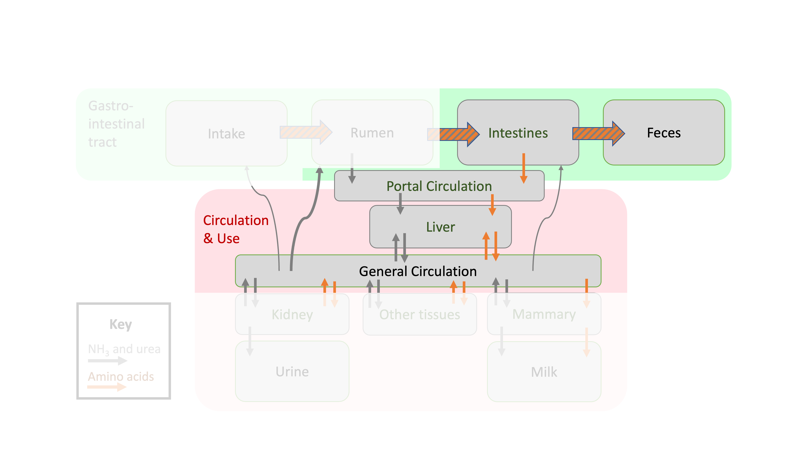

---
output:
  html_document: default
  pdf_document: default
  word_document: default
editor_options: 
  markdown: 
    wrap: 72
---

# Protein postruminal supplies

```{r, echo = F, fig.align = "center", out.width = '100%', fig.cap = "Depiction of protein flows in ruminant animals focused on postruminal flows."}

library(webexercises)
library(kableExtra)

# POTENTIAL addition here or rumen. Urea 5.88 kcal
```

```{r, include=FALSE}
knitr::opts_chunk$set(
  comment = '', echo = F, message = F, warning = F, cache = FALSE,
  out.width = '85%', fig.align = 'center', dpi = 300
)
```

```{r, echo = FALSE}
library(ggplot2)
theme_set(theme_classic())
```

::: lo
**Learning Objectives**

1.  Define MP.

2.  Describe how the fractions of digested microbial TP and RUP are calculated.

3.  Explain how to convert RUP and microbial TP supplies to an AA basis. 

:::

In the last chapter, we determined what fractions of protein were degraded and potentially contributed to microbial TP. We also learned that some protein passes out of the rumen without being altered by microbes. In this chapter, we will resume where we left off:  with microbial TP and RUP exiting the rumen and entering the lower gastrointestinal tract where they can be digested and absorbed. In other words, the goal of this chapter is to move from rumen protein fractions to **metabolizable protein and AA.** 

## Digestion of microbial TP

Microbial TP is assumed to be 80% digestible (NASEM, 2021). 
$$\text{digestible MiTP (g/d)} = 0.80* \text{MiTP (g/d)}$$


::: {.green}

**Test Yourself: **  
True or false:  The digestibility of microbial TP depends on the feeds in the diet. `r torf(FALSE)`

:::  

## Digestion of RUP

Each feed has its own intestinal digestibility coefficient (dRUP) listed in the Feed Tables. To calculate the amount of digestible RUP for a certain feed, multiply the feed's digestibility coefficient ($dcRUP_i$) by the RUP intake from that feed ($RUPIn_i$). All of digestible RUP is assumed to be TP. 

$$\text{digestible RUP (g/d) from feed }i = {dcRUP_i} * RUPIn_i$$

The digestible RUP from each feed can be summed to create a diet-level digestible RUP. 

$$\text{Diet digestible RUP}= \sum_{i = 1}^{n \space feeds} ({dcRUP_i} * RUPIn_i) $$ 

where: 
$dcRUP_i$ is the RUP digestibility coefficient (g RUP digested / 100 g RUP supply)
$RUPIn_i$ is the RUP supply from feed $i$ in g/d 

```{r, fig.cap = "Digestibility coefficients of RUP in selected feeds from NASEM (2021) feed library."}
#paste(dn$Fd_Name, collapse = "',' ")
Feed = c('Wheat grain',' Corn silage, typical','Legume silage, mid-maturity','Soybean meal, solvent 48CP')
dcRUP = c(87.734, 70, 70, 91)
df2 = data.frame(Feed, dcRUP)
kable(df2, table.attr = "style='width:50%;'") %>% 
  kable_styling(position = "center")
```


## Metabolizable protein

The true protein digested postruminally is absorbed as AA that reach
the blood stream (portal vein) for transport to the liver. This pool of
AA circulating in the blood is called Metabolizable
Protein (MP). Thus similar to the metabolizable energy concept, MP refers to the "useful" nutrients (in this case AA) absorbed in the blood. MP is the sum of digestible RUP and digestible microbial TP. 


$$\text{MP (g/d)} = (\text{digestible MiTP (g/d)}) + (\text{digestible RUP (g/d)})$$


## AA basis

According to the NASEM (2021) committee, although MP should be used to
describe and assess diets, it is intestinally-absorbed AAs (rather than
protein) that are metabolized. In other words, the nutrients used by tissues are AA, not protein. 


## AA in microbial protein

NASEM (2021) gives an average AA composition of microbial protein that is used across dietary and animal conditions. After estimating the microbial true protein supply, it can be multiplied by the AA composition to determine the amounts of each AA supplied per day. For example, 

$$
\text{MiTP_AA, g/d} = \text{MiTP, g/d} *
\begin{bmatrix} 
\text{Arg % of TP} \\ 
\text{His % of TP} \\ 
\text{Ile % of TP} \\ 
\text{Leu % of TP} \\ 
\text{Lys % of TP} \\ 
\text{Met % of TP} \\ 
\text{Phe % of TP} \\ 
\text{Thr % of TP} \\ 
\text{Trp % of TP} \\ 
\text{Val % of TP} \\ 
\end{bmatrix}
$$

```{r, fig.height = 3, fig.width = 4, out.width = '60%', fig.cap = "Essential amino acid profile (% of true protein) of microbial true protein in NASEM (2021, p. 79)."}
library(ggplot2)
library(dplyr)
library(tidyr)
AAname <- c("Arg", "His", "Ile", "Leu", "Lys", "Met", "Phe", "Thr", "Trp", "Val")
AAname = factor(AAname, levels = AAname)

Microbial_AA<- c(5.47, 2.21, 6.99, 9.23, 9.44, 2.63, 6.30, 6.23, 1.37, 6.88)
micr_AA = data.frame(  AAname,  Microbial_AA)


micr_AA %>% 
  ggplot(aes(x = AAname, y = Microbial_AA, fill = AAname)) + 
  geom_bar(stat = "identity") + 
  geom_label(aes(label = round(Microbial_AA, 1)), fill = "white", label.padding = unit(.1, "lines"), size = 4)+  theme_bw() + theme(legend.position = "none") + labs(x =NULL, y = NULL)
```


## AA in RUP

The EAA composition of RUP is assumed to be the same as the EAA composition of CP in the feed ingredient. Therefore, to convert RUP to an AA basis, we can multiply the RUP (g/d) by the EAA composition of the feed. 

$$
\text{RUPEAA, g/d} = \text{RUP, g/d} *
\begin{bmatrix} 
\text{Arg % of CP} \\ 
\text{His % of CP} \\ 
\text{Ile % of CP} \\ 
\text{Leu % of CP} \\ 
\text{Lys % of CP} \\ 
\text{Met % of CP} \\ 
\text{Phe % of CP} \\ 
\text{Thr % of CP} \\ 
\text{Trp % of CP} \\ 
\text{Val % of CP} \\ 
\end{bmatrix}
$$


```{r, fig.height = 6, fig.width = 6, out.width = '100%' , fig.cap = "Essential amino acid (EAA, % of true protein) composition of selected feeds from the NASEM (2021) feed tables, which is equivalent to the EAA composition of rumen undegraded protein from these feeds."}
library(stringr)
dl = dairynasem::default_library
selected_fds = c("Canola meal", "Feather meal", # "Soybean meal, solvent 48CP", 
                 "Legume silage, mid-maturity", "Corn gluten meal")
dl %>%
  filter(Fd_Name %in% selected_fds) %>%
  select(Fd_Name, matches("Fd_..._CP"), -Fd_CPs_CP, -Fd_NPN_CP) %>%
  pivot_longer(-Fd_Name) %>%
  mutate(name = str_replace_all(name, "Fd_", "")) %>%
  mutate(name = str_replace_all(name, "_CP", "")) %>%
  ggplot(., aes(x = name, y = value, fill = name)) +
  geom_bar(stat = "identity") +
  geom_label(aes(label = format(round(value, 1), nsmall = 1L)),
    fill = "white",
    label.padding = unit(.1, "lines"), size = 3
  ) +
  facet_wrap(~Fd_Name) +
  theme_bw() +
  theme(legend.position = "none") + labs(x = NULL, y = NULL)
  
```

NASEM (2021) assumed that the digestibility of each individual AA in RUP was the same as the digestibility of RUP (p. 78). The committee noted that this assumption is likely incorrect, but they had insufficient data to recommend digestibility coefficients for each individual AA. 

For a given feed, the digested fraction of each EAA can be calculated using the digestibility coefficient of RUP for that feed ($dcRUP$) multiplied by the total supply of each EAA in RUP supply. In the NASEM (2021) model, these AA supplies are corrected for incomplete recovery during hydrolysis to correct for errors introduced by laboratory methods. This aspect is omitted from our interactive textbook.

$$
\text{dRUPEAA, g/d} = dcRUP *
\begin{bmatrix} 
\text{Arg, g/d} \\ 
\text{His, g/d} \\ 
\text{Ile, g/d} \\ 
\text{Leu, g/d} \\ 
\text{Lys, g/d} \\ 
\text{Met, g/d} \\ 
\text{Phe, g/d} \\ 
\text{Thr, g/d} \\ 
\text{Trp, g/d} \\ 
\text{Val, g/d} \\ 
\end{bmatrix}
$$
```{r}
# spacer, do not delete
```

::: {.green}

**Test Yourself: **  

True or false:  The digestibility of each individual AA in RUP is assumed to be the same as the overall digestibility of RUP. `r torf(TRUE)`

True or false:  In many feeds, only a small portion (10-20%) of RUP is digestible. `r torf(FALSE)`

:::  

## Examples

`r hide("Show NASEM dairy-8 Example")`

1. Open NASEM dairy-8. 
1. Load one of the default simulations, for example by clicking File > Load Simulation > "Example-Lactating-Cow-DIM-150." The default simulation is pre-populated with inputs, so there is no need to add information about the animal. However, this information can be modified if you are interested in seeing the results.
1. Click "Reports" tile in the top menu. 
1. Check "All" under "Select one or more reports." Then hit the button "Generate Selected Reports." A Word Document will appear for download. 
1. In the Word Document, find "Report 6. Protein and Amino Acid Supply and Requirements." This report shows the Metabolized Protein Supply including the fractions derived from microbial CP versus RUP. Then, scroll down a few pages to find "6.4 Duodenal AA Flows, g/d." This table shows the supply of EAA from RUP and MiCP as calculated above. Note that NASEM (2021) includes a correction for incomplete recovery of AA during laboratory analysis that was not discussed in this chapter. 

`r unhide()` 

`r hide("Show R example")`
```{r, echo = T, eval = F}
# load required packages
library(dplyr)

# Inputs - these were generated in examples for last chapter
MiTP = 903.3779 # g/d 
Feed = c('Wheat grain',' Corn silage, typical','Legume silage, mid-maturity','Soybean meal, solvent 48CP')
rup_ests = c(28.6788318293683, 32.9167509509957, 26.8887175712971, 32.7318319327731)
dcRUP = c(87.734, 70, 70, 91)

# Calculate microbial TP and digestible MiTP and RUP, calculate MP
dMiTP = 0.80 * MiTP
dRUP = dcRUP * rup_ests # rup_ests g/d
MP = dMiTP + dRUP

# Dataframe with selected feeds
# Fd_CP is a percent of DM
# Fd_RUP_base is the RUP as a % of CP
# Fd_dcRUP is the digestibility coefficient of RUP
# AAname is the name of AA
# AApercent of CP is the percent of CP from that AA
# Inclusion is the proportion of the diet DM made up by this ingredient. 
# Diet DMI is the kg/d intake of the entire diet

feed_aa_rup_info <- structure(list(Fd_Name = c(
  "Wheat grain", "Wheat grain", "Wheat grain",
  "Wheat grain", "Wheat grain", "Wheat grain", "Wheat grain", "Wheat grain",
  "Wheat grain", "Wheat grain", "Corn silage, typical", "Corn silage, typical",
  "Corn silage, typical", "Corn silage, typical", "Corn silage, typical",
  "Corn silage, typical", "Corn silage, typical", "Corn silage, typical",
  "Corn silage, typical", "Corn silage, typical", "Legume silage, mid-maturity",
  "Legume silage, mid-maturity", "Legume silage, mid-maturity",
  "Legume silage, mid-maturity", "Legume silage, mid-maturity",
  "Legume silage, mid-maturity", "Legume silage, mid-maturity",
  "Legume silage, mid-maturity", "Legume silage, mid-maturity",
  "Legume silage, mid-maturity", "Soybean meal, solvent 48CP",
  "Soybean meal, solvent 48CP", "Soybean meal, solvent 48CP", "Soybean meal, solvent 48CP",
  "Soybean meal, solvent 48CP", "Soybean meal, solvent 48CP", "Soybean meal, solvent 48CP",
  "Soybean meal, solvent 48CP", "Soybean meal, solvent 48CP", "Soybean meal, solvent 48CP"
), Fd_CP = c(
  13.485, 13.485, 13.485, 13.485, 13.485, 13.485,
  13.485, 13.485, 13.485, 13.485, 7.707, 7.707, 7.707, 7.707, 7.707,
  7.707, 7.707, 7.707, 7.707, 7.707, 20.471, 20.471, 20.471, 20.471,
  20.471, 20.471, 20.471, 20.471, 20.471, 20.471, 52.644, 52.644,
  52.644, 52.644, 52.644, 52.644, 52.644, 52.644, 52.644, 52.644
), Fd_RUP_base = c(
  28.686, 28.686, 28.686, 28.686, 28.686, 28.686,
  28.686, 28.686, 28.686, 28.686, 32.917, 32.917, 32.917, 32.917,
  32.917, 32.917, 32.917, 32.917, 32.917, 32.917, 26.89, 26.89,
  26.89, 26.89, 26.89, 26.89, 26.89, 26.89, 26.89, 26.89, 32.746,
  32.746, 32.746, 32.746, 32.746, 32.746, 32.746, 32.746, 32.746,
  32.746
), Fd_dcRUP = c(
  87.734, 87.734, 87.734, 87.734, 87.734,
  87.734, 87.734, 87.734, 87.734, 87.734, 70, 70, 70, 70, 70, 70,
  70, 70, 70, 70, 70, 70, 70, 70, 70, 70, 70, 70, 70, 70, 91, 91,
  91, 91, 91, 91, 91, 91, 91, 91
), AAname = c(
  "Fd_Arg_CP", "Fd_His_CP",
  "Fd_Ile_CP", "Fd_Leu_CP", "Fd_Lys_CP", "Fd_Met_CP", "Fd_Phe_CP",
  "Fd_Thr_CP", "Fd_Trp_CP", "Fd_Val_CP", "Fd_Arg_CP", "Fd_His_CP",
  "Fd_Ile_CP", "Fd_Leu_CP", "Fd_Lys_CP", "Fd_Met_CP", "Fd_Phe_CP",
  "Fd_Thr_CP", "Fd_Trp_CP", "Fd_Val_CP", "Fd_Arg_CP", "Fd_His_CP",
  "Fd_Ile_CP", "Fd_Leu_CP", "Fd_Lys_CP", "Fd_Met_CP", "Fd_Phe_CP",
  "Fd_Thr_CP", "Fd_Trp_CP", "Fd_Val_CP", "Fd_Arg_CP", "Fd_His_CP",
  "Fd_Ile_CP", "Fd_Leu_CP", "Fd_Lys_CP", "Fd_Met_CP", "Fd_Phe_CP",
  "Fd_Thr_CP", "Fd_Trp_CP", "Fd_Val_CP"
), AApercentofCP = c(
  4.794,
  2.154, 3.445, 6.537, 2.761, 1.537, 4.447, 2.946, 1.357, 4.444,
  2.317, 1.707, 3.415, 8.537, 2.805, 1.585, 3.902, 3.415, 0.732,
  4.512, 1.762, 1.917, 4.145, 6.736, 4.715, 1.347, 4.352, 3.834,
  1.192, 5.078, 7.291, 2.641, 4.537, 7.63, 6.163, 1.377, 5.034,
  3.95, 1.377, 4.763
), Inclusion = c(
  0.1, 0.1, 0.1, 0.1, 0.1, 0.1,
  0.1, 0.1, 0.1, 0.1, 0.4, 0.4, 0.4, 0.4, 0.4, 0.4, 0.4, 0.4, 0.4,
  0.4, 0.2, 0.2, 0.2, 0.2, 0.2, 0.2, 0.2, 0.2, 0.2, 0.2, 0.3, 0.3,
  0.3, 0.3, 0.3, 0.3, 0.3, 0.3, 0.3, 0.3
), DMI = c(
  25, 25, 25,
  25, 25, 25, 25, 25, 25, 25, 25, 25, 25, 25, 25, 25, 25, 25, 25,
  25, 25, 25, 25, 25, 25, 25, 25, 25, 25, 25, 25, 25, 25, 25, 25,
  25, 25, 25, 25, 25
)), class = c("tbl_df", "tbl", "data.frame"), row.names = c(NA, -40L))

# Calculate AA flows in digestible RUP, g/d for each feed
# The resulting calculations are new columns in the dataframe
# Each result is specific to FEED, or specific to FEED and AA (AAgperd)
feed_aa_rup_info %>% 
  mutate(CPgperd = DMI*Inclusion*(Fd_CP/100), # NOTE this is repeated across AA
         RUPgperd = DMI*Inclusion*(Fd_CP/100)*(Fd_RUP_base/100),  # NOTE this is repeated across AA
         dRUPgperd = DMI*Inclusion*(Fd_CP/100)*(Fd_RUP_base/100)*(Fd_dcRUP/100)*1000, # NOTE this is repeated across AA
         dRUPEAAgperd = dRUPgperd*(AApercentofCP/100)) # grams of individual AA. 
  
  
```
`r unhide()` 

`r hide("Show Python example")`

```{python, eval = F, echo = T}
# Note - must use list evaluation:  dRUP = [dcRUP[i] * rup_ests[i] for i in range(len(rup_ests))] or the alternative. 
import pandas as pd

# Inputs - these were generated in examples for last chapter
MiTP = 903.3779  # g/d
Feed = ['Wheat grain', 'Corn silage, typical', 'Legume silage, mid-maturity', 'Soybean meal, solvent 48CP']
rup_ests = [28.6788318293683, 32.9167509509957, 26.8887175712971, 32.7318319327731]
dcRUP = [87.734, 70, 70, 91]

# Calculate microbial TP and digestible MiTP and RUP, calculate MP
dMiTP = 0.80 * MiTP
dRUP = [r * e for r, e in zip(dcRUP, rup_ests)]
MP = [dMiTP + r for r in dRUP]

# Dataframe with selected feeds
# Fd_CP is a percent of DM
# Fd_RUP_base is the RUP as a % of CP
# Fd_dcRUP is the digestibility coefficient of RUP
# AAname is the name of AA
# AApercent of CP is the percent of CP from that AA
# Inclusion is the proportion of the diet DM made up by this ingredient.
# Diet DMI is the kg/d intake of the entire diet

Fd_Name = [
  "Wheat grain", "Wheat grain", "Wheat grain",
  "Wheat grain", "Wheat grain", "Wheat grain", "Wheat grain", "Wheat grain",
  "Wheat grain", "Wheat grain", "Corn silage, typical", "Corn silage, typical",
  "Corn silage, typical", "Corn silage, typical", "Corn silage, typical",
  "Corn silage, typical", "Corn silage, typical", "Corn silage, typical",
  "Corn silage, typical", "Corn silage, typical", "Legume silage, mid-maturity",
  "Legume silage, mid-maturity", "Legume silage, mid-maturity",
  "Legume silage, mid-maturity", "Legume silage, mid-maturity",
  "Legume silage, mid-maturity", "Legume silage, mid-maturity",
  "Legume silage, mid-maturity", "Legume silage, mid-maturity",
  "Legume silage, mid-maturity", "Soybean meal, solvent 48CP",
  "Soybean meal, solvent 48CP", "Soybean meal, solvent 48CP", "Soybean meal, solvent 48CP",
  "Soybean meal, solvent 48CP", "Soybean meal, solvent 48CP", "Soybean meal, solvent 48CP",
  "Soybean meal, solvent 48CP", "Soybean meal, solvent 48CP", "Soybean meal, solvent 48CP"
]
Fd_CP = [
  13.485, 13.485, 13.485, 13.485, 13.485, 13.485,
  13.485, 13.485, 13.485, 13.485, 7.707, 7.707, 7.707, 7.707, 7.707,
  7.707, 7.707, 7.707, 7.707, 7.707, 20.471, 20.471, 20.471, 20.471,
  20.471, 20.471, 20.471, 20.471, 20.471, 20.471, 52.644, 52.644,
  52.644, 52.644, 52.644, 52.644, 52.644, 52.644, 52.644, 52.644
  ]

Fd_RUP_base =  [ 
  28.686, 28.686, 28.686, 28.686, 28.686, 28.686,
  28.686, 28.686, 28.686, 28.686, 32.917, 32.917, 32.917, 32.917,
  32.917, 32.917, 32.917, 32.917, 32.917, 32.917, 26.89, 26.89,
  26.89, 26.89, 26.89, 26.89, 26.89, 26.89, 26.89, 26.89, 32.746,
  32.746, 32.746, 32.746, 32.746, 32.746, 32.746, 32.746, 32.746,
  32.746
  ]

Fd_dcRUP = [
  87.734, 87.734, 87.734, 87.734, 87.734,
  87.734, 87.734, 87.734, 87.734, 87.734, 70, 70, 70, 70, 70, 70,
  70, 70, 70, 70, 70, 70, 70, 70, 70, 70, 70, 70, 70, 70, 91, 91,
  91, 91, 91, 91, 91, 91, 91, 91]

AAname = [
  "Fd_Arg_CP", "Fd_His_CP",
  "Fd_Ile_CP", "Fd_Leu_CP", "Fd_Lys_CP", "Fd_Met_CP", "Fd_Phe_CP",
  "Fd_Thr_CP", "Fd_Trp_CP", "Fd_Val_CP", "Fd_Arg_CP", "Fd_His_CP",
  "Fd_Ile_CP", "Fd_Leu_CP", "Fd_Lys_CP", "Fd_Met_CP", "Fd_Phe_CP",
  "Fd_Thr_CP", "Fd_Trp_CP", "Fd_Val_CP", "Fd_Arg_CP", "Fd_His_CP",
  "Fd_Ile_CP", "Fd_Leu_CP", "Fd_Lys_CP", "Fd_Met_CP", "Fd_Phe_CP",
  "Fd_Thr_CP", "Fd_Trp_CP", "Fd_Val_CP", "Fd_Arg_CP", "Fd_His_CP",
  "Fd_Ile_CP", "Fd_Leu_CP", "Fd_Lys_CP", "Fd_Met_CP", "Fd_Phe_CP",
  "Fd_Thr_CP", "Fd_Trp_CP", "Fd_Val_CP"
]
AApercentofCP = [
  4.794,
  2.154, 3.445, 6.537, 2.761, 1.537, 4.447, 2.946, 1.357, 4.444,
  2.317, 1.707, 3.415, 8.537, 2.805, 1.585, 3.902, 3.415, 0.732,
  4.512, 1.762, 1.917, 4.145, 6.736, 4.715, 1.347, 4.352, 3.834,
  1.192, 5.078, 7.291, 2.641, 4.537, 7.63, 6.163, 1.377, 5.034,
  3.95, 1.377, 4.763]
Inclusion = [
  0.1, 0.1, 0.1, 0.1, 0.1, 0.1,
  0.1, 0.1, 0.1, 0.1, 0.4, 0.4, 0.4, 0.4, 0.4, 0.4, 0.4, 0.4, 0.4,
  0.4, 0.2, 0.2, 0.2, 0.2, 0.2, 0.2, 0.2, 0.2, 0.2, 0.2, 0.3, 0.3,
  0.3, 0.3, 0.3, 0.3, 0.3, 0.3, 0.3, 0.3]

DMI = [
  25, 25, 25,
  25, 25, 25, 25, 25, 25, 25, 25, 25, 25, 25, 25, 25, 25, 25, 25,
  25, 25, 25, 25, 25, 25, 25, 25, 25, 25, 25, 25, 25, 25, 25, 25,
  25, 25, 25, 25, 25
]
data = {
    'Fd_Name': Fd_Name,
    'Fd_CP': Fd_CP,
    'Fd_RUP_base': Fd_RUP_base,
    'Fd_dcRUP': Fd_dcRUP,
    'AAname': AAname,
    'AApercentofCP': AApercentofCP,
    'Inclusion': Inclusion,
    'DMI': DMI
}

feed_aa_rup_info = pd.DataFrame(data)

# Calculate AA flows in digestible RUP, g/d for each feed
# The resulting calculations are new columns in the dataframe
# Each result is specific to FEED, or specific to FEED and AA (AAgperd)

feed_aa_rup_info['CPgperd'] = feed_aa_rup_info['DMI'] * feed_aa_rup_info['Inclusion'] * (feed_aa_rup_info['Fd_CP'] / 100)
feed_aa_rup_info['RUPgperd'] = feed_aa_rup_info['DMI'] * feed_aa_rup_info['Inclusion'] * (feed_aa_rup_info['Fd_CP'] / 100) * (feed_aa_rup_info['Fd_RUP_base'] / 100)
feed_aa_rup_info['dRUPgperd'] = feed_aa_rup_info['DMI'] * feed_aa_rup_info['Inclusion'] * (feed_aa_rup_info['Fd_CP'] / 100) * (feed_aa_rup_info['Fd_RUP_base'] / 100) * (feed_aa_rup_info['Fd_dcRUP'] / 100) * 1000
feed_aa_rup_info['dRUPEAAgperd'] = feed_aa_rup_info['dRUPgperd'] * (feed_aa_rup_info['AApercentofCP'] / 100)


```

`r unhide()` 

```{r, echo=F, eval = F}
# R CODE FOR FIGURES???

library(ggplot2)
library(dplyr)
library(tidyr)
AAname <- c("Arg", "His", "Ile", "Leu", "Lys", "Met", "Phe", "Thr", "Trp", "Val")
AAname = factor(AAname, levels = AAname)

Microbial_AA<- c(5.47, 2.21, 6.99, 9.23, 9.44, 2.63, 6.30, 6.23, 1.37, 6.88)
micr_AA = data.frame(  AAname,  Microbial_AA)


micr_AA %>% 
  ggplot(aes(x = AAname, y = Microbial_AA, fill = AAname)) + 
  geom_bar(stat = "identity") + 
  geom_label(aes(label = round(Microbial_AA, 1)), fill = "white", label.padding = unit(.1, "lines"), size = 4)+  theme_bw() + theme(legend.position = "none") + labs(x =NULL, y = NULL)


 # CODE TO GENERATE EXAMPLE DF
Fd_Name = c('Wheat grain','Corn silage, typical','Legume silage, mid-maturity','Soybean meal, solvent 48CP')
Inclusion = c(0.1, 0.4, 0.2, 0.3)
DMI = rep(25, 4) # DIet DMI, kg/d
incl = data.frame(Fd_Name, Inclusion, DMI)


library(readxl)
library(dplyr)
df = read_xls("Feeds-2023-05-14x21-31-37.xls")
df = dairynasem::default_library
dfaa = df %>% 
  select(Fd_Name, Fd_CP, Fd_RUP_base, Fd_dcRUP, matches("Fd_..._CP"), -Fd_CPs_CP, -Fd_NPN_CP) %>% 
  filter(Fd_Name %in% Feed) %>%
  pivot_longer(c(-Fd_Name, -Fd_CP, -Fd_RUP_base, -Fd_dcRUP), names_to = "AAname", values_to = "AApercentofCP") %>%
  left_join(incl)
dfaa
dput(dfaa)
```


## Questions

1. What is microbial TP and how is its digestibility calculated? Is it specific to each feed?
1. How is the amount of digestible RUP calculated? Is it specific to each feed?
1. What is Metabolizable Protein (MP) and how is it calculated?
1. Why is MP preferred over crude protein (CP) for describing and assessing diets?
1. How is the essential amino acid profile of microbial true protein determined?
1. How is the essential amino acid composition of RUP calculated?
