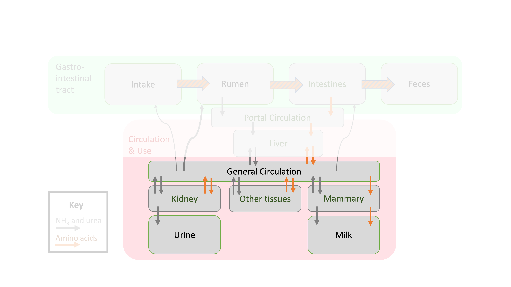

---
output:
  html_document: default
  pdf_document: default
  word_document: default
editor_options: 
  markdown: 
    wrap: 72
---

# Protein use and recommended supplies

```{r, include=FALSE}
knitr::opts_chunk$set(
  comment = '', echo = F, message = F, warning = F, cache = TRUE,
  out.width = '85%', fig.align = 'center', dpi = 300
)
```

```{r, echo = F, message = F, warning = F, fig.align = "center", out.width = '100%', fig.cap = "Depiction of protein flows in ruminant animals focused on use by various tissues."}

library(webexercises)
library(kableExtra)
library(tibble)
library(ggplot2)
library(dplyr)
library(patchwork)
```


```{r, echo = FALSE}
library(ggplot2)
theme_set(theme_classic())
```

::: lo
**Learning Objectives**

1.  Define NP.

1.  List the protein demands (e.g., scurf, lactation) considered by the NASEM (2021) model
    
1.  Explain what happens to protein in excess of body uses

:::

In the last chapter, we followed protein transformations through digestion and absorption. By the end of the last chapter, we knew the AA supplies (g/d) entering circulation and available as metabolizable protein (MP). In this chapter, we will focus on how circulating AA are used by various body tissues, for body functions. Protein used in body tissues (export or constitutive proteins) is referred to as **net protein** (NP). This is mostly analogous to the energy fractionation scheme. Similar to how energy is conserved, we can recall from the Systems Concepts chapter that the mass of the element N will also be conserved across nutritional processes. 

The NASEM (2021) model includes predictions of NP use for several body functions. First, there are baseline body functions that demand protein even for animals that are not "performing" (lactating, gestating, or growing). These functions are collectively referred to as "maintenance" uses. Maintenance uses include endogenous urinary, metabolic fecal, and scurf protein use. In contrast, pregnancy, lactation, and growth can be considered "productive" uses.

To get an idea of overall uses, let's compare predicted protein uses for the scenarios discussed in the last chapter:

- A dry multiparous cow at 260 days in gestation (dry = not lactating). This cow is anticipated to be gaining a small amount of body reserves (0.1 kg/d). The cow is assumed to be 3+ lactations and no longer growing in frame size.

- The same multiparous cow, but after starting to lactate, at 30 days in milk (DIM). Her reproductive organs are still involuting. The animal is not accreting body protein reserves.

- The same lactating multiparous cow at 150 DIM, mid-lactation, after reaching peak production. The animal is not accreting body protein reserves. 

- The same lactating multiparous cow at 250 DIM, in late lactation. At this point, she is expected to gain some body reserves (0.1 kg/d)

- A lactating primiparous cow at 150 DIM that is still growing in frame size. 


```{r}
# From Book Example diets protein D01.R
# adding HTML manually as variable naem doesn't work. `<span style=\" font-weight: bold;    \" >Dry multiparous, 260 days gestation</span>`
rec <- structure(list(Use = c(
  "Dry multiparous, 260 days gestation", "Lactating multiparous, 30 DIM", "Lactating multiparous, 250 DIM",   "Lactating multiparous, 150 DIM", "Lactating primiparous, 150 DIM"
), Scurf = c(
  8.45774930684706,
  8.45774930684706, 8.45774930684706, 8.45774930684706, 7.15995758365611
), `Endogenous Urinary` = c(
  218.625, 218.625, 218.625, 218.625,
  165.625
), `Metabolic Fecal` = c(
  171.254547684, 319.6751556768, 289.99103407824,
  283.14085217088, 239.7563667576
), `Frame Growth` = c(
  0, 0, 0, 0,
  24.6178909090909
), `Body Reserves` = c(5.848, 0, 5.848, 0, 0), Pregnancy = c(
  94.9605024737663,
  -4.80979745775318, 14.8428141045525, 0.560002723656485, 0.560002723656485
), Lactation = c(0, 1395, 992, 1193.5, 992)), row.names = c(
  NA,
  -5L
), class = c("tbl_df", "tbl", "data.frame"))
rect = rec %>% tibble() %>% 
  mutate(across(where(is.numeric), ~round(., 0))) %>% t() 
#  rownames_to_column()
# dput creates rownames = NA
# rec[1,1]

kable(rect) %>% 
 # cell_spec(c(1,1), bold = T) %>% 
  column_spec(1, width = "25em") %>%
  row_spec(1, extra_css = "vertical-align:bottom;") %>% 
  add_header_above(., c(" " = 1, "Simulated Conditions" = 5)) 
# r = cell_spec(r[1,1], bold = T)
# r
```


```{r, out.width =  '85%', fig.height = 10, fig.width = 6, fig.cap = "Predicted net protein use for different body functions"}
rec %>% 
 # filter(Use == "Dry multiparous, 260 days gestation" | Use == "Lactating multiparous, 150 DIM" | Use == "Lactating primiparous, 150 DIM") %>% 
  pivot_longer(-Use) %>% 
  mutate(
    value = round(value, digits = 0),
    Use = factor(Use, levels = c(Use = c(
  "Lactating multiparous, 30 DIM",
  "Lactating multiparous, 150 DIM", 
  "Lactating multiparous, 250 DIM", 
  "Dry multiparous, 260 days gestation", 
  "Lactating primiparous, 150 DIM"
))), 
label = paste(name, ": ", value)) %>% 
  ggplot(aes(x = name, y = value, fill = name) ) + geom_bar(position = "stack", stat = "identity") + #coord_flip() + 
  geom_label(aes(label = value), fill = "white",
             label.padding = unit(.1, "lines"), size = 4) +
  labs(x = NULL, y = NULL) + #coord_flip()+
  theme(axis.text.x = element_text(angle = 45,
                                   hjust = 1),
        legend.position = "none")+facet_wrap(~Use, ncol = 1) + theme_bw() + theme(legend.position = "none")+coord_flip()

```

::: {.green}

**Pause and think**   

What 3-5 main points (about protein use) would you conclude based on this table and figures? Write down a few observations.

::: 

Pulling out a few examples, we can make some observations. Every scenario demands protein for maintenance functions:  scurf, endogenous urinary, and metabolic fecal protein use. However, some scenarios have predicted uses that equal zero. For example, the protein used for Frame Growth = 0 for the multiparous cow because this scenario assumed an animal with 3+ lactations that was no longer growing.  The protein requirement for body reserves is zero for the scenarios at 30 and 150 DIM, because these scenarios assume the cow is maintaining a similar body reserve status. The total requirement for protein is drastically lower for non-lactating animals, although the pregnancy requirement is more substantial in late gestation (Dry cow scenario). These scenarios show that the total predicted protein use varies depending on the animal's productive status and life stage. 


## Scurf 

Scurf protein includes skin, hair, and hooves. The animal continually sheds some of this protein into the environment, although it is a small amount compared to other export proteins (e.g., milk protein). The requirements for scurf net protein and AA were determined based on
experiments in the mid-1960s by the U.S. Department of Agriculture. In
these experiments, they measured the composition of the head, hide,
feet, and tail of cattle. Based on these results, NASEM (2021)
recommended an equations for predicting scurf requirements based on
bodyweight.

$$\text{NPScurf (g/d)} = 0.20 * BW^{0.60} * 0.85$$
This equation uses an allometric scaling of BW ($BW^{0.60}$) multiplied by a fixed coefficient (0.20). Scurf is assumed to contain 85% TP based on its AA composition. The implication of this equation is that animals with greater bodyweight (i.e., bigger animals) require more scurf protein because they have more protein being lost to maintain their skin, hair, and
hooves. Probably, scurf requirements vary depending on the environmental
conditions. For example, cattle may need more scurf protein during
winter to build up the thick hair coat. However, these differences are
so minor compared to other protein requirements that they are ignored in
the NASEM (2021) model.


## Endogenous urinary protein

NASEM (2021) lists major contributors to endogenous urinary N as endogenous urea, endogenous purine derivatives, creatinine and creatine, hippuric acid, and 3-methyl histidine. These compounds are produced as an unavoidable part of maintaining the animal's function and regular protein turnover. 

$$\text{NPEndUrinary (g/d)} = 53*6.25*BW*0.001$$
This equation uses a relationship found in past research, that 53 mg of endogenous N were excreted in urine per kg of bodyweight. The equation includes a conversion to CP basis (x6.25) and to grams from mg (x0.001). Because endogenous urinary N derives from AA, NASEM (2021) assumed that the ratio of TP to CP was 1.0. Therefore a TP to CP conversion factor is not included in the equation. 


## Metabolic fecal protein

Metabolic fecal protein represents the endogenous proteins "secreted or sloughed in the gut lumen and not digested in the small intestine" (NASEM, 2021; p. 85). In other words, these are proteins produced as part of regular gastrointestinal tract functions that exit the animal (in feces) before being reabsorbed. 

Eq. 6-9, p. 85
$$\text{NPMFP (g/d)} = [(11.62 + 0.134*NDF)*DMI]*0.73$$
where $NDF$ is the percent of NDF in DM (not divided by 100 in this case), and $DMI$ is in kg/d. The MFP fraction is assumed to contain 73% TP. This equation suggests that diets with more fiber (greater NDF%) and greater DMI intake contribute to larger use of protein for metabolic fecal protein. This is because each of these terms has a positive coefficient. 


## Milk protein

Milk protein export is commonly measured. The net protein requirement for milk production is assumed to be the net protein amount of milk exported. For example, production of 35 kg/d of milk with 3.2% true protein accounts for 1.12 kg of milk net protein secretion (1120 g). Because milk protein production is commonly known, often there is no need for a predictive equation such as those used with other protein uses (e.g., gestation, metabolic fecal protein)

## Gestation protein

During gestation, the fetus and placenta grow and demand protein. Maternal reproductive tissues (e.g., the uterus) also grow and demand protein. For this reason, the NASEM (2021) model uses the total gain of the gravid uterus (pregnant uterus) to estimate requirements. 

Eq. 6-11, p. 86
$$\text{NPGestation (g/d)} = Gain_{GrUter} * 125$$
$Gain_{GrUter}$ is the daily gain in mass (as-is) of the gravid uterus. The gravid uterus is assumed to contain 125 g of protein per kg of wet weight. The NASEM (2021) model also assumes that some NP is released by the involution of maternal reproductive tissues. In other words, the process of shrinking the maternal reproductive organs back down to non-pregnant state frees some AA that can be used for other body purposes. This is why the NP use for gestation is negative from days 0 to 100 of lactation. 

```{r, fig.cap = "Example of NP use for gestation for a cow with conception at 90 days in milk." }
An_GestDay = 0
An_GestLength = 283
Fet_BWbrth = 41
An_AgeDay = 1100
An_LactDay = 1:100
An_Parity_rl = 2
  Body_NP_CP <- 0.86
  
# For a cow bred at 90 DIM, starting with lactation
An_Day = 1:373
An_LactDay = c(1:305, rep(NA, 68))
An_GestDay = c(rep(0, 90), 1:283)

  #Create a pregnancy switch for use in calculations.
  An_Preg <- ifelse(An_GestDay > 0 & An_GestDay <= An_GestLength, 1, 0)

  GrUterWt_FetBWbrth <- 1.816	#kg of Gravid Uterus/kg of calf birth weight based on 280 d gestation and Bell solutions.
  UterWt_FetBWbrth <- 0.2311;	#kg Maternal Tissue/kg calf weight at parturition from fits to Bell 1995 data
  NE_GrUtWt <- 0.950;		#mcal/kg fresh Gravid Uterus weight at birth which represents the accumulated values
  CP_GrUtWt <- 0.123;		#kg CP/kg fresh Gr Uterus weight

  #Gravid uterine, fetal, and uterine (+cotyledons) growth rate constants derived from Bell data
  #An_GestDay=0 shuts this section off.
  GrUter_Ksyn <- 2.43e-2
  GrUter_KsynDecay <- 2.45e-5
  Fet_Ksyn <- 5.16e-2
  Fet_KsynDecay <- 7.59e-5
  Uter_Ksyn <- 2.42e-2		#Derived from Maternal Tissue data by Hanigan et al., 2009
  Uter_KsynDecay <- 3.53e-5
  Uter_Kdeg <- 0.20			#Estimate from Hanigan et al, 2009

  #Estimate Maternal Tisue weight (uterus plus caruncles) at any time
  Uter_Wtpart <- Fet_BWbrth * UterWt_FetBWbrth
  Uter_Wt <- 0.204  #Nonpregnant uterine base weight; ideally would be scaled to BW/BWmature, but a small error for young animals
  Uter_Wt <- ifelse(An_AgeDay < 240, 0, Uter_Wt)  #Set Uter_Wt to 0 for young animals
  Uter_Wt <- ifelse(An_GestDay > 0 & An_GestDay <= An_GestLength,  #gestating animal
                    Uter_Wtpart * exp(-(Uter_Ksyn-Uter_KsynDecay*An_GestDay)*(An_GestLength-An_GestDay)), Uter_Wt)
  Uter_Wt <- ifelse(An_GestDay <= 0 & An_LactDay > 0 & An_LactDay < 100, #uterine involution after calving
                    ((Uter_Wtpart-0.204)*exp(-Uter_Kdeg*An_LactDay))+0.204, Uter_Wt)	#LactDay should start at 1, not 0
  Uter_Wt <- ifelse(An_Parity_rl > 0 & Uter_Wt < 0.204, 0.204, Uter_Wt)  #Set the min to 0.204.  Should be scaled to BW, but no data.
  #The above needs to be looked at again.  It doesn't converge back to 0.204 as it should when using the Bell et al. birth weights.  Close but not exact.  Perhaps rounding error, but not sure. MDH

  #Estimate Gravid Uterine weight at any time
  GrUter_Wtpart <- Fet_BWbrth * GrUterWt_FetBWbrth
  GrUter_Wt <- Uter_Wt                                               #non-pregnant animal
  GrUter_Wt <- ifelse(An_GestDay > 0 & An_GestDay <= An_GestLength,  #gestating animal
                      GrUter_Wtpart * exp(-(GrUter_Ksyn-GrUter_KsynDecay*An_GestDay)*(An_GestLength-An_GestDay)),
                      GrUter_Wt)
  GrUter_Wt <- ifelse(GrUter_Wt < Uter_Wt, Uter_Wt, GrUter_Wt)  #Shouldn't need this, but just in case, trap bad values

  #Estimate Fetal weight at any time
  Fet_Wt <- 0                                                     #open animal
  Fet_Wt <- ifelse(An_GestDay > 0 & An_GestDay <= An_GestLength,  #gestating animal
                   Fet_BWbrth * exp(-(Fet_Ksyn-Fet_KsynDecay*An_GestDay)*(An_GestLength-An_GestDay)), Fet_Wt)

  #Estimate rates of fresh tissue growth for the Gravid Uterus, Maternal Repro Tissue, and the Fetus
  Uter_BWgain <- 0  #Open and nonregressing animal
  Uter_BWgain <- ifelse(An_GestDay > 0 & An_GestDay <= An_GestLength,  #gestating animal
                        (Uter_Ksyn - Uter_KsynDecay * An_GestDay) * Uter_Wt, Uter_BWgain)
  Uter_BWgain <- ifelse(An_GestDay <= 0 & An_LactDay > 0 & An_LactDay < 100, #uterine involution after calving
                        -Uter_Kdeg*Uter_Wt, Uter_BWgain)	#kg/d

  GrUter_BWgain <- 0       #open animal and nonregressing, kg fresh wt/d
  GrUter_BWgain <- ifelse(An_GestDay > 0 & An_GestDay <= An_GestLength,  #gestating animal
                          (GrUter_Ksyn-GrUter_KsynDecay*An_GestDay)*GrUter_Wt, GrUter_BWgain)
  GrUter_BWgain <- ifelse(An_GestDay <= 0 & An_LactDay > 0 & An_LactDay < 100, #uterine involution after calving
                          Uter_BWgain, GrUter_BWgain)
  Fet_BWgain <- 0	#open animal, kg/d
  Fet_BWgain <- ifelse(An_GestDay > 0 & An_GestDay <= An_GestLength, #gestating animal
                       (Fet_Ksyn-Fet_KsynDecay*An_GestDay)*Fet_Wt, Fet_BWgain)
  Conc_BWgain <- GrUter_BWgain - Uter_BWgain

  #Net protein gain in other maternal tissues during late gestation: mammary, intestine, liver, and blood
  #this should be replaced with a growth funncton such as Dijkstra's mammary growth equation. MDH.
  Gest_NPother_g <- 0
  #Gest_CPother_g <- ifelse(An_GestDay>=260, 0.135*6.25*An_MBW,0) #Causes a big jump when it turns on at 260 days pregnant.  Not used.
  #0.135 g/kg is the mean of values from McNeill et al. 1997 and Putnam and Varga, 1998.
  #Gest_NPother_g <- Gest_CPother_g * Body_NP_CP
  #Body_NP_CP is the conversion of CP to TP.

  #### Gestation Energy ####
  Gest_REgain <- GrUter_BWgain * NE_GrUtWt;	#This will slightly underestimate release of NE from the regressing uterus

  #### Estimate net rates of NP (g/d), and AA (g/d) deposition in the Gravid uterus ####
  Gest_NCPgain_g <- GrUter_BWgain * CP_GrUtWt * 1000
  Gest_NPgain_g <- Gest_NCPgain_g * Body_NP_CP;	#Will slightly underestimate release of NP from the regressing uterus
  Gest_NPuse_g <- Gest_NPgain_g + Gest_NPother_g
  Gest_CPuse_g <- Gest_NPuse_g/Body_NP_CP

  
  
  # Create plots 
gest_use = data.frame(An_Day, An_GestDay, Gest_CPuse_g, GrUter_BWgain, Gest_NPuse_g, Gest_NPgain_g)

#dput(gest_use)


gest_use %>% 
  ggplot(aes(x = An_Day, y = Gest_NPuse_g))+ geom_point() +
  theme_bw() +
  annotate(geom="rect", xmin = 0, xmax = 90, ymin = -Inf, ymax = Inf, alpha = .2) +
  annotate(geom = "text", label = "Involution \n up to 100 d \n of lactation", x = 50, y = 100) +
  annotate(geom="rect", xmin = 90, xmax = 373, ymin = -Inf, ymax = Inf, alpha = .2, fill = "purple") +
  annotate(geom = "text", label = "Gestation, 283 d", x = 225, y = 100) +
  geom_vline(xintercept = 90, linetype = "dashed", color = "red")+  
  annotate(geom = "label", label = "Conception,\n 90 DIM", x = 100, y = 50, color = "red") + 
  geom_vline(xintercept = 0, linetype = "dashed", color = "red")+
  annotate(geom = "label", label = "Parturition,\n 0 DIM", x = 15, y = 50, color = "red")+
  labs(x = NULL, y = "NP use for gestation, g/d")
```


## Growth

NASEM (2021) divides body growth into two categories:  frame growth and body reserve gain. Whereas frame growth is true growth in the size (frame) of a maturing animal, body reserve gain represents changes to body stores including muscle and adipose tissue. The growth requirement is the sum of frame growth and body reserve gain needs. 

$$\text{NPGrowth (g/d)} = (\text{NP frame gain} )+(\text{NP reserve gain} )$$

**Frame growth**

Chapter 11 of NASEM (2021, p. 255) discusses growth in much greater detail, including a description of how body composition changes as the animal grows closer to mature body weight. Protein requirements for youngstock are discussed in Chapter 10. Still, lactating cattle continue to grow during the first and second lactation, therefore, Chapter 6 includes an equation to estimate the NP used for frame growth. 

Eq 6-12, p. 87
$$\text{NP frame gain (g/d)} = \text{Frame weight gain (g/d)} * 0.11 *0.86$$
This is because frame growth is assumed to include 11% CP on an as-is basis, with 86% TP. According to NASEM (2021), 0.19 and 0.15 kg/d of frame growth rates are reasonable targets for frame growth in first and second lactation Holsteins. After the second lactation, frame growth is typically assumed to be zero. Frame growth is assumed to represent 85% of live weight growth.

```{r, fig.cap="Frame growth targets in NASEM (2021) for first, second, and third or greater lactations"}
lact = c(rep(1, 365), rep(2, 365), rep(3, 365*2))
day = c(rep(1:365,4))
yearday = c(1:1460)
lact = data.frame(lact, day, yearday)

maturewt = 700*0.85 # kg

framegain = lact %>% 
  mutate(EBW = case_when(lact == 1 ~ (maturewt*0.82)+day*0.19,
                        lact == 2 ~ (maturewt*0.82)+day*0.15+(365*.19),
                        lact == 3 ~ (maturewt*0.82)+day*0+(365*.19)+(365*.15)))
framegain %>% 
  ggplot(aes(x = yearday, y = EBW, color = as.character(lact))) +
  geom_point()+ theme_classic()+theme(legend.position = "none") + 
  labs(x = NULL, y = "Frame Weight, kg") + 
  annotate(geom = "text", x = 420, y = 515, label = "Parity 1 frame gain:  0.19 kg/d", color = "darkred")+ 
  annotate(geom = "text", x = 770, y = 575, label = "Parity 2 frame gain:  0.15 kg/d", color = "darkgreen")+ 
  annotate(geom = "text", x = 1150, y = 600, label = "Parity 3+ frame gain:  0.0 kg/d", color = "darkblue")
```


**Body reserve gain**

The equation for body reserve gain is similar, except that body reserves are assumed to contain 8% CP. Target body reserve gain is specified by the user based on the animal's current and target body reserve status. 

Eq 6-12, p. 87
$$\text{NP reserve gain (g/d)} = \text{Body reserve gain (g/d)} * 0.08 * 0.86$$  

## Total NP use

The total NP use is estimated by summing the predicted use of NP for each body function:

$$\text{Total NP use, g/d} = \text{NPScurf} + \text{NPEndUrinary} + \text{NPMFP} + \text{NPMilk} + \\[16pt] \text{NPGestation} +  \text{NPGrowth} $$

Endogenous urinary, metabolic fecal, and scurf proteins are sometimes referred to collectively as "maintenance" uses. This is because these requirements exist across animals to "maintain" body function. In contrast, pregnancy, lactation, and growth can be considered "productive" uses.

## AA basis

To convert each of these NP equations to an AA basis, multiply the NP use by the AA composition of the respective protein fraction. AA composition of CP and TP fractions is given in Table 6-2 in NASEM (2021; p. 79). The AA composition of body growth and the growth of the gravid uterus are assumed to equal the "Whole Empty Body" AA composition. 


```{r, fig.height = 6, fig.width = 8, out.width='100%', fig.cap = "AA composition of protein fractions as listed in NASEM (2021, p. 79) as a percentage of TP."}
library(ggplot2)
library(dplyr)
library(tidyr)
AAname <- c("Arg", "His", "Ile", "Leu", "Lys", "Met", "Phe", "Thr", "Trp", "Val")
AAname = factor(AAname, levels = AAname)
AA_N_conc <- c(32.16, 27.08, 10.68, 10.68, 19.16, 9.39, 8.48, 11.76, 13.72, 11.96)
# Microbial protein AA profile (g hydrated AA / 100 g TP)
Growth_AA = c(8.2, 3.04, 3.69, 8.27, 7.9, 2.37, 4.41, 4.84, 1.05, 5.15)

Microbial_AA<- c(5.47, 2.21, 6.99, 9.23, 9.44, 2.63, 6.30, 6.23, 1.37, 6.88)
# Doudenal endogenous CP AA profile (g hydrated AA / 100 g CP)
# ### Note this is CP not TP basis ####
# Duo endogenous was used to REMOVE this bias from observed AA flow to isolate the feed related flows. Therefore, I am omitting it. 
#Duodenal_End_AA <- c(4.61, 2.90, 4.09, 7.67, 6.23, 1.26, 3.98, 5.18, 1.29, 5.29)
# AA recovery factors
#Rec_AA <- c(
#  1 / 1.061, 1 / 1.073, 1 / 1.12, 1 / 1.065, 1 / 1.066, 1 / 1.05,
#  1 / 1.061, 1 / 1.067, 1 / 1.06, 1 / 1.102
#)
# Milk Protein AA Composition, g/100 g of TP
Milk_AA <- c(3.74, 2.92, 6.18, 10.56, 8.82, 3.03, 5.26, 4.62, 1.65, 6.90)
# Metabolic Fecal Protein AA Composition, g/100 g of TP
Metabolic_Fecal_AA <- c(5.90, 3.54, 5.39, 9.19, 7.61, 1.73, 5.28, 7.36, 1.79, 7.01)
# Scurf Protein AA Composition, g/100 g of TP
Scurf_AA <- c(9.60, 1.75, 2.96, 6.93, 5.64, 1.40, 3.61, 4.01, 0.73, 4.66)
# Endogenous Urinary Protein AA Composition, g/100 g of TP; these are set equal to body protein AA comp
Urine_End_AA <- c(8.20, 3.04, 3.69, 8.27, 7.90, 2.37, 4.41, 4.84, 1.05, 5.15)
# target efficiencies from table 6-4, p. 88 to convert MP and EAA to export proteins and body gain
Trg_AA_Eff <- c(0.69, 0.75, 0.71, 0.73, 0.72, 0.73, 0.60, 0.64, 0.86, 0.74)


AAinfo_dat <- data.frame(
  AAname, Milk_AA, Metabolic_Fecal_AA, Scurf_AA, Urine_End_AA, Growth_AA
) 
AA_info_long = AAinfo_dat %>% 
  pivot_longer(-c(AAname)) 

AA_info_long %>% 
  ggplot(aes(x = AAname, y = value, fill = AAname, group = name)) + 
  geom_bar(stat = "identity") + 
  geom_label(aes(label = format(round(value, 1), nsmall = 1L)), fill = "white", label.padding = unit(.1, "lines"), size = 3)+
  facet_wrap(~name) + theme_bw() + theme(legend.position = "none") + labs(x =NULL, y = NULL)

```

::: blue
**Example**  
Calculate the scurf net protein and amino acids recommended for
a 550 kg Jersey cow.

Scurf NP requirement. 
$$\text{NPScurf (g/d)} = 0.17*(550^{0.60})$$
$$ = 7.5 \text{ g/d}$$

```{r, echo = FALSE, eval = F}
matrix2latex <- function(matr) {

printmrow <- function(x) {

    cat(cat(x,sep=" & "),"\\\\ \n")
} 
# https://stackoverflow.com/questions/20749444/converting-r-matrix-into-latex-matrix-in-the-math-or-equation-environment

cat("\\begin{bmatrix}","\n")
body <- apply(matr,1,printmrow)
cat("\\end{bmatrix}")
} 
matrix2latex(matrix(paste0(("\\"), ("text{"), AAname, " % of TP in export/body pool}")))
```


Convert to AA basis.  
$$
NetAA use = \begin{bmatrix} 
\text{Arg % of TP in export or body pool} \\ 
\text{His % of TP in export or body pool} \\ 
\text{Ile % of TP in export or body pool} \\ 
\text{Leu % of TP in export or body pool} \\ 
\text{Lys % of TP in export or body pool} \\ 
\text{Met % of TP in export or body pool} \\ 
\text{Phe % of TP in export or body pool} \\ 
\text{Thr % of TP in export or body pool} \\ 
\text{Trp % of TP in export or body pool} \\ 
\text{Val % of TP in export or body pool} \\ 
\end{bmatrix} * (\text{NP use for export or body pool})
$$
:::

## Recommendations

The NASEM (2021) adopted a factorial approach to calculate total NP use, which means that the daily NP use is determined as the sum of the protein use for each relevant body function (maintenance, tissue growth, lactation and reproduction). The last step in evaluating the adequacy of protein nutrition for a diet is determining if the circulating MP (or metabolizable AA) supplied by the diet is sufficient given the predicted total NP (or Net AA) use. 

**MP to NP**
MP is used with less than perfect efficiency (<1.0 ratio of NP to MP). When considering MP as a whole (not individual AA), the efficiencies of converting MP to NP depend on the body function. Scurf, metabolic fecal protein, milk, and growth share the same target efficiency of MP use (0.69; NASEM, 2021). The use of MP for gestation is much less efficient, so an efficiency of 0.33 is used. Finally, endogenous urinary N losses are endproducts of N metabolism, so they are assigned an efficiency of 1.0 (NASEM, 2021, p. 87). In summary, the total recommended MP supply (g/d) can be calculated using the predicted NP uses (g/d) for each body function:

Eq. 6-14a, p. 89, NASEM (2021)
$$
\begin{aligned}
\text{Recommended MP supply} &= \frac{(NPScurf + NPMFP + NPMilk + NPGrowth)}{0.69} +\\[16pt]  &\quad\frac{NPGestation}{0.33} + \frac{NPEndogenousUrinary}{1.0}
\end{aligned}
$$
**Metabolizable AA to Net AA**

For a given AA ($AA_i$), the equation is similar, except that a target efficiency specific to that AA can be used, rather than a target efficiency for the entire MP fraction. NASEM provides target efficiencies for each AA for export proteins (Table 6-4, p. 88, NASEM, 2021). However, the efficiencies for gestation and endogenous urinary MP to NP use are fixed to 0.33 and 1.0, respectively. This is because there was insufficient data to recommend efficiencies specific to each AA for these body functions. 

Eq. 6-14b, p. 89, NASEM (2021)
$$
\begin{aligned}
\text{Recommended metabolizable supply of }AA_i &= \frac{(NetAA_iScurf + NetAA_iMFP + NetAA_iMilk + NetAA_iGrowth)}{TargetEffAA_i} + \\[16pt] &\quad \frac{NetAA_iGestation}{0.33} + \frac{NetAA_iEndogenousUrinary}{1.0}
\end{aligned}
$$

 
 <p style="text-align: center;"> **Table 9.1. ** Target efficiencies for EAA conversion from MP to milk, growth, scurf, and metabolic fecal protein accretion/export from NASEM (2021)" </p>
```{r}
AA <- c("Arg", "His", "Ile", "Leu", "Lys", "Met", "Phe", "Thr", "Trp", "Val")
TargetEff <- c("NA", "0.75", "0.71", "0.73", "0.72", "0.73", "0.60", "0.64", "0.86", "0.74")
data.frame(AA, TargetEff) %>% kable() %>% kable_styling(full_width = F) # there is no way to make caption in kable wider than table
```

**Determining target efficiencies** 

The NASEM (2021) committee used a creative approach to determine target MP to NP conversion efficiencies. The committee acknowledged that a lot of data was available on milk protein production, and data on protein use for other body functions were very limited. However, they found it reasonable to assume that the animal would use protein for non-milk-production body functions (e.g., maintenance functions) before milk protein production was maximized. In general, nutrition studies have shown that milk protein production increases with greater MP supply, then reaches a maximum, and declines if MP supply is excessive, forming a curve shape.  Therefore, they set out to find the efficiencies of MP to NP use at maximal milk protein production. 

The NASEM (2021) consensus report gives great detail about the process used by the committee to determine target MP and AA efficiencies. To envision the approach, we can construct a fictional example. Our example will describe a simplified way to determine MP to NP conversion efficiencies using an approach based on NASEM (2021). 

1. Develop a database with animal characteristics (e.g., body weight, milk protein production) and diet information.
1. Use the database to generate predicted supplies of MP in each scenario, and predicted use of NP for each body function using the NASEM (2021) model.
1. For each scenario, determine the MP available for milk protein production, after protein needs for other body functions have been met. 
1. Plot the MP available for milk protein production against the observed milk NP output. 
2. Fit a model to describe the observed data in an equation with linear and quadratic terms (Figure).  
3. Determine the derivative of the equation (Figure).
4. Set the derivative equal to zero to determine the maximum of the curve, where the marginal return to additional MP is zero. The maximum will have an X value and Y value describing the available MP and NP output, respectively.  
5. Calculate the efficiency of NP to MP use for milk protein production at maximum NP output, by dividing the NP output (Y value) by the MP supply (X value on figure). 


```{r, fig.cap = "Approach to calculating target efficiencies based on NASEM (2021)"}
# Create data frame for Milk Protein and its derivative
MP <- 500:2500
MilkProtein <- 1.15 * MP + -0.0003 * MP^2
Derivative <- 1.15 - 0.0006 * MP

data1 <- data.frame(MP, MilkProtein, Derivative)

p1 <- data1 %>%
  ggplot(aes(x = MP, y = MilkProtein)) +
  geom_point(size = .2) +
  geom_vline(xintercept = 1916.667, color = "red") +
  theme_bw() +
  labs(x = NULL, y = "Milk protein (NP), g/d") + 
  annotate(geom = "label", x = 750, y = 1000, label = "NP = 1102 g/d \n MP = 1917 g/d")


p2 <- data1 %>%
  ggplot(aes(x = MP, y = Derivative)) +
  geom_point(size = .2) +
  geom_vline(xintercept = 1916.667, color = "red") +
  geom_hline(yintercept = 0) +
  theme_bw() +
  labs(x = "MP available for milk protein", y = "Derivative")
patch <- p1 / p2
patch + plot_layout(heights = c(2, 1))

```

## Examples

### NASEM dairy-8

### R ## NEEDS UPDATE
```{r, echo = T, eval = F}
# Animal information
BW = 700 # body weight, kg
DMI = 25 # dry matter intake, kg/d


# Diet information
NDF = 30 # % of DM, not divided by 100!!!


# Define functions to predict use of NP
NPScurf <- function(BW) {
  0.20*BW^0.60*0.85
}
NPEndUrinary <- function(BW) {
  53*6.25*BW*0.001
}
NPMFP <- function(NDF, DMI) {
  ((11.62 +0.134 * NDF)*DMI)*0.73
}
NPGestation <- function(GainGrUter) {
  GainGrUter*125
}
NPFrame <- function(FrameGain) {
  FrameGain*0.11*0.86
}
NPReserve <- function(ReserveGain) {
  ReserveGain*0.08*0.86
}
```

## Questions

1. Which protein uses scale with body size in NASEM (2021)?
1. Which protein uses would be expected to increase as days in lactation and days in gestation increase? Which would decrease?
1. Which protein uses are considered "maintenance" functions, and why?
1. What function is often the largest protein use for non-lactating animals?
1. What function is the largest protein use in lactating animals?
1. When should producers change dietary protein after a cow becomes pregnant? Explain your reasoning. 