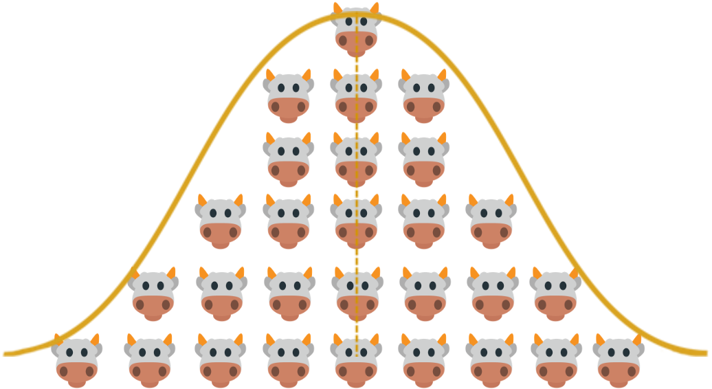

--- 
title: Learning from the narrative and model in NASEM (2021) 'Nutrient Requirements
  of Dairy Cattle'
author:
- "MaryGrace Erickson, University of Wisconsin--Madison"
- "Michel A. Wattiaux, University of Wisconsin--Madison"
- Mark D. Hanigan, Virginia Polytechnic Institute and State University
- Marina A.C. Danes, Universidade Federal de Lavras
date: "`r Sys.Date()`"
site: bookdown::bookdown_site
documentclass: book
bibliography:
- book.bib
- packages.bib
description: |
  This book is intended to help independent learners and instructors working with the NASEM (2021) dairy nutrition model.
link-citations: yes
# https://bookdown.org/yihui/bookdown/html.html
favicon: <"images/favicon.ico">
---

# https://bookdown.org/yihui/bookdown/html.html

Placeholder


## Purpose
## Structure of the module and materials for teachers
## Accessing the NASEM (2021) book
## The NASEM-dairy-8 software
## Known discrepancies
## Suggested citations
## Contribute to this module
## License details

<!--chapter:end:index.Rmd-->


# Introduction to nutritional models

Placeholder


## A brief history
## Definition
## Usefulness
## NASEM (2021) and other dairy nutrition models
## Let's develop a simple nutritional model
### Hypothesis generation
### Data collection through observation (or experimentation)
### Model development
### Model verification
### Model refinement (re-starting the process)
## Conclusions and additional complexity

<!--chapter:end:01-Introduction.Rmd-->


# Systems concepts

Placeholder


## The animal nutritional system
## Ways of understanding nutritional systems
## Systems concepts
## Single-animal nutritional system
## Physical/chemical principles: Mass & energy balance
## Biological principles: ordered processes
## Biological principles: context-dependence
## Conclusions

<!--chapter:end:02-Systems.Rmd-->

```{r include=FALSE, cache=FALSE}
suppressPackageStartupMessages({
  library(webexercises)
})

knitr::knit_hooks$set(webex.hide = function(before, options, envir) {
  if (before) {
    if (is.character(options$webex.hide)) {
      hide(options$webex.hide)
    } else {
      hide()
    }
  } else {
    unhide()
  }
})
```
# Requirements
```{r, echo = F, fig.align = "center", fig.cap = "Which one of us did you have in mind when you formulated this diet?>"}

library(webexercises)
library(ggplot2)
theme_set(theme_classic())
```


::: {.lo}

**Learning Objectives**

1. Define a nutrient requirement in precise terms. 

1. Explain how nutrient requirements are determined through experimentation.

1. List and discuss limitations of typical conceptions of “requirement” 

::: 


## Defining "nutrient requirement"

### Requirement definitions in human and dairy nutrition

Previous editions of “Nutrient Requirements for Dairy Cattle” did not explicitly define the term **nutrient requirement**, but NASEM [-@NASEM8] includes an entire chapter delineating nutrient requirements and related terms. Much of this work is based on definitions used in human nutrition. NASEM's Food and Nutrition Board in the Institute of Medicine [@iom2006] defined a series of terms outlining what **nutrient requirement** means in the human nutrition context. The dairy nutrition committee selected from these terms for use with dairy cattle. 

The NASEM [-@NASEM8] book defines a nutrient requirement as **“the daily amount of a nutrient necessary to meet a healthy animal’s needs for maintenance, activity, growth, reproduction, and lactation without any changes in body reserves or status”** (NASEM, 2021, p. 4). Let's break down each part of this definition. 

- **the daily amount of a nutrient** - In human and animal nutrition, nutrient requirements are often given in amounts per day. Thus, a requirement is a rate of amount consumed per unit time. The use of “day” as the denominator is practical. Per hour is too short a timescale, because animals do not *require* nutrients every hour to maintain their health and functioning. Yet per week is too long, because an animal deprived of a certain nutrient would probably show symptoms associated with that nutrient deficiency. Additionally, most cattle rations are mixed and fed once or twice daily, so farm operators need to know the amounts to feed once or twice daily. Therefore, amount per day is a logical choice of timescale for expressing the requirements of most nutrients.

- **a healthy animal's needs** - NASEM [-@NASEM8] acknowledges that illnesses alter the physiological state of animals such that they have different nutrition requirements. However, each illness alters nutrient requirements differently. The committee decided that there was insufficient data to predict requirements for unhealthy animals presently. As such, requirements are based on the assumption that the animal is healthy. 

- **for maintenance, activity, growth, reproduction, and lactation without any changes in body reserves or status** - This part explains that nutrient requirements are calculated to allow the animal to maintain various body functions without gaining or losing body reserves (e.g., losing fat or muscle mass) or status (e.g., losing milk production). Therefore, a nutrient requirement is specific to a given animal and scenario. 

::: {.green}

**Test Yourself:  **
How is the term **nutrient requirement** used colloquially, and how does this differ from its scientific definition?

::: 

### Absorbed and metabolizable amounts

Before moving on, we need to add more detail to what is meant by **the daily amount of a nutrient**. We know that not all the energy and nutrients eaten by an animal can be actually used for the body functions listed above. This is because a fraction of the energy and nutrients is excreted in feces and urine, and another fraction is lost as gas and heat. When discussing requirements, NASEM [-@NASEM8] most often gives the amount of nutrient on a **metabolizable** basis. This means that when we define the daily amount of a nutrient required, we mean the amount that is actually available for the animal to use for body functions (metabolizable amount) rather than the total amount of intake (gross amount). This will be detailed in later chapters. Reporting requirements as metabolizable amounts applies to energy and most nutrients except minerals, which are considered on an **absorbed** basis. The committee most likely chose an absorbed basis for minerals due to data availability. Many mineral studies report the amount of circulating minerals in the blood (absorbed) and few studies analyze mineral content in excreta (feces and urine).

::: {.orange}

**Just for fun:  ** 
Check a human food label. Similar to reporting for dairy cattle nutrition, human nutrition labels typically show the amounts of metabolizable energy and nutrients.

::: 


## Dietary reference intakes

We established a basic definition for a nutrient requirement. Estimating these average requirements is an important component of NASEM [-@NASEM8]. But NASEM Dairy-8 [-@NASEM8] not only helps determine the daily amount of nutrient required **on average** (the mean), it also gives information about the variability around the average (the variance). As a consequence, the estimated average requirement is just one parameter in a class of terms referred to as **dietary reference intakes**. These dietary reference intakes combine information about both the mean and variance in a requirement to assist nutritionists in formulating rations that protect against under- and over-supplying nutrients. 

Dietary Reference Intakes include the estimated average requirement, the recommended daily allowance, adequate intake, and maximum tolerable level. Each of these will be defined in the subsequent sections. The dietary reference intakes are based on the principle that nutrient requirements are not a single fixed level of nutrient intake. Instead, nutrient requirements have both a mean and variance. In other words, a distribution. 

NASEM [-@NASEM8] explains that within a given group of animals at a particular life stage, the distribution of responses to nutrient intake includes predictable and unpredictable variation. Predictable sources of variation are factors with a known effect on the animal's response to nutrient intake (e.g., stage of lactation, milk production, body weight).  Conversely, unpredictable variation represents both random variation and unmeasured variation. 

### Protecting against underfeeding with "safety factors"


Considering the variance in nutrient requirements is especially important when it comes to avoiding reductions in performance due to nutrient deficiencies. For example, let's imagine we have a population of lactating cows with a distribution of requirements that looks as shown below. We feed them the estimated average requirement (EAR), as shown with the vertical red line:

```{r, echo = F, fig.asp = .4, fig.cap = "Population distribution of nutrient requirements with reference intakes annotated."}

# dnorm gives standard normal
ggplot(NULL, aes(c(-5,5))) + 
  geom_area(stat = "function", fun = dnorm, fill = "grey80", xlim = c(-5, -1))+
  geom_area(stat = "function", fun = dnorm, fill = "grey80", xlim = c(-1,5)) + 
  labs(x = "Nutrient intake amount", y = "Proportion of Population", title = "")+
  theme(axis.text = element_blank(),
        axis.ticks = element_blank(),
        axis.line = element_blank(),
        plot.title = element_text(hjust = 0.5))+
  geom_vline(xintercept = 0, color = "red")+  
  annotate(geom = "text", x = 1, y = .45, label = "EAR", color = "red")
```


::: {.green}

**Test Yourself: **
What proportion of the population is being underfed if nutrient intake is at the EAR?

::: 

When feeding the average requirement, we can see that about half the animals will be overfed, and half will be underfed the nutrient. Underfeeding nutrients is expected to worsen health and performance. For this reason, human and animal nutritionists often feed not the average requirement, but instead the average requirement plus a "safety factor." In order to determine an appropriate safety factor, we need to know the variance in the requirement. For example, in human nutrition, the recommended dietary allowance (RDA) refers to the EAR + two standard deviations (recall that standard deviation is a measure of variance). 


```{r, echo = F, fig.asp = .4, fig.cap = "Population distribution of nutrient requirements with reference intakes annotated."}

# dnorm gives standard normal
ggplot(NULL, aes(c(-5,5))) + 
  geom_area(stat = "function", fun = dnorm, fill = "grey80", xlim = c(-5, -1))+
  geom_area(stat = "function", fun = dnorm, fill = "grey80", xlim = c(-1,5)) + 
  labs(x = "Nutrient intake amount", y = "Proportion of Population", title = "")+
  theme(axis.text = element_blank(),
        axis.ticks = element_blank(),
        axis.line = element_blank(),
        plot.title = element_text(hjust = 0.5)) + 
  geom_vline(xintercept = 0, color = "red")+  
  geom_vline(xintercept = 2, color = "red", linetype = "dashed")+ 
  annotate(geom = "text", x = 0.35, y = .45, label = "EAR", color = "red")+
  annotate(geom = "text", x = 2.35, y = .45, label = "RDA", color = "red")

```

::: {.green}

**Test Yourself: **
What proportion of the population is being underfed if nutrient intake is at the RDA (EAR + 2 standard deviations)?

::: 

Because the RDA is set at 2 standard deviations above the EAR, when feeding at the RDA, only a small proportion (2-3%) of the population is being underfed. The majority (97-98%) of the population is being fed an adequate amount. This illustrates how nutritionists need to know both the mean and variance of a nutrient requirement to make informed decisions about the amount to feed. 

### Protecting against overfeeding

For dairy cattle, it is often preferable to overfeed nutrients than to underfeed. However, there are risks associated with overfeeding that nutritionists must guard against. For example, overfeeding energy could result in excessive body reserve gain leading to an increased risk of ketosis. Overfeeding the mineral selenium can cause acute toxicosis. Overfeeding crude protein is associated with reduced reproductive performance and (__________citation ) and an increase in negative environmental impacts. 

In cases where toxicities have been observed and adequate data are available, NASEM [-@NASEM8] provides the **maximum tolerable level (MTL)** of a nutrient. At the MTL, research has shown that symptoms of toxicity begin to occur. 
Vary in requirement. Keeping in mind that feeds vary in composition and animals vary in their requirements, nutritionists should aim to create rations that are sufficiently below the MTL to reduce the chances of toxicities.


### Accounting for uncertainty

Finally, NASEM [-@NASEM8] acknowledged that there are certain cases where insufficient data are available to determine the mean and variance for a nutrient requirement. In these cases, the committee makes an educated guess on an appropriate level for the nutrient requirement. The best guess for the requirement is referred to not as an EAR, but instead as an **adequate intake (AI)**. This distinction helps nutritionists determine whether the requirement has been determined after substantial experimental studies (EAR) or whether the requirement is an educated guess by the committee (AI). 

Putting it all together, we can see all of the dietary reference intakes discussed so far:
```{r, echo = F, fig.asp = .4, fig.cap = "Population distribution of nutrient requirements with reference intakes annotated."}

# dnorm gives standard normal
ggplot(NULL, aes(c(-5,5))) + 
  geom_area(stat = "function", fun = dnorm, fill = "grey80", xlim = c(-5, -1))+
  geom_area(stat = "function", fun = dnorm, fill = "grey80", xlim = c(-1,5)) + 
  labs(x = "Nutrient intake amount", y = "Proportion of Population", title = "")+
  theme(axis.text = element_blank(),
        axis.ticks = element_blank(),
        axis.line = element_blank(),
        plot.title = element_text(hjust = 0.5)) + 
  geom_vline(xintercept = 0, color = "red")+  
  geom_vline(xintercept = 2, color = "red", linetype = "dashed")+ 
  geom_vline(xintercept = 3, color = "purple", linetype = "dashed")+ 
  annotate(geom = "segment", xend = 2.25, x = 3.4, y = .33, yend = .2,color = "green")+
  annotate(geom = "text", x = 0.35, y = .45, label = "EAR", color = "red")+
  annotate(geom = "text", x = 2.35, y = .45, label = "RDA", color = "red")+
  annotate(geom = "text", x = 3.35, y = .45, label = "MTL", color = "purple")+
  annotate(geom = "text", x = 3.45, y = .35, label = "?AI?", color = "green")+
  annotate(geom = "rect", xmin = 0, xmax = 2.5, ymin = 0, ymax = .4, fill = "green", alpha = .1)

```

::: {.green}

**Test Yourself: **
The figure shows several reference intake levels. What does each mean, and when might it be useful?

::: 


## Modeling nutrient requirements and supplies

We established that nutrient requirements need to be considered as the absorbed or metabolizable amounts of nutrients in the intestine. Yet typically, nutritionists only have information about the nutrients in the feed before it enters the animal's mouth. 

This raises two questions:

1. Assuming we know the composition of the diet as it is fed, and we know about the animal we are feeding, how do we predict the amount of nutrient that will be absorbed or metabolizable at the intestine?

1. How do we predict what absorbed or metabolizable amount of nutrient is required for various body functions (e.g., maintenance, gestation, lactation, growth, and reserve gain)?


****Additional clarification to be added. ***


## Types of literature used by NASEM [-@NASEM8]

We know now that a nutrient requirement is the daily (metabolizable or absorbed) amount of a nutrient required to support an animal's body functioning without changing body reserves and status. We also know that requirements are often calculated factorially, e.g., separate requirements are estimated for maintenance, gestation, lactation, growth, and reserve gain and summed together to estimate the total nutrient requirement. 

Yet how does NASEM [-@NASEM8] determine the required nutrient needed for separate body functions? The committee uses a variety of types of research. The narrative in NASEM [-@NASEM8] focuses on research done after the 7th edition (NRC, 2001), but it also cites some classical studies done in prior years. Some examples of the types of literature referenced by NASEM are discussed below. 

### Measuring composition of inputs, body tissues, and outputs

**** citation **

Nutrient requirements for growth and changes in body reserves are often estimated using data on body composition. For example, early researchers determined the chemical composition of the carcasses of animals slaughtered at different ages. They assumed that 1 kg of growth in the body frame (carcass) would require at least as many nutrients as were contained in 1 kg of the body frame at slaughter. Similarly, studies have measured the composition of cows with more or less body reserve (body reserves = primarily adipose and muscle tissue). This type of research is often used to calculate nutrient requirements expected for certain rates (kg/d) of growth and changes in body reserves.  

Researchers in the mid-20th century studied the chemical composition of the gravid (pregnant) uterus, including the fetus, placenta, and the uterus itself. They tracked the growth of the gravid uterus across the gestation period. This type of research helped determined nutrient requirements for gestation, often based on the gestational age (days pregnant) and the expected weight of the calf. 

### Measuring losses when intake is minimal

@Swanson1977

To determine maintenance requirements, one experimental approach involves feeding animals very little of the nutrient in question for a short period. Then, researchers can determine the amount of nutrient that would be lost (in urine and feces) through body functions alone (not diet). For example, part of the maintenance requirement for protein is the amount of protein lost in feces due to typical gastrointestinal tract secretions and sloughed cells. This fraction is referred to as metabolic fecal protein. Typically, the protein in feces includes both metabolic fecal protein and undigested dietary protein. When minimal protein is fed, the amount of undigested dietary protein approaches zero. This isolates the amount of metabolic protein needed by the animal. A similar approach is used to determine the energy, protein, and minerals lost in urine as part of maintenance body functions. 


### Studying symptoms of deficiency and toxicity

** citation **

The NASEM [-@NASEM8] committee also used studies that reported observable symptoms of deficiency and toxicity. For example, vitamin D deficiency (rickets) is known to cause a stiff gait, bowed legs, and increased incidence of fractures. By studying the levels of absorbed vitamin D that were associated with visible symptoms, the committee could establish minimum nutrient requirements. Conversely, the committee set upper limits  by examining the level of nutrient associated with symptoms of toxicity. This approach was particularly important with vitamin and mineral requirements. 

### Regression on productive performance

 ** citation **
 
Finally, the NASEM [-@NASEM8] committee cited several works where requirements was studied with a regression approach. When data are abundant, regression enables researchers to mathematically relate values of a nutrient (X) to an animal performance trait (Y). For example, milk and milk component data are often used as dependent (Y) variables in regression. This is because nearly every study with dairy cattle measures the production of milk and components. 

For many people, regression calls to mind the image of a line. Perhaps in high school, they learned that a line can describe the relationship between X and Y variables by an intercept and slope. The regressions cited by NASEM [-@NASEM8] uses a similar idea. However, the relationship between the metabolizable amount of a nutrient (X) and animal performance (Y) is generally not expected to be a single line. Two common shapes are given below. 

#### Breakpoint analysis or "broken-stick" response

@Robbins2006

Assuming the same animal and diet characteristics, one way researchers have conceptualized requirements is through breakpoint analysis. With this framework in mind, researchers examine the performance response (e.g., the production of fat- and protein-corrected milk, FPCM) with increasing metabolizable amounts of nutrient X. The requirement is expected to be the "breakpoint" where additional amounts of nutrient (X) lead to zero gains in performance (Y). Breakpoint analysis is sometimes referred to as a "broken-stick" model, because it resemble a stick of wood that has been snapped. More technically, it is a piecewise linear function. 

The breakpoint or broken-stick model supposes the following: 

Feeding more nutrient X will increase FPCM production if nutrient X is deficient. Feeding above the requirement for nutrient X will result in no gains in FPCM (response = 0).


```{r, echo = F, fig.asp = .6, fig.cap = "Broken-stick response to nutrient X metaboliazble amounts"}
x = c(11:30)
y1 = c(25:34, rep(35, 10))
e = rnorm(n = 20, 0, 1)
y2 = y1 + e
dat = data.frame(x, y2 )
ggplot(dat,aes(x = x, y = y2)) + 
  geom_point() + 
  geom_vline(aes(xintercept = 22), color = "red")+
  annotate(geom = "text", x = 24.5, y = 37, 
           label = "Requirement of nutrient X", color = "red")+
  annotate(geom = "segment", xend = 10, x = 22, yend = 25, y = 35)+
  annotate(geom = "segment", xend = 22, x = 30, yend = 35, y = 35)+
  labs(y = "FPCM (kg)", x = "Intake amount of nutrient X") 

# 0.8x + 
```

#### Curvlinear response

@Pesti2009

Sometimes, the broken-stick type response does not match well with the observed data. This can be because excessive amounts of the nutrient X lead to declines in performance Y, rather than Y remaining flat. Or perhaps the relation between X and Y may appear to be made up of curves rather than lines. In these cases, we can express the relation of X and Y using mathematical terms for curves. For example, polynomial functions, e.g., $FPCM = 25 + 12x -0.1x^2$ can describe a gradual increase in performance that curves to reach a maximum and declines. A logistic function can describe a situation where additional metabolizable amounts of nutrient X result in smaller and smaller gains in performance (Y). Various mathematical functions are used "behind the scenes" in the NASEM Dairy-8 [-@NASEM8] nutritional model, and they are based on regression work. 

In general, nutrient requirements are determined by experiments where different levels of a nutrient are fed and animals' responses (e.g., bodyweight, milk production, reproductive performance) are observed. Let's consider a hypothetical nutrient X. A single experiment might compare just a few levels of nutrient X and record the average response. For example, researchers could feed 0.9, 1.2, and 1.5% of diet dry matter as calcium and record the response with each level. 

Over time, more experiments are done. The data from multiple experiments can be combined through meta-analysis. Compared to an experiment that shows responses to just a few levels of nutrient X metabolizable amounts, a meta-analysis can show animal responses across a large range of nutrient X metabolizable amounts. Using data from the meta-analysis, researchers can plot animal performance at each level of nutrient X intake to determine the nutrient requirement for a given scenario. 

::: {.green}

**Test Yourself:  **
Assume you have the data to plot the volume of milk production (Y) at different levels of the metabolizable amount of nutrient X.  How would you determine the required amount of nutrient X for each level of milk production?

::: 


```{r, echo = F, fig.asp = .6, fig.cap = "Curvilinear response to nutrient X metaboliazble amounts"}
x = c(11:30)
y1 = c(25:34, rep(35, 10))
e = rnorm(n = 20, 0, 1)
y2 = y1 + e
dat = data.frame(x, y2 )
ggplot(dat,aes(x = x, y = y2)) + 
  geom_point() + 
  geom_vline(aes(xintercept = 26), color = "red")+
  annotate(geom = "text", x = 20, y = 37, 
           label = "Amount X when FPCM (Y) is optimized", color = "red") +
  geom_smooth(method = "lm", formula = y~poly(x,2), se = F, color = "black")+
  labs(y = "FPCM (kg)", x = "Intake amount of nutrient X") 
```

## Activities


<!--chapter:end:03_Requirements.Rmd-->


# Model machinery

Placeholder


<!--chapter:end:04-Machinery.Rmd-->


# Glossary

Placeholder


<!--chapter:end:11-Glossary.Rmd-->

