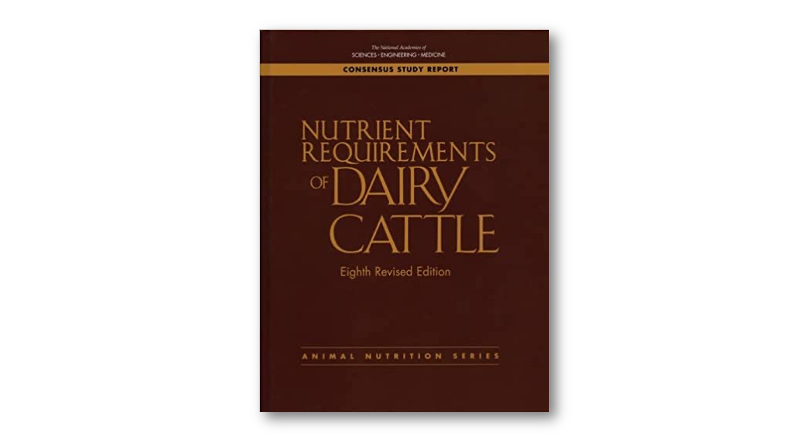

--- 
title: Teaching with the narrative and model in NASEM (2021) 'Nutrient Requirements
  of Dairy Cattle'
author:
- "MaryGrace Erickson, University of Wisconsin--Madison"
- "Michel A. Wattiaux, University of Wisconsin--Madison"
- Mark D. Hanigan, Virginia Polytechnic Institute and State University
- Marina A.C. Danes, Universidade Federal de Lavras
date: "`r Sys.Date()`"
site: bookdown::bookdown_site
documentclass: book
bibliography:
- book.bib
- packages.bib
description: |
  This book is intended to help instructors integrate the NASEM (2021) dairy nutrition model into undergraduate courses.
link-citations: yes
---

# About this module

```{r, echo = F, fig.align = "center", fig.cap = "Cover of 'Nutrient Requirements of Dairy Cattle, 8th edition'" }


```

## Purpose

The NASEM (2021) "Nutrient Requirements of Dairy Cattle" consensus report is a distillation of our collective knowledge about dairy cattle nutrition in the U.S. in the form of written text and mathematical equations. The most recent edition (8th), hereafter referred to as NASEM (2021), includes two parts. First, a 502 page consensus report book describes advancements in the dairy nutrition literature in recent decades in the form of narrative text and prediction equations. Second, a software for Windows enables users to evaluate diet adequacy for a given scenario based on the equations explained in the book.

Our online module and its accompanying resources for teachers are intended to promote learning from the NASEM (2021) materials. Because the NASEM (2021) narrative and software were designed for advanced dairy nutrition practitioners, they may be difficult for less-experienced learners. Our module is designed to highlight core concepts that will assist learners in understanding the NASEM narrative and utilizing the mathematical model in practice. 

::: {.lo}
**Learning Objectives of this Module**

1. Raise learners' knowledge and confidence working with nutritional models, using the example of the NASEM (2021) "Nutrient Requirements of Dairy Cattle"

:::

## Structure of the module and materials for teachers

**Intended audience**

This module is for anyone interested in learning about nutritional science and nutritional modeling. Although is discusses a dairy cattle nutritional model, it is NOT designed solely for dairy-interested learners. As the "Requirements" chapter illustrates, there is substantial overlap in how scientists describe nutritional processes for humans and other animal species. Throughout the module, we emphasized critical thinking about nutritional science rather than memorization of any particular dairy cattle nutrition facts. Therefore, we hope this module will be interesting and relevant for learners regardless of their interest in dairy cattle. 

**Assumptions about prior knowledge**

This module can be used by anyone, but it has been designed with the assumption that learners have some prior knowledge. Before starting this module, we suggest that learners should have:

- Intermediate understanding of nutritional physiology of ruminants, e.g., have taken an animal nutrition course

- Intermediate knowledge of dairy production systems, e.g., through an introductory animal science or management-focused course, or through personal/career-related experiences

- Basic skills with statistics and math (mean, standard deviation, regression)

**Technology requirements**

- To read the narrative and complete activities, need a computer and stable internet connection
- To run NASEM-8 software, need Windows operating system


## Accessing the NASEM (2021) book


The NASEM (2021) book provides a narrative that summarizes recent scientific literature on dairy nutrition and justifies choices made while developing the mathematical model. The narrative is rich with information on nutritional physiology, dairy herd management, dairy nutrition experimentation, and the model development process. Due to its information density and use of technical language, it may be overwhelming to read for less-experienced practitioners. For this reason, learners may find it helpful to read the NASEM (2021) book in a class or small-group setting where it is possible to ask questions and verify their understanding. 

Instructors and learners can work together to determine which sections of the text are appropriate to the learners' current comprehension level. For intermediate learners, it may be best to complete this module first before spending much time reading the NASEM (2021) narrative. Advanced learners may be able to read through the NASEM (2021) Consensus Report simultaneous to completing the activities in this module. In some cases, learners may benefit from approaching the narrative in an informal "Journal Club"-style setting (arranged either by teachers or students!).


:::{.blue}

**Accessing NASEM (2021) consensus report**

At the time of writing, a print version of the NASEM 8th edition book is available for purchase at the link below. Eventually this material will be available to read for free online. 
https://nap.nationalacademies.org/catalog/25806/nutrient-requirements-of-dairy-cattle-eighth-revised-edition

:::

::: {.grey}

**Earlier editions, e.g., 7th, NRC (2001)**

Earlier editions of "Nutrient Requirements for Dairy Cattle" are available to read for free online, for example, the 7th edition (2001):
https://nap.nationalacademies.org/catalog/9825/nutrient-requirements-of-dairy-cattle-seventh-revised-edition-2001

::: 


## The NASEM-dairy-8 software


Most of this module can be completed without using the NASEM-dairy-8 software. However, learners are encouraged to download and experiment with the NASEM dairy-8 software on their own time. Download instructions are available on the NASEM website.

The NASEM dairy-8 software runs only on Windows operating system. Learners who wish to run NASEM dairy-8 can install it on a personal computer or a campus library computer. Learners with non-Windows operating system may be able to download the NASEM dairy-8 using virtual machines through platforms such as Virtual Box (https://www.virtualbox.org). However, this requires substantial computer expertise and may be inconvenient for everyday use. 

:::{.blue}

**Accessing NASEM-dairy-8 software**

The NASEM-dairy-8 software for Windows is available to download as shown here:
https://nap.nationalacademies.org/resource/25806/Installation_Instructions_NASEM_Dairy8.pdf
:::

::: {.grey}

**Earlier software, e.g., NASEM-dairy-7 **

It is also possible to download the Windows software for NRC (2001), although NASEM recommendeds against having both NRC 2001 and NASEM 2021 software installed on the same computer. https://nap.nationalacademies.org/catalog/9825/nutrient-requirements-of-dairy-cattle-seventh-revised-edition-2001

::: 


The easiest way to get started running NASEM-8 is to Load a pre-defined simulation.The software comes with several pre-defined simulations for different classes of animals (e.g., "Example Lactating Cow 100 DIM"). Loading a pre-defined simulation pre-loads all of the inputs describing an example animal, management scenario, and diet. This can be helpful to avoid entering unrealistic inputs. 


To run NASEM-8, users proceed through four sections:

1. **Inputs.** In the first panel, users must specify the Program Settings. Most commonly, the default settings (Metric, Dry Matter) can be retained. In the second panel of Inputs, "Animal Description/Management" users can provide detail about the animal (e.g., age, breed, days in milk) and the management scenario (e.g., grazing vs. no grazing). Finally, the "Production" panel allows users to specify the expected rates of growth, changes in body reserves, and milk and component production. 

1. **Feeds**. In this section, users can select the feedstuffs that will comprise the ration ("Add Feeds to Ration"). The software is pre-loaded with a default Feed Library, which contains composition information for over 300 feeds commonly used in dairy rations. Ingredients in the feed library can be modified to create custom feeds ("Edit feed components and nutrients"), which users can save to the feed library (Save Feed in Feed Library) for later use. This section defines which feeds are used in the ration, but not the inclusion rates. 

1. **Ration**. Feeds selected in the prior section will appear in the Ration List. To create a ration, users enter either the amount of dry matter (DM) consumed or the feed's percent of total diet DM. The bottom of the screen allows users to specify DMI manually ("Total Intake") or to select from two estimated intakes produced by the NASEM model using the animal characteristics (e.g., milk production, parity, body weight). Using the "Set to 100%" allows users to easily scale diet information to 100%. This can be helpful to correct rounding errors (e.g., to fix ingredient composition that sums to 100.01 or 99.99% of DM). A sidebar shows quick estimates of the diet nutritional value, which makes it easier to tweak the ingredient composition to meet goals. 

1. **Reports**. Finally, users can generate reports detailing the predictions from the NASEM (2021) model. Nine types of reports are available. By selecting "10. All" and "Generate Selected Reports," a Word document is created and opened. Users can look through the Word document to see predicted nutrient supplies and requirements associated with their inputs. It is also possible to generate an excel spreadsheet with the nutrient composition of ingredients. This may be helpful for users who wish to do their own manual calculations. 

Some of the most common mistakes when using NASEM dairy-8 relate to improper inputs. For example, a user could enter a body weight of 7,000 instead of 700 kg in the Animal Description; or create a custom feed with unrealistic nutrient composition. For this reason, it is easiest to use pre-loaded simulations and default Feed Library ingredients in classroom settings. This will prevent many hours of troubleshooting related to improper inputs. 


::: {.red}

**NOTE**: Even with perfectly-matched inputs, the NASEM software is more up-to-date than the consensus report. For this reason, the outputs may differ slightly when using equations in the book versus the reports generated in the software. More details are given in the next section.
::: 


## Known discrepancies

The software is under continual improvement, whereas the book is static. According to the NASEM-8 software "help" documentation, the latest software and R code contains the most correct and up-to-date version of the NASEM model. **To avoid confusion, our module will use the NASEM model equations given in the software.**

**Software updates and bugs**

Since the software was released, several updates have been made. Users should ensure they have the latest version of NASEM-8 downloaded to avoid any errors. The errors below may be encountered with older versions:

1. With versions of NASEM-8 software downloaded prior to 2023.03.11, user-entered target milk production, milk protein production, and milk fat were silently overridden with predicted values. This resulted in NEL, urine energy, and other values reported incorrectly. This bug has been fixed by the developer in subsequent releases.
1. In certain cases, the NEL balance in the sidebar does not match the Word document output. 
1. In certain versions of the NASEM-8 software, manure volatile solids was overwritten by manure water in tabular output in Word.

**Inconsistencies between the book and software**

The most recent software is more up-to-date than the equations in the Consensus Report book. Most discrepancies result in relatively small differences in predictions as a result of fine-tuning parameters. Known discrepancies between the book and software include:

1. The kg of CP in gravid uterus per kg of calf birth weight (CP_GrUtWt) differs from book p. 87. 
1. The kg gravid uterus weight per fetal birthweight (GrUterWt_FetBWbrth) differs from book p. 31.
1. The energy (Mcal/kg) fresh gravid uterus weight (NE_GrUtWt) at birth differs from book p. 31. 
1. The amount of CP (kg/kg) in fresh gravid uterus weight (CP_GrUtWt) differs from book p. 87. 
1. The coefficient for digestible energy in urinary nitrogen differs from the book (p. 32?).
1. Estimated manure output (Man_out) uses a different equation than those listed in the Environment chapter. 
1. The coefficient for NDF in the methane emission equation for heifers is positive in the book (p. 302), and negative in the software.
1. The intercept for the methane production of non-lactating dairy cows is positive in the book (p. 302; 14-1c) and negative in the software. Additionally, note that CF is crude fat, not crude fiber!
1. In the book (eq. 13-4, p. 304) the CP:N factor is listed as 0.638. It is 0.634 (6.34) in the software. The 6.34 factor is consistent with the Protein chapter. 

## Suggested citations

If you use this module, please give credit by citing our work and the NASEM report. 

::: {.cit}

**Cite our abstract on this module:**

Erickson, M.G., Hanigan, M.D., and Wattiaux, M.A. (2023). Teaching with the narrative and model in NASEM (2021) "Nutrient Requirements of Dairy Cattle." Proceedings of the American Dairy Science Association Annual Meeting in Ottawa, Ontario, Canada. 

**Cite the consensus report:**

National Academies of Sciences, Engineering, and Medicine. (2021). Nutrient Requirements of Dairy Cattle: Eighth Revised Edition. Washington, DC: The National Academies Press. https://doi.org/10.17226/25806.


::: 

## Contribute to this module

Interested in editing or adding to this instructional module? Please share your ideas with our team (merickson3@wisc.edu) so we can incorporate them and acknowledge you as a contributor. 


## License details
