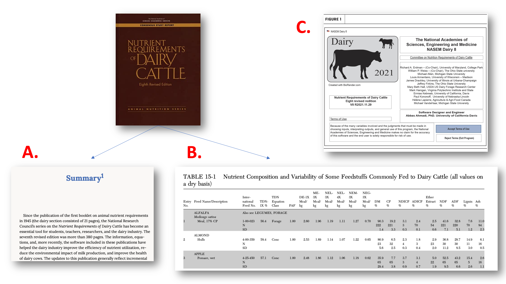

--- 
title: Learning from the narrative and model in NASEM (2021) 'Nutrient Requirements
  of Dairy Cattle'
author:
- "MaryGrace Erickson, University of Wisconsin--Madison"
- "Michel A. Wattiaux, University of Wisconsin--Madison"
- Mark D. Hanigan, Virginia Polytechnic Institute and State University

date: "`r Sys.Date()`"
site: bookdown::bookdown_site
documentclass: book
bibliography:
- book.bib
- packages.bib
description: |
  This book is intended to help independent learners, students, and instructors interacting with the NASEM (2021) dairy nutrition model, especially in undergraduate courses.
link-citations: yes
---

# About this interactive textbook

```{r, echo = F, fig.align = "center", fig.cap = "Cover of 'Nutrient Requirements of Dairy Cattle, 8th edition'" }
knitr::include_graphics("images/nasem_book.jpg")

```

## Overview

The NASEM (2021) "Nutrient Requirements of Dairy Cattle" consensus report is a distillation of our collective knowledge about dairy cattle nutrition in the U.S. in the form of written text and mathematical equations. The most recent edition (8th), hereafter referred to as NASEM (2021), includes two parts. First, a 502 page consensus report book describes advancements in the dairy nutrition literature in recent decades in the form of narrative text and prediction equations. Second, a software for Windows enables users to evaluate diet adequacy for a given scenario based on the equations explained in the book.

Our interactive textbook and its accompanying resources for teachers are intended to promote learning from the NASEM (2021) materials. Because the NASEM (2021) narrative and software were designed for advanced dairy nutrition practitioners, they may be difficult for less-experienced learners. Our interactive textbook is designed to highlight core concepts that will assist learners in understanding the NASEM narrative and utilizing the mathematical model in practice. 


::: {.lo}
**Learning Objectives of this interactive textbook**

1. Raise learners' knowledge and confidence working with nutritional models, using the example of the NASEM (2021) "Nutrient Requirements of Dairy Cattle"

:::

## Information for educators

**Intended audience**

This interactive textbook is for anyone interested in learning about nutritional science and nutritional modeling. Although is discusses a dairy cattle nutritional model, it is NOT designed solely for dairy-interested learners. As the "Requirements" chapter illustrates, there is substantial overlap in how scientists describe nutritional processes for humans and other animal species. Throughout the  textbook, we emphasized critical thinking about nutritional science rather than memorization of any particular dairy cattle nutrition facts. Therefore, we hope this interactive textbook will be interesting and relevant for learners regardless of their interest in dairy cattle. 

**Assumptions about prior knowledge**

This textbook can be used by anyone, but it has been designed with the assumption that learners have some prior knowledge. Before starting this material, we suggest that learners should have:

- Intermediate understanding of nutritional physiology of ruminants, e.g., have taken an animal nutrition course

- Intermediate knowledge of dairy production systems, e.g., through an introductory animal science or management-focused course, or through personal/career-related experiences

- Basic skills with statistics and math (mean, standard deviation, regression)

**Technology requirements**

- To read the narrative and complete activities, need a computer and stable internet connection
- To run NASEM-8 software, need Windows operating system

## NASEM Components

```{r, echo = F, fig.align = "center", out.width = '100%', fig.cap = "Components of 'Nutrient Requirements of Dairy Cattle, 8th edition.' The consensus report book includes (A) narrative text reviewing scientific literature used in creating the model, (B) Feed Tables with ingredient composition data. The book was also released with (C) Windows software." }


```

### Accessing the NASEM (2021) book


The NASEM (2021) book provides a narrative that summarizes recent scientific literature on dairy nutrition and justifies choices made while developing the mathematical model. The narrative is rich with information on nutritional physiology, dairy herd management, dairy nutrition experimentation, and the model development process. Due to its information density and use of technical language, it may be overwhelming to read for less-experienced practitioners. For this reason, learners may find it helpful to read the NASEM (2021) book in a class or small-group setting where it is possible to ask questions and verify their understanding. 

Instructors and learners can work together to determine which sections of the text are appropriate to the learners' current comprehension level. For intermediate learners, it may be best to read this interactive textbook first before spending much time reading the NASEM (2021) narrative. Advanced learners may be able to read through the NASEM (2021) Consensus Report simultaneous to completing the activities in it. In some cases, learners may benefit from approaching the narrative in an informal "Journal Club"-style setting (arranged either by teachers or students!).


:::{.blue}

**Accessing NASEM (2021) consensus report**

At the time of writing, a print version of the NASEM 8th edition book is available for purchase at the link below. Eventually this material will be available to read for free online. 
https://nap.nationalacademies.org/catalog/25806/nutrient-requirements-of-dairy-cattle-eighth-revised-edition

:::

::: {.grey}

**Earlier editions, e.g., 7th, NRC (2001)**

Earlier editions of "Nutrient Requirements for Dairy Cattle" are available to read for free online, for example, the 7th edition (2001):
https://nap.nationalacademies.org/catalog/9825/nutrient-requirements-of-dairy-cattle-seventh-revised-edition-2001

::: 


### Accessing NASEM-dairy-8 software


Most of this interactive textbook can be completed without using the NASEM-dairy-8 software. However, learners are encouraged to download and experiment with the NASEM dairy-8 software on their own time. Download instructions are available on the NASEM website.

The NASEM dairy-8 software runs only on Windows operating system. Learners who wish to run NASEM dairy-8 can install it on a personal computer or a campus library computer. Learners with non-Windows operating system may be able to download the NASEM dairy-8 using virtual machines through platforms such as Virtual Box (https://www.virtualbox.org). However, this requires substantial computer expertise and may be inconvenient for everyday use. 

:::{.blue}

**Accessing NASEM-dairy-8 software**

The NASEM-dairy-8 software for Windows is available to download as shown here:
https://nap.nationalacademies.org/resource/25806/Installation_Instructions_NASEM_Dairy8.pdf
:::

::: {.grey}

**Earlier software, e.g., NASEM-dairy-7 **

It is also possible to download the Windows software for NRC (2001), although NASEM recommendeds against having both NRC 2001 and NASEM 2021 software installed on the same computer. https://nap.nationalacademies.org/catalog/9825/nutrient-requirements-of-dairy-cattle-seventh-revised-edition-2001

::: 

## Examples

### NASEM dairy-8

The easiest way to get started running NASEM-8 is to Load a pre-defined simulation.The software comes with several pre-defined simulations for different classes of animals (e.g., "Example Lactating Cow 100 DIM"). Loading a pre-defined simulation pre-loads all of the inputs describing an example animal, management scenario, and diet. This can be helpful to avoid entering unrealistic inputs. 


To run NASEM-8, users proceed through four sections:

1. **Inputs.** In the first panel, users must specify the Program Settings. Most commonly, the default settings (Metric, Dry Matter) can be retained. In the second panel of Inputs, "Animal Description/Management" users can provide detail about the animal (e.g., age, breed, days in milk) and the management scenario (e.g., grazing vs. no grazing). Finally, the "Production" panel allows users to specify the expected rates of growth, changes in body reserves, and milk and component production. 

1. **Feeds**. In this section, users can select the feedstuffs that will comprise the ration ("Add Feeds to Ration"). The software is pre-loaded with a default Feed Library, which contains composition information for over 300 feeds commonly used in dairy rations. Ingredients in the feed library can be modified to create custom feeds ("Edit feed components and nutrients"), which users can save to the feed library (Save Feed in Feed Library) for later use. This section defines which feeds are used in the ration, but not the inclusion rates. 

1. **Ration**. Feeds selected in the prior section will appear in the Ration List. To create a ration, users enter either the amount of dry matter (DM) consumed or the feed's percent of total diet DM. The bottom of the screen allows users to specify DMI manually ("Total Intake") or to select from two estimated intakes produced by the NASEM model using the animal characteristics (e.g., milk production, parity, body weight). Using the "Set to 100%" allows users to easily scale diet information to 100%. This can be helpful to correct rounding errors (e.g., to fix ingredient composition that sums to 100.01 or 99.99% of DM). A sidebar shows quick estimates of the diet nutritional value, which makes it easier to tweak the ingredient composition to meet goals. 

1. **Reports**. Finally, users can generate reports detailing the predictions from the NASEM (2021) model. Nine types of reports are available. By selecting "10. All" and "Generate Selected Reports," a Word document is created and opened. Users can look through the Word document to see predicted nutrient supplies and requirements associated with their inputs. It is also possible to generate an excel spreadsheet with the nutrient composition of ingredients. This may be helpful for users who wish to do their own manual calculations. 

Some of the most common mistakes when using NASEM dairy-8 relate to improper inputs. For example, a user could enter a body weight of 7,000 instead of 700 kg in the Animal Description; or create a custom feed with unrealistic nutrient composition. For this reason, it is easiest to use pre-loaded simulations and default Feed Library ingredients in classroom settings. This will prevent many hours of troubleshooting related to improper inputs. 


::: {.red}

**NOTE**: Even with perfectly-matched inputs, the NASEM software is more up-to-date than the consensus report. For this reason, the outputs may differ slightly when using equations in the book versus the reports generated in the software. More details are given in the next section.
::: 

### R

The examples assume that the user has installed R and set the working directory to a relevant folder. However, most examples are designed to be relatively portable and work regardless of the working directory.  Additionally, some ```library()``` calls are made to load required packages. If this is the first time using a package, the user needs to first install the package (```install.packages("packagename")```, where packagename is replaced with the enquoted ("") name of the package to be installed). 

Many people run R within a developing environment such as Rstudio. Rstudio is available for download across platforms:  https://posit.co/download/rstudio-desktop/. The learnr package provides a nice overview of how to set up R and Rstudio:  https://learnr-examples.shinyapps.io/ex-setup-r/#section-welcome

:::{.orange}

**Complete beginners:  learn R with swirl**  
To get started feeling more comfortable with R, I would recommend you give the "swirl" package a try. It is pretty fun and helps you start to grasp the basic R syntax. Use the install.packages command to install it. Then, you can use library() to call the swirl package, loading it into your workspace.

From here, the swirl package should mostly guide you the rest of the way. There are several modules you can complete. The R Programming course is a good start. You can see more about the swirl package here: https://github.com/swirldev/swirl_courses#swirl-courses

```{r, echo = T, eval = F}
install.packages ("swirl")
library(swirl)
install_course("R Programming")  #Loading a course in "swirl"
swirl()
```

:::


### Python

The examples assume the user has installed Python and pandas. The simplest way for inexperienced users to install Python and pandas is through Anaconda. For installation instructions, see here:  https://docs.continuum.io/free/anaconda/install/

For Mac, python is preinstalled. To run an example, open a terminal in the working directory (folder with input/output files in it) and call ```python``` to change the interpreter to Python.  Alternatively, the examples can be run from a developing environment such as Visual Studio code. Again, it is important to ensure the working directory (if relevant for the example) has been set up. However, most examples are designed to be relatively portable and work regardless of the working directory. 

## Helpful information

**Known updates (discrepancies in book vs. software)**

The software is under continual improvement, whereas the book is static. According to the NASEM-8 software "help" documentation, the latest software and R code contains the most correct and up-to-date version of the NASEM model. **NOTE**: *To avoid confusion, our interactive textbook will use the NASEM model equations given in the software.*

**NASEM dairy-8 software updates and bugs**

Since the software was released, several updates have been made. Users should ensure they have the latest version of NASEM-8 downloaded to avoid any errors. The errors below may be encountered with older versions:

1. With versions of NASEM-8 software downloaded prior to 2023.03.11, user-entered target milk production, milk protein production, and milk fat were silently overridden with predicted values. This resulted in NEL, urine energy, and other values reported incorrectly. This bug has been fixed by the developer in subsequent releases.
1. In certain cases, the NEL balance in the sidebar does not match the Word document output. 
1. In certain versions of the NASEM-8 software, manure volatile solids was overwritten by manure water in tabular output in Word.

**Differences between the book and software**

The most recent software is more up-to-date than the equations in the Consensus Report book. Most updates resulted in relatively small differences in predictions as a result of fine-tuning parameters. Known differences between the book and software include:


1. The efficiency of ME to RE is 0.75 in the software and 0.74 in the book (p. 29). 
1. The kg of CP in gravid uterus per kg of calf birth weight (CP_GrUtWt) differs from book p. 87. 
1. The kg gravid uterus weight per fetal birthweight (GrUterWt_FetBWbrth) differs from book p. 31.
1. The energy (Mcal/kg) fresh gravid uterus weight (NE_GrUtWt) at birth differs from book p. 31. 
1. The amount of CP (kg/kg) in fresh gravid uterus weight (CP_GrUtWt) differs from book p. 87. 
1. The coefficient for digestible energy in urinary nitrogen differs from the book (p. 32?).
1. Estimated manure output (Man_out) uses a different equation than those listed in the Environment chapter. 
1. The coefficient for NDF in the methane emission equation for heifers is positive in the book (p. 302), and negative in the software.
1. The intercept for the methane production of non-lactating dairy cows is positive in the book (p. 302; 14-1c) and negative in the software. Additionally, note that CF is crude fat, not crude fiber!
1. In the book (eq. 13-4, p. 304) the CP:N factor is listed as 0.638. It is 0.634 (6.34) in the software. The 6.34 factor is consistent with the Protein chapter. 

Other notes (not discrepant, but maybe helpful to know).
1. The book (eq. 6-13b, p. 87) gives an equation for the efficiency of AA use for non-pregnant animals. There is no corresponding equation for gestating animals in the book, but the software takes into account AA needs for gestation when appropriate. 
1. The book (eq. 6-4a) has a parentheses error. The end of the equation shows a calculation of total diet NDF intake as NDF/100 * DMI. The diet NDF intake should be multiplied by the entire equation preceding, not just the last term (1.51 * DMI). This is because the first part of the equation calculates the percentage of rumen-degradable NDF out of the diet NDF. 
1. The book (p. 32) abbreviates the gains/losses of reproductive tissues associated with pregnancy and involution as GrUter_Wt. The uterus is not technically gravid after parturition, therefore, gravid signifies that the uterus is still returning from pregnant to non-pregnant status. 
1. The equation 3-5a on p. 25 reads "DMI_DM" where it should say "DMI_BW."

## Contribute edits and suggestions

Interested in editing or adding to this interactive textbook? Please share your ideas with our team (merickson3@wisc.edu) so we can incorporate them and acknowledge you as a contributor. We could especially use suggested alternative text and activities to improve the accessibility of this resource. 


## License & Citation Information

This work is licensed under a CC-BY-NC-SA license. This means you are free to use it for educational purposes or modify it, as long as you **cite the original work (see below)** and share your creation under a similar license. 

<a rel="license" href="http://creativecommons.org/licenses/by-nc-sa/4.0/"></a><br /> See here for more information on the license <a rel="license" href="http://creativecommons.org/licenses/by-nc-sa/4.0/">Creative Commons Attribution-NonCommercial-ShareAlike 4.0 International License</a>.
https://creativecommons.org/licenses/by-nc-sa/4.0/


**Required Citations**

If you use this interactive textbook, please give credit by citing our work and the NASEM report. 

::: {.cit}

**Cite our interactive textbook:**

Erickson, M.G., Hanigan, M.D., and Wattiaux, M.A. (2023). Learning from the narrative and model in NASEM (2021) "Nutrient Requirements of Dairy Cattle": an interactive textbook. Version 1.0.0. https://doi.org/10.17605/OSF.IO/Q6WX9

**Cite the consensus report:**

National Academies of Sciences, Engineering, and Medicine. (2021). Nutrient Requirements of Dairy Cattle: Eighth Revised Edition. Washington, DC: The National Academies Press. https://doi.org/10.17226/25806.

::: 